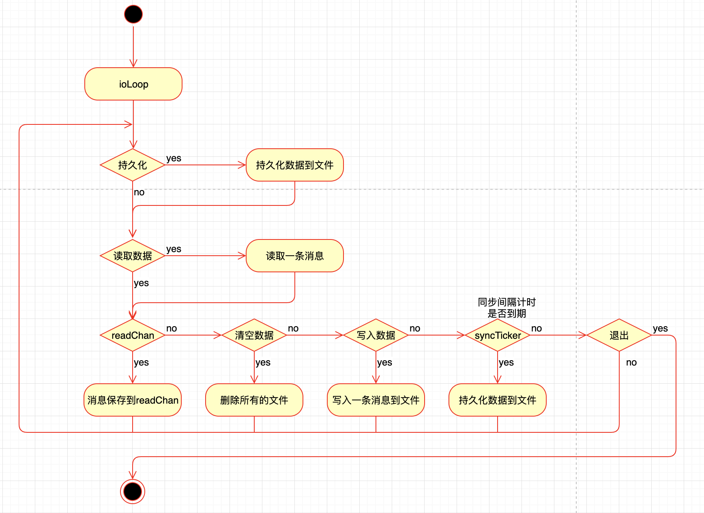
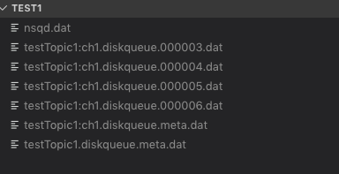
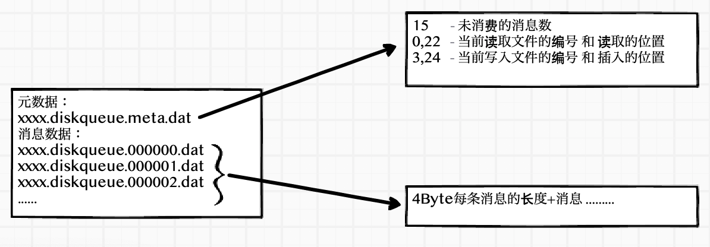

# 剖析nsq消息队列(四)消息传输的可靠性和持久化

上一篇主要说了一下 nsq 如何保证消息被消费端成功消费，大概提了一下消息的持久化，--mem-queue-size 设置为0，所有的消息将会存储到磁盘。总有人说 nsq 的持久化问题，消除疑虑的方法就是阅读源码做 benchmark 测试，个人感觉 nsq 还是很靠谱的。

nsq 自己实现了一个先进先出的消息文件队列 go-diskqueue 是把消息保存到本地文件内，很值得分析一下他的实现过程。

## 整体处理逻辑

go-disqueue 会启动一个 goroutine 进行读写数据也就是方法 ioLoop 
会根据你设置的参数来进行数据的读写，流程图如下



这个图画的也不是特别准确 ioLoop 用的是 select 并不是多个if else 当有多个条件为 true 时，会随机选择一个进行执行

nsq 生成的数据大致如下：



- xxxx.diskqueue.meta.dat 元数据保存了未读消息的长度，读取和存入数据的编号和读取位置

- xxxx.diskqueue.编号.dat 消息保存的文件，每一个消息的存储：4Byte消息的长度+消息



## 参数说明

一些主要的参数和约束说明，这些参数的使用在后面的处理逻辑中会提到。

```go
// diskQueue implements a filesystem backed FIFO queue
type diskQueue struct {
	// run-time state (also persisted to disk)
	// 读取数据的位置    
	readPos      int64
	// 写入数据的位置
	writePos     int64
	// 读取文件的编号    
	readFileNum  int64
	// 写入文件的编号
	writeFileNum int64
	// 未处理的消息总数    
	depth        int64

	// instantiation time metadata
	// 每个文件的大小限制    
	maxBytesPerFile int64 // currently this cannot change once created
	// 每条消息的最小大小限制    
	minMsgSize      int32
	// 每条消息的最大大小限制    
	maxMsgSize      int32
	// 缓存消息有多少条后进行写入    
	syncEvery       int64         // number of writes per fsync
	// 自动写入消息文件的时间间隔    
	syncTimeout     time.Duration // duration of time per fsync
	exitFlag        int32
	needSync        bool

	// keeps track of the position where we have read
	// (but not yet sent over readChan)
	// 下一条消息的位置    
	nextReadPos     int64
	// 下一条消息的文件编号    
	nextReadFileNum int64

	// 读取的文件
	readFile  *os.File
	// 写入的文件    
	writeFile *os.File
	// 读取的buffer    
	reader    *bufio.Reader
	// 写入的buffer    
	writeBuf  bytes.Buffer

	// exposed via ReadChan()
	// 读取数据的channel    
	readChan chan []byte

	//.....
}
```

## 数据

### 元数据

读写数据信息的元数据保存在xxxxx.diskqueue.meta.data文件内主要用到代码里的字段如下

未处理的消息总数 depth

读取文件的编号 readFileNum 读取数据的位置 readPos

写入文件的编号 writeFileNum 写入数据的位置 writePos

真实数据如下

```
15
0,22
3,24
```

保存元数据信息

```go
func (d *diskQueue) persistMetaData() error {
	// ...
	fileName := d.metaDataFileName()
	tmpFileName := fmt.Sprintf("%s.%d.tmp", fileName, rand.Int())
	// write to tmp file
	f, err = os.OpenFile(tmpFileName, os.O_RDWR|os.O_CREATE, 0600)
	// 元数据信息
	_, err = fmt.Fprintf(f, "%d\n%d,%d\n%d,%d\n",
		atomic.LoadInt64(&d.depth),
		d.readFileNum, d.readPos,
		d.writeFileNum, d.writePos)
	// 保存
	f.Sync()
	f.Close()
	// atomically rename
	return os.Rename(tmpFileName, fileName)
}
```

得到元数据信息

```go
func (d *diskQueue) retrieveMetaData() error {
	// ...
	fileName := d.metaDataFileName()
	f, err = os.OpenFile(fileName, os.O_RDONLY, 0600)
	// 读取数据并赋值
	var depth int64
	_, err = fmt.Fscanf(f, "%d\n%d,%d\n%d,%d\n",
		&depth,
		&d.readFileNum, &d.readPos,
		&d.writeFileNum, &d.writePos)
	//...
	atomic.StoreInt64(&d.depth, depth)
	d.nextReadFileNum = d.readFileNum
	d.nextReadPos = d.readPos
	return nil
}
```

### 消息数据

**写入一条数据**

ioLoop 中发现有数据写入时,会调用writeOne方法，把消息保存到文件内

```go
select {
		// ...
		case dataWrite := <-d.writeChan:
			count++
			d.writeResponseChan <- d.writeOne(dataWrite)
		// ...
```
```go
func (d *diskQueue) writeOne(data []byte) error {
	var err error

	if d.writeFile == nil {
		curFileName := d.fileName(d.writeFileNum)
		d.writeFile, err = os.OpenFile(curFileName, os.O_RDWR|os.O_CREATE, 0600)
		// ...
		if d.writePos > 0 {
			_, err = d.writeFile.Seek(d.writePos, 0)
			// ...
		}
	}

	dataLen := int32(len(data))
	// 判断消息的长度是否合法
	if dataLen < d.minMsgSize || dataLen > d.maxMsgSize {
		return fmt.Errorf("invalid message write size (%d) maxMsgSize=%d", dataLen, d.maxMsgSize)
	}
	d.writeBuf.Reset()
	// 写入4字节的消息长度,以大端序保存
	err = binary.Write(&d.writeBuf, binary.BigEndian, dataLen)
	if err != nil {
		return err
	}
	// 写入消息
	_, err = d.writeBuf.Write(data)
	if err != nil {
		return err
	}

	// 写入到文件
	_, err = d.writeFile.Write(d.writeBuf.Bytes())
	// ...
	// 计算写入位置，消息数量加1
	totalBytes := int64(4 + dataLen)
	d.writePos += totalBytes
	atomic.AddInt64(&d.depth, 1)
	// 如果写入位置大于 单个文件的最大限制， 则持久化文件到硬盘
	if d.writePos > d.maxBytesPerFile {
		d.writeFileNum++
		d.writePos = 0

		// sync every time we start writing to a new file
		err = d.sync()
		// ...
	}
	return err
}
```
写入完消息后，会判断当前的文件大小是否已经大于maxBytesPerFile，如果大，就持久化文件到硬盘，然后重新打开一个新编号文件，进行写入。

**什么时候持久化文件到硬盘**

调用sync()方法会持久化文件到硬盘，然后重新打开一个新编号文件，进行写入。
有几个地方调用会调用这个方法：

- 一个写入文件的条数达到了syncEvery的值时，也就是初始化时设置的最大的条数。会调用sync()

- syncTimeout 初始化时设置的同步时间间隔，如果这个时间间隔到了，并且写入的文件条数>0的时候，会调用sync()

- 还有就是上面说过的writeOne方法，写入完消息后，会判断当前的文件大小是否已经已于maxBytesPerFile如果大，会调用sync()

- 当读取文件时，把整个文件读取完时，会删除这个文件并且会把needSync 设置为true，ioLoop 会调用sync()

- 还有就是Close的时候，会调用sync()

```go
func (d *diskQueue) sync() error {
	if d.writeFile != nil {
		// 把数据 flash到硬盘，关闭文件并设置为 nil
		err := d.writeFile.Sync()
		if err != nil {
			d.writeFile.Close()
			d.writeFile = nil
			return err
		}
	}
	// 保存元数据信息
	err := d.persistMetaData()
	// ...
	d.needSync = false
	return nil
}
```

**读取一条数据**

元数据保存着 读取文件的编号 readFileNum 和读取数据的位置 readPos

并且diskQueue暴露出了一个方法来，通过channel来读取数据

```go
func (d *diskQueue) ReadChan() chan []byte {
	return d.readChan
}
```
ioLoop里，当发现读取位置小于写入位置 或者读文件编号小于写文件编号，并且下一个读取位置等于当前位置时才会读取一条数据，然后放在一个外部全局变量 dataRead 里，并把 读取的channel 赋值监听 r = d.readChan，当外部有人读取了消息，则进行moveForward操作

```go
func (d *diskQueue) ioLoop() {
	var dataRead []byte
	var err error
	var count int64
	var r chan []byte
	for {
		// ...
		if (d.readFileNum < d.writeFileNum) || (d.readPos < d.writePos) {
			if d.nextReadPos == d.readPos {
				dataRead, err = d.readOne()
				if err != nil {
					d.handleReadError()
					continue
				}
			}
			r = d.readChan
		} else {
			r = nil
		}

		select {
		// ...
		case r <- dataRead:
			count++
			// moveForward sets needSync flag if a file is removed
			d.moveForward()
		// ...
		}
	}

// ...
}
```
readOne 从文件里读取一条消息，4个bit的大小，然后读取具体的消息。如果读取位置大于最大文件限制，则close。在moveForward里会进行删除操作

```go
func (d *diskQueue) readOne() ([]byte, error) {
	var err error
	var msgSize int32
	// 如果readFile是nil，打开一个新的
	if d.readFile == nil {
		curFileName := d.fileName(d.readFileNum)
		d.readFile, err = os.OpenFile(curFileName, os.O_RDONLY, 0600)
		// ...
		d.reader = bufio.NewReader(d.readFile)
	}
	err = binary.Read(d.reader, binary.BigEndian, &msgSize)
	// ...
	readBuf := make([]byte, msgSize)
	_, err = io.ReadFull(d.reader, readBuf)
	totalBytes := int64(4 + msgSize)
	// ...
	d.nextReadPos = d.readPos + totalBytes
	d.nextReadFileNum = d.readFileNum
	// 如果读取位置大于最大文件限制，则close。在moveForward里会进行删除操作
	if d.nextReadPos > d.maxBytesPerFile {
		if d.readFile != nil {
			d.readFile.Close()
			d.readFile = nil
		}
		d.nextReadFileNum++
		d.nextReadPos = 0
	}
	return readBuf, nil
}
```

moveForward方法会查看读取的编号，如果发现下一个编号 和当前的编号不同时，则删除旧的文件。

```go
func (d *diskQueue) moveForward() {
	oldReadFileNum := d.readFileNum
	d.readFileNum = d.nextReadFileNum
	d.readPos = d.nextReadPos
	depth := atomic.AddInt64(&d.depth, -1)

	// see if we need to clean up the old file
	if oldReadFileNum != d.nextReadFileNum {
		// sync every time we start reading from a new file
		d.needSync = true

		fn := d.fileName(oldReadFileNum)
		err := os.Remove(fn)
		// ...
	}
	d.checkTailCorruption(depth)
```

