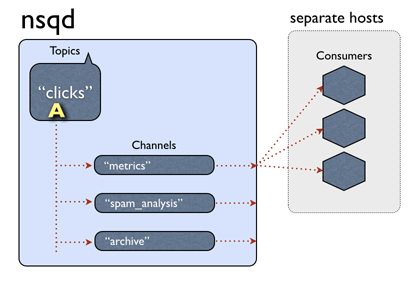
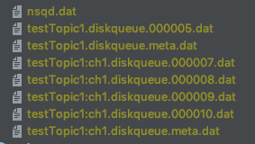

# 剖析nsq消息队列(三)消息传输的可靠性和持久化(一)

前面主要介绍了一下nsq的拓扑结构，如何进行故障处理和横向扩展，保证了客户端和服务端的长连接，连接保持了，就需要传输数据了，这里讲一下nsq如何保证消息被订阅者消费，如何保证消息不丢失。



nsq topic channel 和 consumer的结构如上图，一个 topic 下有多个 channel，每个 channel 可以被多个 consumer 订阅。消息处理的大概流程：当一个消息被 nsq 接收后，传给响应的 topic，topic 把消息传递给所有的 channel ，channel 根据算法选择一个订阅客户端，把消息发送给客户端进行处理。

看上去这个流程是没有问题的，我们来思考几个问题：

- 网络传输的不确定性，比如超时，客户端处理消息时崩溃等，消息如何重传。

- 如何标识消息被客户端成功处理完毕

- 消息的持久化，nsq服务端重新启动时消息不丢失

## 服务端发送中的消息处理逻辑

之前的文章说过客户端和服务端进行连接后，会启动一个goroutine来发送信息给客户端

```go
go p.messagePump(client, messagePumpStartedChan)
```

然后会监听客户端发送过来的命令 client.Reader.ReadSlice('\n')

服务端会定时检查client的连接状态，读取客户端发送过来的各种命令，发送心跳等。每一个连接最终的目的就是监听channel的消息，发送给客户端进行消费。

当有消息发送给订阅客户端的时候，选择哪个client也是有规则的。

```go
func (p *protocolV2) messagePump(client *clientV2, startedChan chan bool) {
	// ...
    for {
		// ...
		case b := <-backendMsgChan:
			if sampleRate > 0 && rand.Int31n(100) > sampleRate {
				continue
			}

			msg, err := decodeMessage(b)
			if err != nil {
				p.ctx.nsqd.logf(LOG_ERROR, "failed to decode message - %s", err)
				continue
			}
			msg.Attempts++

			subChannel.StartInFlightTimeout(msg, client.ID, msgTimeout)
			client.SendingMessage()
			err = p.SendMessage(client, msg)
			if err != nil {
				goto exit
			}
			flushed = false
		case msg := <-memoryMsgChan:
			if sampleRate > 0 && rand.Int31n(100) > sampleRate {
				continue
			}
			msg.Attempts++

			subChannel.StartInFlightTimeout(msg, client.ID, msgTimeout)
			client.SendingMessage()
			err = p.SendMessage(client, msg)
			if err != nil {
				goto exit
			}
			flushed = false
		case <-client.ExitChan:
			goto exit
		}
	}

// ...
}
```

看一下这个方法的调用subChannel.StartInFlightTimeout(msg, client.ID, msgTimeout)，在发送给客户端之前，把这个消息设置为飞行中。

```go
// pushInFlightMessage atomically adds a message to the in-flight dictionary
func (c *Channel) pushInFlightMessage(msg *Message) error {
	c.inFlightMutex.Lock()
	_, ok := c.inFlightMessages[msg.ID]
	if ok {
		c.inFlightMutex.Unlock()
		return errors.New("ID already in flight")
	}
	c.inFlightMessages[msg.ID] = msg
	c.inFlightMutex.Unlock()
	return nil
}
```
然后发送给客户端进行处理。

在发送中的数据，存在的各种不确定性，nsq的处理方式是：对发送给客户端信息设置为在飞行中，如果在如果处理成功就把这个消息从飞行中的状态中去掉，如果在规定的时间内没有收到客户端的反馈，则认为这个消息超时，然后重新归队，两次进行处理。所以无论是哪种特殊情况，nsq统一认为消息为超时。

## 服务端处理超时消息

nsq对超时消息的处理，借鉴了redis的过期算法，但也不太一样，redis的算法更复杂一些。因为redis是单线程的，还要处理占用CPU时间等等，nsq因为goroutine的存在要简单很多。

简单来说，就是在nsq启动的时候启动协程去处理channel的过期数据。

```go
func (n *NSQD) Main() error {
	// ...
	// 启动协程去处理channel的过期数据    
	n.waitGroup.Wrap(n.queueScanLoop)
	n.waitGroup.Wrap(n.lookupLoop)
	if n.getOpts().StatsdAddress != "" {
		n.waitGroup.Wrap(n.statsdLoop)
	}

	err := <-exitCh
	return err
}
```

当然不是每一个channel启动一个协程来处理过期数据，而是有一些规定，我们看一下一些默认值，然后再展开讲算法

```go
return &Options{
		// ...

		HTTPClientConnectTimeout: 2 * time.Second,
		HTTPClientRequestTimeout: 5 * time.Second,
		// 内存最大队列数
		MemQueueSize:    10000,
		MaxBytesPerFile: 100 * 1024 * 1024,
		SyncEvery:       2500,
		SyncTimeout:     2 * time.Second,

		// 扫描channel的时间间隔
		QueueScanInterval:        100 * time.Millisecond,
		// 刷新扫描的时间间隔        
		QueueScanRefreshInterval: 5 * time.Second,
		QueueScanSelectionCount:  20,
		// 最大的扫描池数量        
		QueueScanWorkerPoolMax:   4,
		// 标识百分比        
		QueueScanDirtyPercent:    0.25,
		// 消息超时
		MsgTimeout:    60 * time.Second,
		MaxMsgTimeout: 15 * time.Minute,
		MaxMsgSize:    1024 * 1024,
		MaxBodySize:   5 * 1024 * 1024,
		MaxReqTimeout: 1 * time.Hour,
		ClientTimeout: 60 * time.Second,

		// ...
	}
```

这些参数都可以在启动nsq的时候根据自己需要来指定，我们主要说一下这几个：

- QueueScanWorkerPoolMax就是最大协程数，默认是4，这个数是扫描所有channel的最大协程数，当然channel的数量小于这个参数的话，就调整协程的数量，以最小的为准，比如channel的数量为2个，而默认的是4个，那就调扫描的数量为2个

- QueueScanSelectionCount 每次扫描最大的channel数量，默认是20，如果channel的数量小于这个值，则以channel的数量为准。

- QueueScanDirtyPercent 标识脏数据 channel的百分比，默认为0.25，eg: channel数量为10,则一次最多扫描10个，查看每个channel是否有过期的数据，如果有，则标记为这个channel是有脏数据的，如果有脏数据的channel的数量 占这次扫描的10个channel的比例超过这个百分比,则直接再次进行扫描一次，而不用等到下一次时间点。

- QueueScanInterval 扫描channel的时间间隔，默认的是每100毫秒扫描一次。

- QueueScanRefreshInterval 刷新扫描的时间间隔 目前的处理方式是调整channel的协程数量。

这也就是nsq处理过期数据的算法，总结一下就是，使用协程定时去扫描随机的channel里是否有过期数据。

```go
func (n *NSQD) queueScanLoop() {
	workCh := make(chan *Channel, n.getOpts().QueueScanSelectionCount)
	responseCh := make(chan bool, n.getOpts().QueueScanSelectionCount)
	closeCh := make(chan int)

	workTicker := time.NewTicker(n.getOpts().QueueScanInterval)
	refreshTicker := time.NewTicker(n.getOpts().QueueScanRefreshInterval)

	channels := n.channels()
	n.resizePool(len(channels), workCh, responseCh, closeCh)

	for {
		select {
		case <-workTicker.C:
			if len(channels) == 0 {
				continue
			}
		case <-refreshTicker.C:
			channels = n.channels()
			n.resizePool(len(channels), workCh, responseCh, closeCh)
			continue
		case <-n.exitChan:
			goto exit
		}

		num := n.getOpts().QueueScanSelectionCount
		if num > len(channels) {
			num = len(channels)
		}

	loop:
		// 随机channel    
		for _, i := range util.UniqRands(num, len(channels)) {
			workCh <- channels[i]
		}

		numDirty := 0
		for i := 0; i < num; i++ {
			if <-responseCh {
				numDirty++
			}
		}

		if float64(numDirty)/float64(num) > n.getOpts().QueueScanDirtyPercent {
			goto loop
		}
	}

exit:
	n.logf(LOG_INFO, "QUEUESCAN: closing")
	close(closeCh)
	workTicker.Stop()
	refreshTicker.Stop()
}
```

在扫描channel的时候，如果发现有过期数据后，会重新放回到队列，进行重发操作。

```go
func (c *Channel) processInFlightQueue(t int64) bool {
	// ...
	for {
		c.inFlightMutex.Lock()
		msg, _ := c.inFlightPQ.PeekAndShift(t)
		c.inFlightMutex.Unlock()

		if msg == nil {
			goto exit
		}
		dirty = true

		_, err := c.popInFlightMessage(msg.clientID, msg.ID)
		if err != nil {
			goto exit
		}
		atomic.AddUint64(&c.timeoutCount, 1)
		c.RLock()
		client, ok := c.clients[msg.clientID]
		c.RUnlock()
		if ok {
			client.TimedOutMessage()
		}
		//重新放回队列进行消费处理。      
		c.put(msg)
	}

exit:
	return dirty
}
```

## 客户端对消息的处理和响应

之前的文章提过，客户端要消费消息，需要实现接口

```go
type Handler interface {
	HandleMessage(message *Message) error
}
```

在服务端发送消息给客户端后，如果在处理业务逻辑时，如果发生错误则给服务器发送Requeue命令告诉服务器，重新发送消息进处理。如果处理成功，则发送Finish命令

```go
func (r *Consumer) handlerLoop(handler Handler) {
	r.log(LogLevelDebug, "starting Handler")

	for {
		message, ok := <-r.incomingMessages
		if !ok {
			goto exit
		}

		if r.shouldFailMessage(message, handler) {
			message.Finish()
			continue
		}

		err := handler.HandleMessage(message)
		if err != nil {
			r.log(LogLevelError, "Handler returned error (%s) for msg %s", err, message.ID)
			if !message.IsAutoResponseDisabled() {
				message.Requeue(-1)
			}
			continue
		}

		if !message.IsAutoResponseDisabled() {
			message.Finish()
		}
	}

exit:
	r.log(LogLevelDebug, "stopping Handler")
	if atomic.AddInt32(&r.runningHandlers, -1) == 0 {
		r.exit()
	}
}
```

服务端收到命令后，对飞翔中的消息进行处理，如果成功则去掉，如果是Requeue则执行归队和重发操作，或者进行defer队列处理。

## 消息的持久化

默认的情况下，只有内存队列不足时(阈值为-mem-queue-size)，才会把数据保存到文件内进行持久到硬盘。

```go
select {
	case c.memoryMsgChan <- m:
	default:
		b := bufferPoolGet()
		err := writeMessageToBackend(b, m, c.backend)
		bufferPoolPut(b)
		c.ctx.nsqd.SetHealth(err)
		if err != nil {
			c.ctx.nsqd.logf(LOG_ERROR, "CHANNEL(%s): failed to write message to backend - %s",
				c.name, err)
			return err
		}
	}
	return nil
```

如果将 --mem-queue-size 设置为 0，所有的消息将会存储到磁盘。我们不用担心消息会丢失，nsq 内部机制保证在程序关闭时将队列中的数据持久化到硬盘，重启后就会恢复。

nsq自己开发了一个库go-diskqueue来持久化消息到内存。这个库的代码量不多，理解起来也不难,代码逻辑我想下一篇再讲。

看一下保存在硬盘后的样子：




