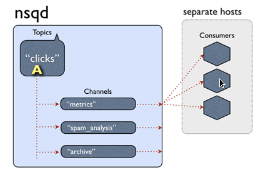
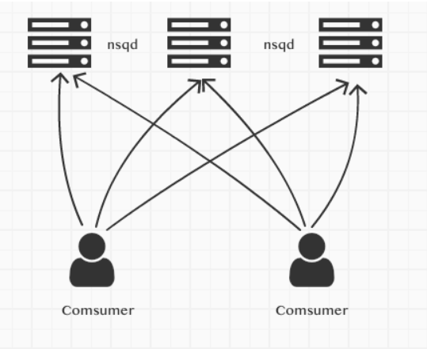
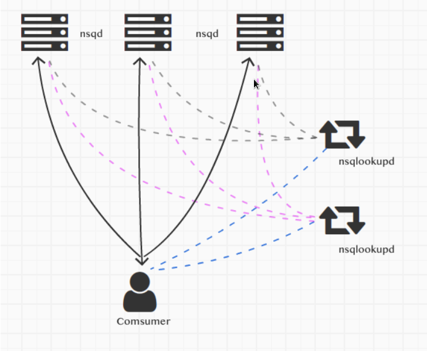
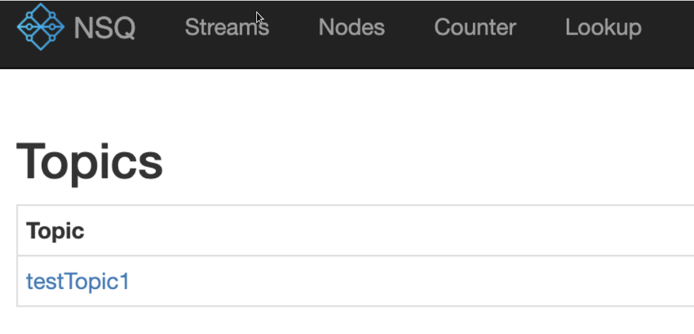

# 剖析nsq消息队列(一)简介及去中心化实现原理

分布式消息队列nsq，简单易用，去中心化的设计使nsq更健壮，nsq充分利用了go语言的goroutine和channel来实现消息处理，代码量也不大，这里主要分析内容如下：

- 分析nsq整体框架结构，分析如何做到的去中心化分布式拓扑结构，如何处理单点故障。

- 分析nsq如何保证消息的可靠性，如何保证消息的处理，对于消息的持久化是如何处理和扩展的

- 分析nsq如何做的消息负载处理，在不超过客户端消费能力的情况下，如何合理的将消息分发到不同的客户端

- 分析nsq的一些辅助组件

这里介绍nsq的主体结构，以及它是如何做到去中心化的分布式拓扑结构，如何处理单点故障。

nsq的几个组件

- nsqd：消息队列的主体，主要负责对消息的接收，处理和分发工作

- nsqlookupd：nsq拓扑信息的管理者，有了他才能组成一个简单易用的去中心化的分布式拓扑网络结构

- nsqadmin：可视化管理组件

- go-nsq：nsq官方go语言客户端

还有一些工具像nsq_to_file、nsq_stat、等等后面介绍。



## 使用方式

两种方式一种是直接连接，另一种是通过nsqlookupd进行连接。

### 直连方式

nsqd是独立运行的，我们可以直接使用部署几个nsqd，然后使用客户端直连的方式使用。



在一台机器上启动两个nsqd

```
./nsqd -tcp-address ":8000"  -http-address ":8001" -data-path=./a
```

```
./nsqd -tcp-address ":7000"  -http-address ":7001" -data-path=./b
```

正常启动会有类似下面的输出：

```
[nsqd] 2019/08/29 18:42:56.928345 INFO: nsqd v1.1.1-alpha (built w/go1.12.7)
[nsqd] 2019/08/29 18:42:56.928512 INFO: ID: 538
[nsqd] 2019/08/29 18:42:56.928856 INFO: NSQ: persisting topic/channel metadata to b/nsqd.dat
[nsqd] 2019/08/29 18:42:56.935797 INFO: TCP: listening on [::]:7000
[nsqd] 2019/08/29 18:42:56.935891 INFO: HTTP: listening on [::]:7001
```
简单使用

```go
func main() {
	adds := []string{"127.0.0.1:7000", "127.0.0.1:8000"}
	config := nsq.NewConfig()

	topicName := "testTopic1"
	c, _ := nsq.NewConsumer(topicName, "ch1", config)
	testHandler := &MyTestHandler{consumer: c}

	c.AddHandler(testHandler)
	if err := c.ConnectToNSQDs(adds); err != nil {
		panic(err)
	}
	stats := c.Stats()
	if stats.Connections == 0 {
		panic("stats report 0 connections (should be > 0)")
	}
	stop := make(chan os.Signal)
	signal.Notify(stop, os.Interrupt)
	fmt.Println("server is running....")
	<-stop
}

type MyTestHandler struct {
	consumer *nsq.Consumer
}

func (m MyTestHandler) HandleMessage(message *nsq.Message) error {
	fmt.Println(string(message.Body))
	return nil
}
```

方法 c.ConnectToNSQDs(adds)，连接多个nsqd服务，我们运行多个客户端然后发送一个消息

```
curl -d 'hello world 2' 'http://127.0.0.1:7001/pub?topic=testTopic1'
```

nsqd会根据他的算法，把消息分配到一个客户端

客户端的输入如下

```
2019/08/30 12:05:32 INF    1 [testTopic1/ch1] (127.0.0.1:7000) connecting to nsqd
2019/08/30 12:05:32 INF    1 [testTopic1/ch1] (127.0.0.1:8000) connecting to nsqd
server is running....
hello world 2
```

但是这种做的话，需要客户端做一些额外的工作，需要频繁的去检查所有nsqd的状态，如果发现出现问题需要客户端主动去处理这些问题。

我使用的客户端库是官方库 go-nsq，使用直接连nsqd的方式，会有下面两个问题：

- 如果有nsqd出现问题，现在的处理方式，他会每隔一段时间执行一次重连操作。想去掉这个连接信息就要额外做一些处理了。

- 如果对nsqd进行横向扩充，只能是自己民额外的写一些代码调用ConnectToNSQDs或者ConnectToNSQD方法

### nsqlookupd方式连接

官方推荐使用连接nslookupd的方式，nsqlookupd用于服务的注册与发现，这样可以做到去中心化。



图中我们运行多个nsqd和多个nsqlookupd的实例，客户端去连接nsqlookupd来操作nsqd

我们要先启动nsqlookupd，为了演示方便，我启动两个nsqlookupd实例, 三个nsqd实例

```
./nsqlookupd -tcp-address ":8200" -http-address ":8201"
```

```
./nsqlookupd -tcp-address ":7200" -http-address ":7201"
```

为了演示横向扩充，先启动两个，客户端连接后，再启动第三个。

```
./nsqd -tcp-address ":8000"  -http-address ":8001" --lookupd-tcp-address=127.0.0.1:8200 --lookupd-tcp-address=127.0.0.1:7200 -data-path=./a
```

```
./nsqd -tcp-address ":7000"  -http-address ":7001" --lookupd-tcp-address=127.0.0.1:8200 --lookupd-tcp-address=127.0.0.1:7200  -data-path=./b
```

--lookupd-tcp-address 用于指定lookup的连接地址

客户端简单代码

```go
package main

import (
	"fmt"
	"os"
	"os/signal"
	"time"

	"github.com/nsqio/go-nsq"
)

func main() {
	adds := []string{"127.0.0.1:7201", "127.0.0.1:8201"}
	config := nsq.NewConfig()
	config.MaxInFlight = 1000
	config.MaxBackoffDuration = 5 * time.Second
	config.DialTimeout = 10 * time.Second

	topicName := "testTopic1"
	c, _ := nsq.NewConsumer(topicName, "ch1", config)
	testHandler := &MyTestHandler{consumer: c}

	c.AddHandler(testHandler)
	if err := c.ConnectToNSQLookupds(adds); err != nil {
		panic(err)
	}
	stop := make(chan os.Signal)
	signal.Notify(stop, os.Interrupt)
	fmt.Println("server is running....")
	<-stop
}

type MyTestHandler struct {
	consumer *nsq.Consumer
}

func (m MyTestHandler) HandleMessage(message *nsq.Message) error {
	fmt.Println(string(message.Body))
	return nil
}
```
方法ConnectToNSQLookupds就是用于连接nsqlookupd的，但是需要注意的是，连接的是http端口7201和8201，库go-nsq 是通过请求其中一个nsqlookupd的 http 方法http://127.0.0.1:7201/lookup?topic=testTopic1 来得到所有提供topic=testTopic1的nsqd 列表信息，然后对所有的nsqd进行连接

```
2019/08/30 13:47:26 INF    1 [testTopic1/ch1] querying nsqlookupd http://127.0.0.1:7201/lookup?topic=testTopic1
2019/08/30 13:47:26 INF    1 [testTopic1/ch1] (li-peng-mc-macbook.local:7000) connecting to nsqd
2019/08/30 13:47:26 INF    1 [testTopic1/ch1] (li-peng-mc-macbook.local:8000) connecting to nsqd
```

目前我们已经连接了两个。我们演示一下橫向扩充,启动第三个nsqd

```
./nsqd -tcp-address ":6000"  -http-address ":6001" --lookupd-tcp-address=127.0.0.1:8200 --lookupd-tcp-address=127.0.0.1:7200  -data-path=./c
```

这里会有一个问题，当我启动了一个亲的nsqd但是他的topic是空的，我们需指定这新的nsqd处理哪些topic。

我们可以用nsqadmin查看所有的topic

```
./nsqadmin  --lookupd-http-address=127.0.0.1:8201 --lookupd-http-address=127.0.0.1:7201
```



然后去你的nsqd上去建topic，当然也可以自己写一些自动化的脚本

```
curl -X POST 'http://127.0.0.1:6001/topic/create?topic=testTopic1'
```

查看客户端的日志输出

```
2019/08/30 14:56:01 INF    1 [testTopic1/ch1] querying nsqlookupd http://127.0.0.1:7201/lookup?topic=testTopic1
2019/08/30 14:56:01 INF    1 [testTopic1/ch1] (li-peng-mc-macbook.local:6000) connecting to nsqd
```

已经连上我们的新nsqd了

手动关闭一个nsqd实例，客户端的日志输出已经断开了连接

```
2019/08/30 15:04:20 ERR    1 [testTopic1/ch1] (li-peng-mc-macbook.local:8000) IO error - EOF
2019/08/30 15:04:20 INF    1 [testTopic1/ch1] (li-peng-mc-macbook.local:8000) beginning close
2019/08/30 15:04:20 INF    1 [testTopic1/ch1] (li-peng-mc-macbook.local:8000) readLoop exiting
2019/08/30 15:04:20 INF    1 [testTopic1/ch1] (li-peng-mc-macbook.local:8000) breaking out of writeLoop
2019/08/30 15:04:20 INF    1 [testTopic1/ch1] (li-peng-mc-macbook.local:8000) writeLoop exiting
2019/08/30 15:04:20 INF    1 [testTopic1/ch1] (li-peng-mc-macbook.local:8000) finished draining, cleanup exiting
2019/08/30 15:04:20 INF    1 [testTopic1/ch1] (li-peng-mc-macbook.local:8000) clean close complete
2019/08/30 15:04:20 WRN    1 [testTopic1/ch1] there are 2 connections left alive
```

并且nsqd和nsqlookupd也断开了连接，客户端再次从nsqlookupd取所有的nsqd的地址时得到的总是可用的地址。

## 去中心化实现原理

nsqlookupd用于管理整个网络拓扑结构，nsqd用他实现服务的注册，客户端使用他得到所有的nsqd服务节点信息，然后所有的consumer端连接，实现原理如下：

- nsqd把自己的服务信息广播给一个或者多个nsqlookupd

- 客户端连接一个或者多个nsqlookupd，通过nsqlookupd得到所有的nsqd的连接信息，进行连接消费，

- 如果某个nsqd出现问题，down机了，会和nsqlookupd断开，这样客户端从nsqlookupd得到的nsqd的列表永远是可用的。客户端连接的是所有的nsqd，一个出问题了就用其他的连接，所以也不会受影响。

