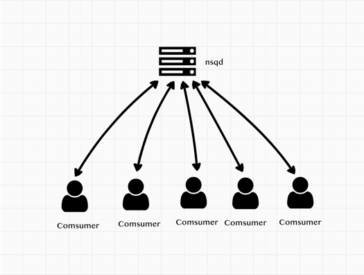
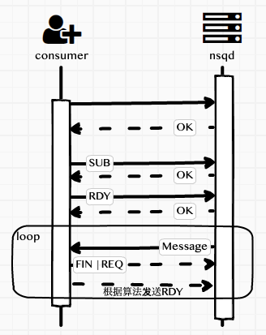
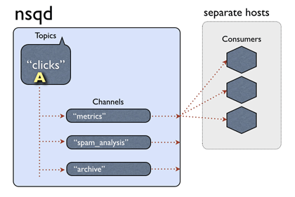

# 剖析nsq消息队列(五)消息的负载处理

实际应用中，一部分服务集群可能会同时订阅同一个topic，并且处于同一个channel下，当nsqd有消息需要发送给订阅客户端去处理时，发给哪个客户端是需要考虑的，也就是我们说的消息负载。



如果不考虑负载的情况，把随机的消息发送到某一客户端去处理消息，如果机器性能不同，可能发生的情况就是某一个或者某几个客户端处理速度慢，但是有大量的新消息需要处理，其他的客户端处于空闲状态。理想状态是，找到当前相对空闲的客户端去处理消息。

> nsq的处理方式是客户端主动向nsqd报告自已的可处理消息数量（也就是RDY命令）。nsqd根据每个连接的客户端的可处理消息的状态来随机把消息发送到可用的客户端，来进行消息处理

如下图所示：



## 客户端更新RDY

前面的文章中我们有配置consumer的config

```go
	config := nsq.NewConfig()
	config.MaxInFlight = 1000
	config.MaxBackoffDuration = 5 * time.Second
	config.DialTimeout = 10 * time.Second
```

MaxInFlight 来设置最大的处理中的消息数量，会根据这个变量计算在是否更新RDY
初始化的时候 客户端会向连接的nsqd服务端来发送updateRDY来设置最大处理数，

```go
func (r *Consumer) maybeUpdateRDY(conn *Conn) {
	inBackoff := r.inBackoff()
	inBackoffTimeout := r.inBackoffTimeout()
	if inBackoff || inBackoffTimeout {
		r.log(LogLevelDebug, "(%s) skip sending RDY inBackoff:%v || inBackoffTimeout:%v",
			conn, inBackoff, inBackoffTimeout)
		return
	}

	remain := conn.RDY()
	lastRdyCount := conn.LastRDY()
	count := r.perConnMaxInFlight()

	// refill when at 1, or at 25%, or if connections have changed and we're imbalanced
	if remain <= 1 || remain < (lastRdyCount/4) || (count > 0 && count < remain) {
		r.log(LogLevelDebug, "(%s) sending RDY %d (%d remain from last RDY %d)",
			conn, count, remain, lastRdyCount)
		r.updateRDY(conn, count)
	} else {
		r.log(LogLevelDebug, "(%s) skip sending RDY %d (%d remain out of last RDY %d)",
			conn, count, remain, lastRdyCount)
	}
}
```
当剩余的可用处理数量remain 小于等于1，或者小于最后一次设置的可用数量lastRdyCount的1/4时,或者可用连接平均的maxInFlight大于0并且小于remain时，则更新RDY状态

当有多个nsqd时，会把最大的消息进行平均计算：

```go
// perConnMaxInFlight calculates the per-connection max-in-flight count.
//
// This may change dynamically based on the number of connections to nsqd the Consumer
// is responsible for.
func (r *Consumer) perConnMaxInFlight() int64 {
	b := float64(r.getMaxInFlight())
	s := b / float64(len(r.conns()))
	return int64(math.Min(math.Max(1, s), b))
}
```
当有消息从nsqd发送过来后也会调用maybeUpdateRDY方法，计算是否需要发送RDY命令

```go
func (r *Consumer) onConnMessage(c *Conn, msg *Message) {
	atomic.AddInt64(&r.totalRdyCount, -1)
	atomic.AddUint64(&r.messagesReceived, 1)
	r.incomingMessages <- msg
	r.maybeUpdateRDY(c)
}
```
上面就是主要的处理逻辑，但还有一些逻辑，就是当消息处理发生错误时，nsq有自己的退避算法backoff也会更新RDY 简单来说就是当发现有处理错误时，来进行重试和指数退避，在退避期间RDY会为0，重试时会先放尝试RDY为1看有没有错误，如果没有错误则全部放开，这个算法这里就不详细说了。

## 服务端nsqd选择客户端发送信息



同时订阅同一topic的客户端（comsumer）有很多个，每个客户端根据自己的配置或状态发送RDY命令到nsqd表明自己能处理多少消息量

nsqd服务端会检查每个客户端的的状态是否可以发送消息。也就是IsReadyForMessages方法，判断inFlightCount是否大于readyCount，如果大于或者等于就不再给客户端发送数据，等待Ready后才会再给客户端发送数据

```go
func (c *clientV2) IsReadyForMessages() bool {
	if c.Channel.IsPaused() {
		return false
	}

	readyCount := atomic.LoadInt64(&c.ReadyCount)
	inFlightCount := atomic.LoadInt64(&c.InFlightCount)

	c.ctx.nsqd.logf(LOG_DEBUG, "[%s] state rdy: %4d inflt: %4d", c, readyCount, inFlightCount)

	if inFlightCount >= readyCount || readyCount <= 0 {
		return false
	}

	return true
```

每一次发送消息inFlightCount会+1并保存到发送中的队列中，当客户端发送FIN会-1在之前的帖子中有说过。

```go
func (p *protocolV2) messagePump(client *clientV2, startedChan chan bool) {
	// ...
	for {
		// 检查订阅状态和消息是否可处理状态	
		if subChannel == nil || !client.IsReadyForMessages() {
			// the client is not ready to receive messages...
			memoryMsgChan = nil
			backendMsgChan = nil
			flusherChan = nil
			// ...
			flushed = true
		} else if flushed {
			memoryMsgChan = subChannel.memoryMsgChan
			backendMsgChan = subChannel.backend.ReadChan()
			flusherChan = nil
		} else {
			memoryMsgChan = subChannel.memoryMsgChan
			backendMsgChan = subChannel.backend.ReadChan()
			flusherChan = outputBufferTicker.C
		}

		select {
		case <-flusherChan:
			// ...
		// 消息处理			
		case b := <-backendMsgChan:
			client.SendingMessage()
			// ...
		case msg := <-memoryMsgChan:
			client.SendingMessage()		
			//...
		}
	}
// ...
}
```

