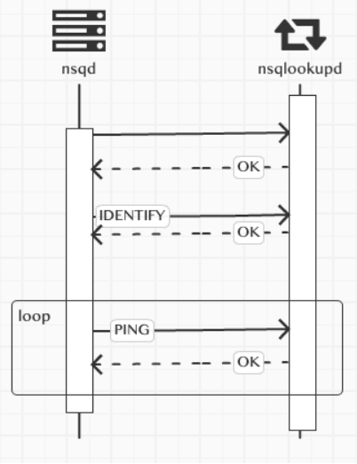
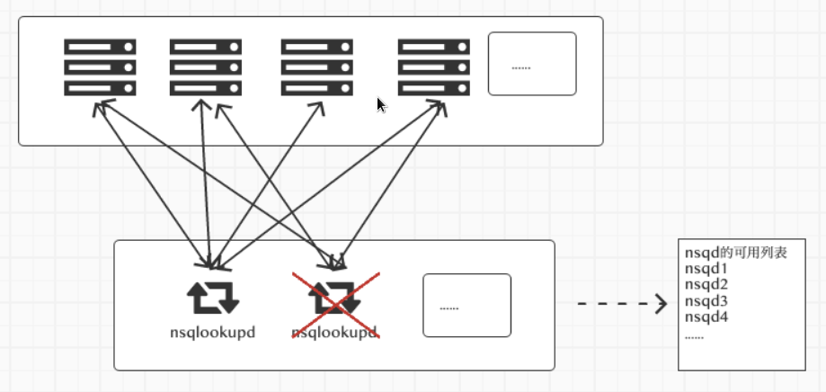
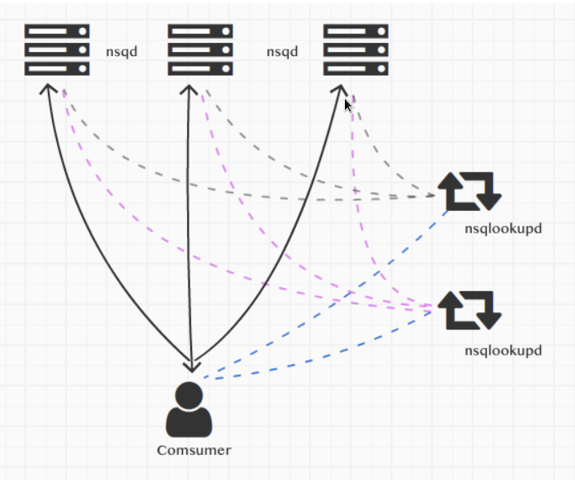
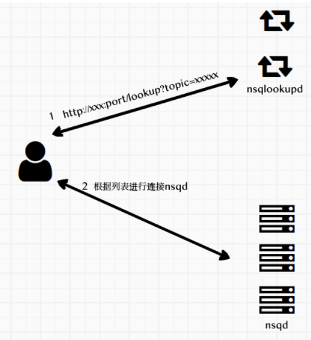
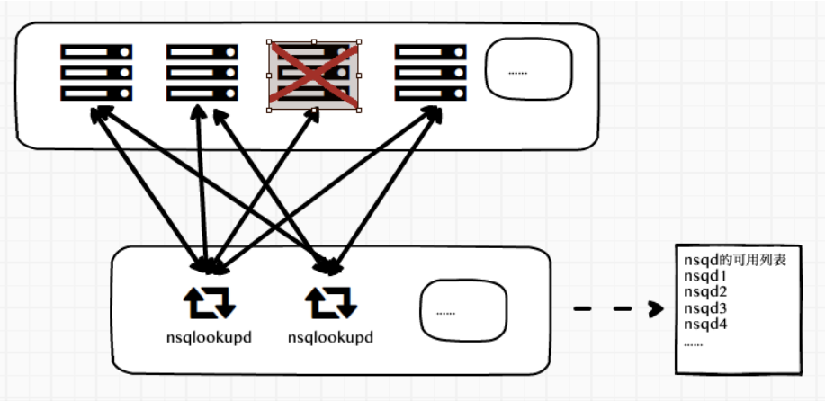

# 剖析nsq消息队列(二)去中心化源码解析

上一篇中介绍了nsq的两种使用方式，一种是直接连接，还有一种是通过nsqlookupd来实现去中心化的方式使用，并大致介绍了一下实现原理，这里结合业务逻辑分析具体的代码。

## nsqd和nsqlookupd的通信实现

上一篇启动nsqd时使用了以下的命令，指定了一个参数--lookupd-tcp-address

```
./nsqd -tcp-address ":8000"  -http-address ":8001" --lookupd-tcp-address=127.0.0.1:8200 --lookupd-tcp-address=127.0.0.1:7200 -data-path=./a
```

--lookupd-tcp-address 用于指定nsqlookupd的tcp监听地址。

nsqd 和 nsqlookupd的通信交流简单来说就是下图这样



nsq启动后连接nsqlookupd，连接成功后，要发送一个魔法标识nsq.MagicV1，他只是用于标明，客户端和服务端双方使用的信息通信版本，不能的版本有不同的处理方式，为了后期做新的消息处理版本方便。

nsqlookupd 的代码块

```go
func (p *tcpServer) Handle(clientConn net.Conn) {	
	// ...
	buf := make([]byte, 4)
	_, err := io.ReadFull(clientConn, buf)
	// ...
	protocolMagic := string(buf)
	// ...
	var prot protocol.Protocol
	switch protocolMagic {
	case "  V1":
		prot = &LookupProtocolV1{ctx: p.ctx}
	default:
		// ...
		return
	}
	err = prot.IOLoop(clientConn)
	//...
}
```

这个时候的nsqd已经和nsqlookupd建立好了连接，但是这时，仅仅说明他俩连接成功。
nsqlookupd也并没有把这个连接加到可用的nsqd列表里。

建立连接完成后，nsqd会发送IDENTIFY命令，这个命令里包含了nsq的基本信息
nsqd的代码

```go
	ci := make(map[string]interface{})
	ci["version"] = version.Binary
	ci["tcp_port"] = n.RealTCPAddr().Port
	ci["http_port"] = n.RealHTTPAddr().Port
	ci["hostname"] = hostname
	ci["broadcast_address"] = n.getOpts().BroadcastAddress

	cmd, err := nsq.Identify(ci)
	if err != nil {
		lp.Close()
		return
	}
	resp, err := lp.Command(cmd)
```

包含了nsqd 提供的tcp和http端口，主机名，版本等等，发送给nsqlookupd,nsqlookupd收到IDENTIFY命令后，解析信息然后加到nsqd的可用列表里

nsqlookupd 的代码块

```go
func (p *LookupProtocolV1) IDENTIFY(client *ClientV1, reader *bufio.Reader, params []string) ([]byte, error) {
	var err error
	if client.peerInfo != nil {
		return nil, protocol.NewFatalClientErr(err, "E_INVALID", "cannot IDENTIFY again")
	}
	var bodyLen int32
	err = binary.Read(reader, binary.BigEndian, &bodyLen)
	// ...
	body := make([]byte, bodyLen)
	_, err = io.ReadFull(reader, body)
	// ...	
	peerInfo := PeerInfo{id: client.RemoteAddr().String()}
	err = json.Unmarshal(body, &peerInfo)
	// ...
	client.peerInfo = &peerInfo
	// 把nsqd的连接加入到可用列表里    
	if p.ctx.nsqlookupd.DB.AddProducer(Registration{"client", "", ""}, &Producer{peerInfo: client.peerInfo}) {
		p.ctx.nsqlookupd.logf(LOG_INFO, "DB: client(%s) REGISTER category:%s key:%s subkey:%s", client, "client", "", "")
	}
	// ...
	return response, nil
}
```
然后每过15秒，会发送一个PING心跳命令给nsqlookupd，这样保持存活状态，nsqlookupd每次收到发过来的PING命令后，也会记下这个nsqd的最后更新时间，这样做为一个筛选条件，如果长时间没有更新，就认为这个节点有问题，不会把这个节点的信息加入到可用列表。

到此为止，一个nsqd就把自己的信息注册到nsqlookupd的可用列表了，我们可以启动多个nsqd和多个nsqlookupd，为nsqd指定多个nsqlookupd，

```
--lookupd-tcp-address=127.0.0.1:8200 --lookupd-tcp-address=127.0.0.1:7200
```

nsqd和所有的nsqlookupd建立连接，注册服务信息，并保持心跳，保证可用列表的更新.

## nsqlookupd挂掉的处理方式

上面说了如果nsq出问题，nsqlookupd的nsqd可用列表就会处理掉这个连接信息，如果nsqlookupd挂掉了怎么办？



目前的处理方式是这样的，无论是心跳，还是其他命令，nsqd会给所有的nsqlookup发送信息，当nsqd发现nsqlookupd出现问题时，在每次发送命令时，会不断的进行重新连接:

```go
func (lp *lookupPeer) Command(cmd *nsq.Command) ([]byte, error) {
	initialState := lp.state
	if lp.state != stateConnected {
		err := lp.Connect()
		if err != nil {
			return nil, err
		}
		lp.state = stateConnected
		_, err = lp.Write(nsq.MagicV1)
		if err != nil {
			lp.Close()
			return nil, err
		}
		if initialState == stateDisconnected {
			lp.connectCallback(lp)
		}
		if lp.state != stateConnected {
			return nil, fmt.Errorf("lookupPeer connectCallback() failed")
		}
	}
	// ...
}
```

如果连接成功，会再次调用connectCallback方法，进行IDENTIFY命令的调用等。

## 客户端和nsqlookupd、nsqd的通信实现

之前介绍了客户端如何连接nsqlookupd来进行通信

```go
    adds := []string{"127.0.0.1:7201", "127.0.0.1:8201"}
	config := nsq.NewConfig()
	config.MaxInFlight = 1000
	config.MaxBackoffDuration = 5 * time.Second
	config.DialTimeout = 10 * time.Second

	topicName := "testTopic1"
	c, _ := nsq.NewConsumer(topicName, "ch1", config)
	testHandler := &MyTestHandler{consumer: c}

	c.AddHandler(testHandler)
	if err := c.ConnectToNSQLookupds(adds); err != nil {
		panic(err)
	}
```

需要注意adds里地址的端口，是nsqlookupd的http端口



调用方法c.ConnectToNSQLookupds(adds)，他的实现是访问nsqlookupd的http端口http://127.0.0.1:7201/lookup?topic=testTopic1 得到提供consumer订阅的topic所有的producers节点信息， url返回的数据信息如下。

```json
{
  "channels": [
    "nsq_to_file",
    "ch1"
  ],
  "producers": [
    {
      "remote_address": "127.0.0.1:58606",
      "hostname": "li-peng-mc-macbook.local",
      "broadcast_address": "li-peng-mc-macbook.local",
      "tcp_port": 8000,
      "http_port": 8001,
      "version": "1.1.1-alpha"
    },
    {
      "remote_address": "127.0.0.1:58627",
      "hostname": "li-peng-mc-macbook.local",
      "broadcast_address": "li-peng-mc-macbook.local",
      "tcp_port": 7000,
      "http_port": 7001,
      "version": "1.1.1-alpha"
    }
  ]
}
```


方法queryLookupd就是进行的上图的操作

- 得到提供订阅的topic 的 nsqd列表

- 进行连接

```go
func (r *Consumer) queryLookupd() {
	retries := 0
retry:
	endpoint := r.nextLookupdEndpoint()

	// ...	
	err := apiRequestNegotiateV1("GET", endpoint, nil, &data)
	if err != nil {
		// ...
	}
	var nsqdAddrs []string
	for _, producer := range data.Producers {
		broadcastAddress := producer.BroadcastAddress
		port := producer.TCPPort
		joined := net.JoinHostPort(broadcastAddress, strconv.Itoa(port))
		nsqdAddrs = append(nsqdAddrs, joined)
	}
	// 进行连接
	for _, addr := range nsqdAddrs {
		err = r.ConnectToNSQD(addr)
		if err != nil && err != ErrAlreadyConnected {
			r.log(LogLevelError, "(%s) error connecting to nsqd - %s", addr, err)
			continue
		}
    }
}
```

## 客户端如何刷新nsqd的可用列表

有新的nsqd加入，是如何处理的呢？在调用ConnectToNSQLookupd时会启一个协程go r.lookupdLoop()调用方法lookupdLoop的定时循环访问queryLookupd更新nsqd的可用列表。

```go
// poll all known lookup servers every LookupdPollInterval
func (r *Consumer) lookupdLoop() {
	// ...
	var ticker *time.Ticker
	select {
	case <-time.After(jitter):
	case <-r.exitChan:
		goto exit
	}
	// 设置Interval 来循环访问 queryLookupd
	ticker = time.NewTicker(r.config.LookupdPollInterval)
	for {
		select {
		case <-ticker.C:
			r.queryLookupd()
		case <-r.lookupdRecheckChan:
			r.queryLookupd()
		case <-r.exitChan:
			goto exit
		}
	}

exit:
	// ...
}
```

处理 nsqd 的单点故障



当有nsqd出现故障时怎么办？当前的处理方式是

nsqdlookupd会把这个故障节点从可用列表中去除，客户端从接口得到的可用列表永远都是可用的。

客户端会把这个故障节点从可用节点上移除，然后要去判断是否使用了nsqlookup进行了连接，如果是则case r.lookupdRecheckChan <- 1 去刷新可用列表queryLookupd，如果不是，然后启动一个协程去定时做重试连接，如果故障恢复，连接成功，会重新加入到可用列表。

客户端实现的代码

```go
func (r *Consumer) onConnClose(c *Conn) {
	// ...
	// remove this connections RDY count from the consumer's total
	delete(r.connections, c.String())
	left := len(r.connections)
	// ...
	r.mtx.RLock()
	numLookupd := len(r.lookupdHTTPAddrs)
	reconnect := indexOf(c.String(), r.nsqdTCPAddrs) >= 0
	// 如果使用的是nslookup则去刷新可用列表
	if numLookupd > 0 {
		// trigger a poll of the lookupd
		select {
		case r.lookupdRecheckChan <- 1:
		default:
		}
	} else if reconnect {
		// ... 
		}(c.String())
	}
}
```

