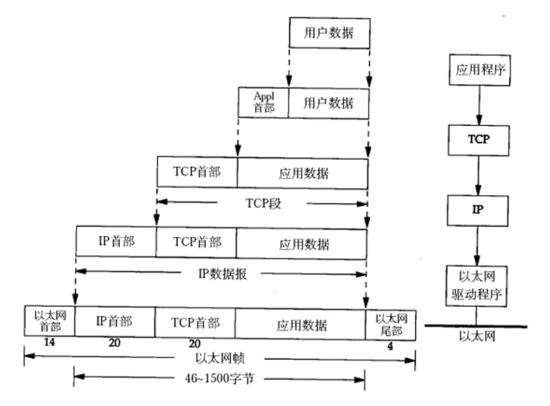

# OSI七层参考模型与TCP/IP四层模型

## OSI七层参考模型

OSI(Open System Interconnection Reference Model)，全名开放式系统互联通信参考模型，是一个试图使各种计算机在全世界范围内互联为网络的标准框架，它定义了网络互联的七层。从下向上依次是：物理层(Physical)，数据链路层(Data Link)，网络层(Network)，传输层(Transport)，会话层(Session)，表示层(Presentation)，应用层(Application)。

各层的主要功能和应用：

1. 应用层(Application Layer)：

主要功能：为应用软件提供接口，使应用程序能够使用网络服务

典型设备：网关

典型协议，标准和应用：http(80)，ftp(20/21)，smtp(25)，pop3(110)，telnet(23)，dns(53)

2. 表示层(Presetation Layer)：

主要功能：数据的解码和编码，数据的加密和解密，数据的压缩和解压缩

典型设备：网关

典型协议、标准和应用：ASCLL，PICT，TIFF，JPEG，MIDI，MPEG

3. 会话层(Session Layer)：

主要功能：建立、维护、管理应用程序之间的会话

典型设备：网关

典型协议、标准和应用：RPC，SQL，NFS，X WINDOWS，ASP

4. 传输层(Transport Layer)：

主要功能：负责建立端到端的链接，保证保温在端到端之间的传输

典型设备：网关

典型协议、标准和应用：TCP，UDP，SPX

5. 网络层(Network Layer)：

主要功能：负责将分组数据从源端传输到目的端，网络层的主要作用就是路由和寻址

典型设备：路由器

典型协议、标准和应用：IP，IPX，APPLETALK，ICMP

6. 数据链接层 (Data Link Layer)：

主要功能：在不可靠的物理链路上，提供可靠的数据传输服务

典型设备：交换机、网桥、网卡

典型协议、标准和应用：802.2，802.3ATM，HDLC，FRAME RELAY

7. 物理层 (Physical Layer)：

主要功能： 利用传输介质为数据链路层提供物理连接，实现比特流的透明传输

典型设备： 集线器、中继器

典型协议、标准和应用： V.35、EIA/TIA-232

## TCP/IP四层模型

互联网协议族(Internet Protocol Suite，缩写为 IPS)，是一个网络通信模型，以及一整个网络传输协议家族，为互联网的基础通信架构。它常被通称为 TCP/IP 协议族(TCP/IP Protocol Suite，或 TCP/IP Protocols)，简称 TCP/IP。由于在网络通讯协议普遍采用分层的结构，当多个层次的协议共同工作时，类似计算机科学中的堆栈，因此又被称为 TCP/IP 协议栈(TCP/IP Protocol Stack)。这些协议最早发源于美国国防部的 ARPA 网项目，由互联网工程任务组负责维护。

TCP/IP 提供点对点的链接机制，将数据应该如何封装，定址，传输，路由以及在目的地如何接收，都加以标准化。它将软件通信过程抽象化为四个抽象层，采取协议堆栈的方式，分别实现出不同通信协议。协议套组下的各种协议，依其功能不同，被分别归属到这四个层次结构之中，常被视为是简化的七层 OSI 模型

TCP/IP 和 OSI 模型组并不能精确的匹配，但是我们可以尽可能的参考 OSI 模型并在其中找到 TCP/IP 的对应位置。主要包括：应用层，传输层，网际层和网络接口层。通常人们认为 OSI 模型最上面三层（应用层、表示层、会话层）在 TCP/IP 中是一个应用层。

1．网络接口层协议

TCP/IP的网络接口层中包括各种物理网络协议，例如Ethernet、令牌环、帧中继、ISDN和分组交换网X.25等。当各种物理网络被用做传输IP数据包的通道时，这种传输过程就可以认为是属于这一层的内容。

2．网络层协议

网络层包括多个重要协议，主要协议有4个，即IP、ARP、RARP和ICMP。

- 网际协议（Internet Protocol，IP）是其中的核心协议，IP协议规定网络层数据分组的格式。

- Internet控制消息协议（Internet Control Message Protocol，ICMP）提供网络控制和消息传递功能。

- 地址解释协议（Address Resolution Protocol，ARP）用来将逻辑地址解析成物理地址。

- 反向地址解释协议（Reverse Address Resolution Protocol，RARP）通过RARP广播，将物理地址解析成逻辑地址。

3．运输层协议

运输层协议主要包含TCP和UDP两个协议。

- 传输控制协议（Transport Control Protocol，TCP）是面向连接的协议，用三次握手和滑动窗口机制来保证传输的可靠性和进行流量控制。

- 用户数据报协议（User Datagram Protocol，UDP）是面向无连接的不可靠运输层协议。

4．应用层协议

应用层包括了众多的应用与应用支撑协议。

常见的应用层协议有：文件传输协议（FTP）、超文本传输协议（HTTP）、简单邮件传输协议（SMTP）、远程登录（Telnet）。

常见的应用支撑协议包括域名服务（DNS）和简单网络管理协议（SNMP）等。

TCP/IP网络模型处理数据的过程描述如下：

1. 生成数据。当用户发送一个电子邮件信息时，它的字母或数字字符被转换成可以通过互联网传输的数据。

2. 为端到端的传输将数据打包。通过对数据打包来实现互联网的传输。通过使用端传输功能确保在两端的信息主机系统之间进行可靠的通信。

3. 在首部上附加目的网络地址。数据被放置在一个分组或者数据报中，其中包含了带有源和目的逻辑地址的网络首部，这些地址有助于网络设备在动态选定的路径上发送这些分组。

4. 附加目的数据链路层MAC地址到数据链路首部。每一个网络设备必须将分组放置在帧中，该帧的首部包括在路径中下一台直接相连设备的物理地址。

5. 传输比特。帧必须转换成“1”和“0”的信息模式，才能在介质上进行传输。时钟功能（Clocking Function）使得设备可以区分这些在介质上传输的比特，物理互联网络上的介质可能随着使用的不同路径而有所不同。例如，电子邮件信息可以起源于一个局域网LAN，通过校园骨干网，然后到达广域网WAN链路，直到到达另一个远端局域网LAN上的目的主机为止。

## TCP/IP族常用协议

应用层： TFTP，HTTP，SNMP，FTP，SMTP，DNS，Telnet 等等

传输层： TCP，UDP

网络层： IP，ICMP，OSPF，EIGRP，IGMP

数据链路层： SLIP，CSLIP，PPP，MTU

