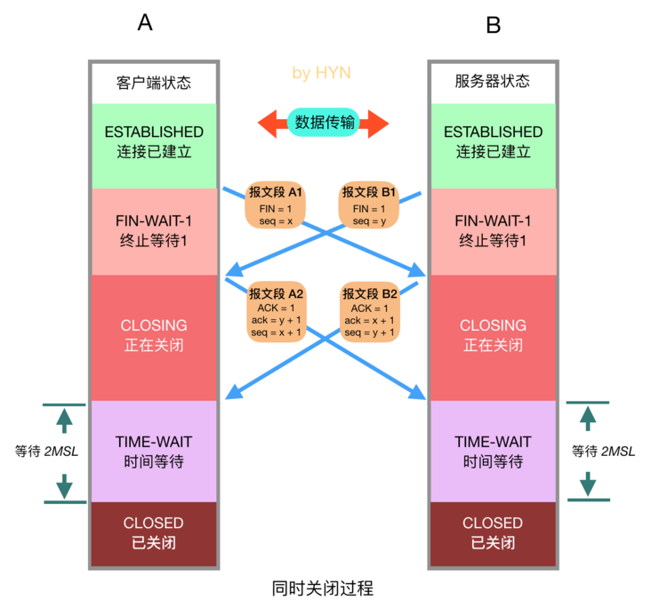

# TCP三次握手与四次挥手

## TCP报文段结构

- 源端口与目标端口：计算机上的进程要和其他进程通信是要通过计算机端口的，而一个计算机端口某个时刻只能被一个进程占用，所以通过指定源端口和目标端口，就可以知道是哪两个进程需要通信。源端口、目标端口是用 16 位表示的，可推算计算机的端口个数为 2^16 个。

- 序列号：表示本报文段所发送数据的第一个字节的编号。在 TCP 连接中所传送的字节流的每一个字节都会按顺序编号。由于序列号由 32 位表示，所以每 2^32 个字节，就会出现序列号回绕，再次从 0 开始。那如何区分两个相同序列号的不同 TCP 报文段就是一个问题了，后面会有答案，暂时可以不管。

- 确认号：表示接收方期望收到发送方下一个报文段的第一个字节数据的编号。也就是告诉发送发：我希望你（指发送方）下次发送的数据的第一个字节数据的编号是这个确认号。也就是告诉发送方：我希望你（指发送方）下次发送给我的 TCP 报文段的序列号字段的值是这个确认号。

- TCP首部长度：由于 TCP 首部包含一个长度可变的选项部分，所以需要这么一个值来指定这个 TCP 报文段到底有多长。或者可以这么理解：就是表示 TCP 报文段中数据部分在整个 TCP 报文段中的位置。该字段的单位是 32 位字，即：4 个字节。

- URG：表示本报文段中发送的数据是否包含紧急数据。URG=1，表示有紧急数据。后面的紧急指针字段只有当 URG=1 时才有效。

- ACK：表示是否前面的确认号字段是否有效。ACK=1，表示有效。只有当 ACK=1 时，前面的确认号字段才有效。TCP 规定，连接建立后，ACK 必须为 1。

- PSH：告诉对方收到该报文段后是否应该立即把数据推送给上层。如果为 1，则表示对方应当立即把数据提交给上层，而不是缓存起来。

- RST：只有当 RST=1 时才有用。如果你收到一个 RST=1 的报文，说明你与主机的连接出现了严重错误（如主机崩溃），必须释放连接，然后再重新建立连接。或者说明你上次发送给主机的数据有问题，主机拒绝响应。

- SYN：在建立连接时使用，用来同步序号。当 SYN=1，ACK=0 时，表示这是一个请求建立连接的报文段；当 SYN=1，ACK=1 时，表示对方同意建立连接。SYN=1，说明这是一个请求建立连接或同意建立连接的报文。只有在前两次握手中 SYN 才置为 1。

- FIN：标记数据是否发送完毕。如果 FIN=1，就相当于告诉对方：“我的数据已经发送完毕，你可以释放连接了”

- 窗口大小：表示现在运行对方发送的数据量。也就是告诉对方，从本报文段的确认号开始允许对方发送的数据量。

- 校验和：提供额外的可靠性。具体如何校验，参考其他资料。

- 紧急指针：标记紧急数据在数据字段中的位置。

- 选项部分：其最大长度可根据 TCP 首部长度进行推算。TCP 首部长度用 4 位表示，那么选项部分最长为：(2^4-1)*4-20=40 字节。

## TCP的连接控制

### 建立连接(三次握手)

TCP的重要特性之一就是面向连接，连接双方在发送数据之前必须经理握手的阶段，具体过程如下：

1. 第一次握手：客户端向服务器发送报文段1，其中的SYN标志位的值为1，表示这是一个用于请求发起连接的报文段，其中的序列号字段seq被设置为初始序号x(Initial Sequence Number，ISN)，TCP连接双方均可随机选择初始序号。发送完报文段1后，客户端进入SYN-SENT状态，等待服务器的确认。

2. 第二次握手：服务器收到客户端连接请求后，向客户端发送报文段2作为应答，其中ACK标志位设置为1，表示对客户端做出应答，其中确认序号字段ack生效，该字段的值设置为x+1，也就是从客户端收到的报文段加一，代表服务器期望下次收到客户端的数据的序号。此外，报文段2的 SYN 标志位也设置为1，代表这同时也是一个用于发起连接的报文段，序号 seq 设置为服务器初始序号y。发送完报文段2后，服务器进入 SYN-RECEIVED 状态。

3. 第三次握手：客户端在收到报文段2后，向服务器发送报文段3，其ACK标志位为1，代表对服务器做出应答，确认序号字段 ack 为 y + 1，序号字段 seq 为 x + 1。此报文段发送完毕后，双方都进入 ESTABLISHED 状态，表示连接已建立。

### 常见问题

1. TCP 建立连接为什么要三次握手而不是两次或者四次？

- 防止已过期的连接请求报文传送到服务器，产生错误。

    如果两次握手即可建立连接，假设客户端发送 A 报文段请求建立连接，由于网络原因造成 A 暂时无法到达服务器，服务器接收不到请求报文段就不会返回确认报文段，客户端在长时间得不到应答的情况下重新发送请求报文段 B，这次 B 顺利到达服务器，服务器随即返回确认报文并进入 ESTABLISHED 状态，客户端在收到 确认报文后也进入 ESTABLISHED 状态，双方建立连接并传输数据，之后正常断开连接。此时姗姗来迟的 A 报文段才到达服务器，服务器随即返回确认报文并进入 ESTABLISHED 状态，但是已经进入 CLOSED 状态的客户端无法再接受确认报文段，更无法进入 ESTABLISHED 状态，这将导致服务器长时间单方面等待，造成资源浪费。

- 三次握手才能让双方均确认自己和对方的发送和接收能力都正常。

    第一次握手：客户端只是发送处请求报文段，什么都无法确认，而服务器可以确认自己的接收能力和对方的发送能力正常；

    第二次握手：客户端可以确认自己发送能力和接收能力正常，对方发送能力和接收能力正常；

    第三次握手：服务器可以确认自己发送能力和接收能力正常，对方发送能力和接收能力正常；

    可见三次握手才能让双方都确认自己和对方的发送和接收能力全部正常，这样就可以正常进行通信了。

- 告知对方自己的初始序号值，并确认收到对方的序号值。

    TCP 实现了可靠的数据传输，原因之一就是 TCP 报文段中维护了序号字段和确认序号字段，也就是图中的 seq 和 ack，通过这两个字段双方都可以知道在自己发出的数据中，哪些是已经被对方确认接收的。这两个字段的值会在初始序号值得基础递增，如果是两次握手，只有发起方的初始序号可以得到确认，而另一方的初始序号则得不到确认

2. 利用TCP连接机制的网络攻击方式

    在三次握手过程中，服务器在收到了客户端的 SYN 报文段后，会分配并初始化连接变量和缓存，并向客户端发送 SYN + ACK 报文段，这相当于是打开了一个半开连接 (half-open connection)，会消耗服务器资源。如果客户端正常返回了 ACK 报文段，那么双方可以正常建立连接，否则，服务器在等待一分钟后会终止这个半开连接并回收资源。这样的机制为 SYN洪泛攻击 (SYN flood attack)提供了机会，这是一种经典的 DoS攻击 (Denial of Service，拒绝服务攻击)，所谓的拒绝服务攻击就是通过进行攻击，使受害主机或网络不能提供良好的服务，从而间接达到攻击的目的。在 SYN 洪水攻击中，攻击者发送大量的 SYN 报文段到服务器请求建立连接，但是却不进行第三次握手，这会导致服务器打开大量的半开连接，消耗大量的资源，最终无法进行正常的服务。

    解决方法：SYN Cookies，现在大多数主流操作系统都有这种防御系统。SYN Cookies 是对 TCP 服务器端的三次握手做一些修改，专门用来防范 SYN 洪泛攻击的一种手段。它的原理是，在服务器接收到 SYN 报文段并返回 SYN + ACK 报文段时，不再打开一个半开连接，也不分配资源，而是根据这个 SYN 报文段的重要信息 (包括源和目的 IP 地址，端口号可一个秘密数)，利用特定散列函数计算出一个 cookie 值。这个 cookie 作为将要返回的SYN + ACK 报文段的初始序列号(ISN)。当客户端返回一个 ACK 报文段时，服务器根据首部字段信息计算 cookie，与返回的确认序号(初始序列号 + 1)进行对比，如果相同，则是一个正常连接，然后分配资源并建立连接，否则拒绝建立连接。

### 同时打开

这是 TCP 建立连接的特殊情况，有时会出现两台机器同时执行主动打开的情况，不过概率非常小，这种情况大家仅作了解即可。在这种情况下就无所谓发送方和接收方了，双放都可以称为客户端和服务器，同时打开的过程如下：

如图所示，双方在同一时刻发送 SYN 报文段，并进入 SYN-SENT 状态，在收到 SYN 后，状态变为 SYN-RECEIVED，同时它们都再发送一个 SYN + ACK 的报文段，状态都变为 ESTABLISHED，连接成功建立。在此过程中双方一共交换了4个报文段，比三次握手多一个。

### 关闭连接(四次挥手)

建立一个连接需要三次握手，而终止一个连接需要四次挥手，这是由于TCP的半关闭造成的。既然一个TCP连接是双工的(数据在两个方向上可以同时传递)，因此每个方向必须单独进行关闭。原则是当一方完成它的数据发送任务后就能发送一个 FIN 来终止这个方向连接。当一端收到一个 FIN，它必须通知应用层另一端已经终止了数据传送。理论上客户端和服务器都可以发起主动关闭，但是更多的情况下是客户端主动发起。

四次挥手的具体过程如下：

1. 客户端发送关闭连接的报文段，FIN标志位为1，请求关闭连接，并停止发送数据。序列号字段seq=x，然后客户端会进入 FIN-WAIT-1 状态，等待来自服务器的确认报文。

2. 服务器收到 FIN 报文后，发回确认报文，ACK = 1， ack = x + 1，并带上自己的序号 seq = y，然后服务器就进入 CLOSE-WAIT 状态。服务器还会通知上层的应用程序对方已经释放连接，此时 TCP 处于半关闭状态，也就是说客户端已经没有数据要发送了，但是服务器还可以发送数据，客户端也还能够接收。

3. 客户端收到服务器的 ACK 报文段后随即进入 FIN-WAIT-2 状态，此时还能收到来自服务器的数据，直到收到 FIN 报文段。

4. 服务器发送完所有数据后，会向客户端发送 FIN 报文段，各字段值如图所示，随后服务器进入 LAST-ACK 状态，等待来自客户端的确认报文段。

5. 客户端收到来自服务器的 FIN 报文段后，向服务器发送 ACK 报文，随后进入 TIME-WAIT 状态，等待 2MSL(2 * Maximum Segment Lifetime，两倍的报文段最大存活时间) ，这是任何报文段在被丢弃前能在网络中存在的最长时间，常用值有30秒、1分钟和2分钟。如无特殊情况，客户端会进入 CLOSED 状态。

6. 服务器在接收到客户端的 ACK 报文后会随即进入 CLOSED 状态，由于没有等待时间，一般而言，服务器比客户端更早进入 CLOSED 状态。

### 常见问题

1. 为什么TCP关闭连接要四次而不是三次？

    服务器在收到客户端的FIN报文段后，可能还有一些数据要传输，所以不能马上关闭连接，但是会做出应答，返回ACK报文段，接下来可能会继续发送数据，在数据发送完后，服务器会向客户单发送 FIN 报文，表示数据已经发送完毕，请求关闭连接，然后客户端再做出应答，因此一共需要四次挥手。

2. 客户端为什么需要在TIME-WAIT状态等待2MSL时间才能进入CLOSED状态？

    按照常理，在网络正常的情况下，四个报文段发送完后，双方就可以关闭连接进入 CLOSED 状态了，但是网络并不总是可靠的，如果客户端发送的 ACK 报文段丢失，服务器在接收不到 ACK 的情况下会一直重发 FIN 报文段，这显然不是我们想要的。因此客户端为了确保服务器收到了 ACK，会设置一个定时器，并在 TIME-WAIT 状态等待 2MSL 的时间，如果在此期间又收到了来自服务器的 FIN 报文段，那么客户端会重新设置计时器并再次等待 2MSL 的时间，如果在这段时间内没有收到来自服务器的 FIN 报文，那就说明服务器已经成功收到了 ACK 报文，此时客户端就可以进入 CLOSED 状态了。

### 同时关闭

之前在介绍 TCP 建立连接的时候会有一种特殊情况，那就是同时打开，与之对应地， TCP 关闭时也会有一种特殊情况，那就是同时关闭，这种情况仅作了解即可，流程图如下：

这种情况下，双方应用层同时发出关闭命令，这将导致双方各发送一个 FIN，两端均从 ESTABLISHED 变为 FIN_WAIT_1，两个 FIN 经过网络传送后分别到达另一端。收到 FIN 后，状态由 FIN_WAIT_1 变迁到 CLOSING，并发送最后的 ACK，当收到最后的 ACK 时，为确保对方也收到 ACK，状态变化为 TIME_WAIT，并等待 2MSL 时间，如果一切正常，随后会进入 CLOSED 状态。

