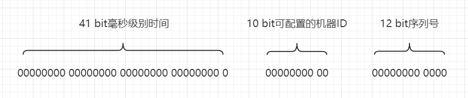
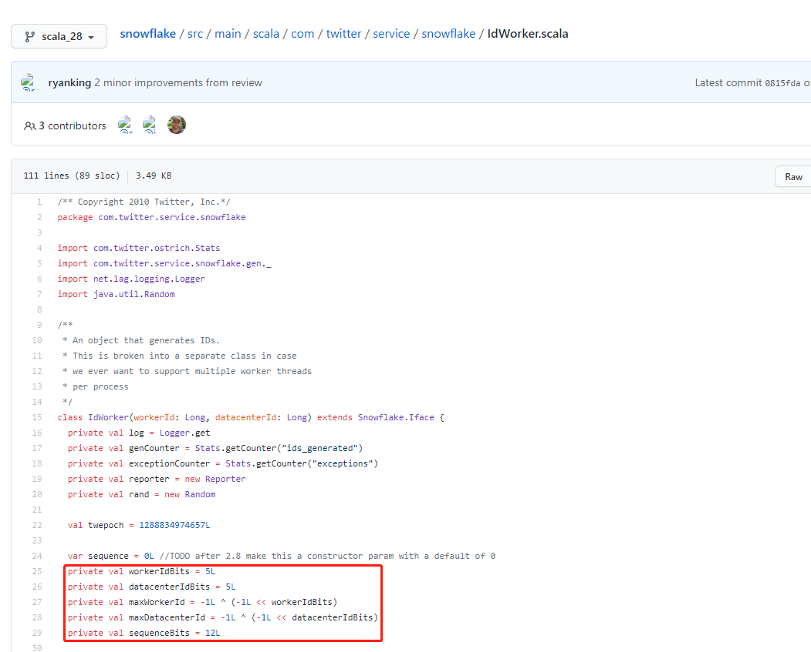
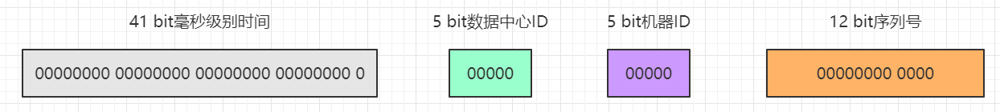
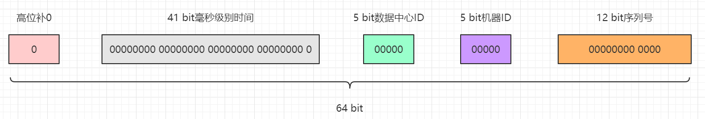
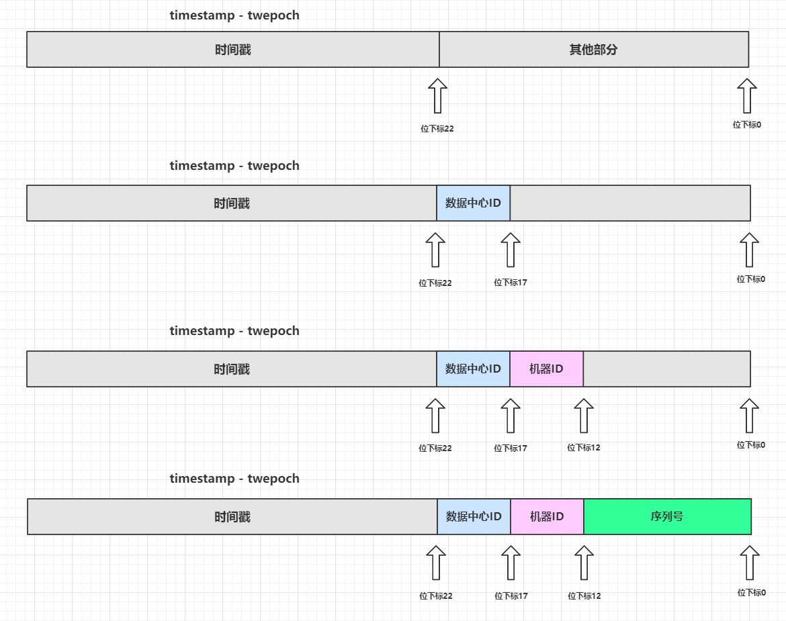
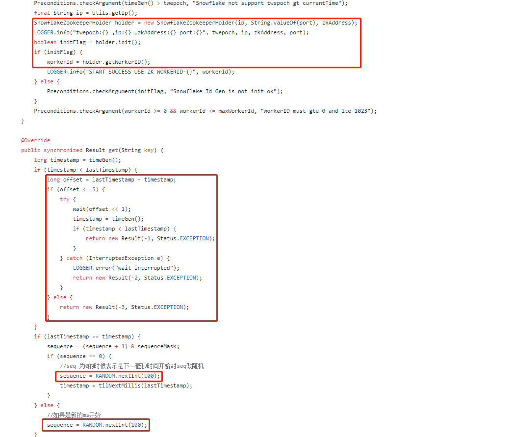
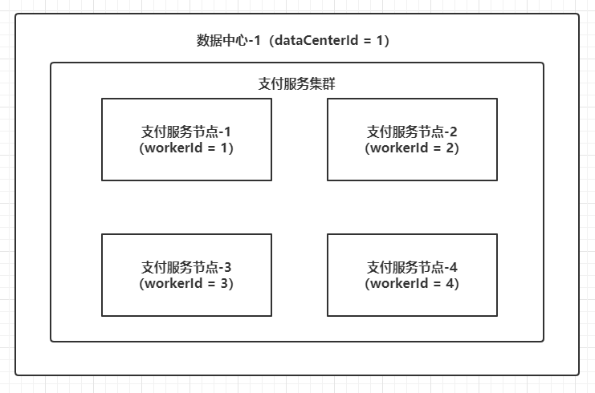

# 理解snowflake算法的实现原理

Snowflake是Twitter开源的高性能ID生成算法服务。初始版本于2010年发布，而Twitter内部使用的Snowflake是一个完全重写的程序，在很大程度上依靠Twitter上的现有的基础架构来运行。

而2010年发布的初版Snowflake源码是使用Scala语言编写的，归档于scala_28分支。换言之，大家目前使用的Snowflake算法原版或者改良版已经是十年前的产物，不得不说的是这个算法确实比较厉害。

该算法的动机和要求：

### 动机

- Cassandra中没有生成顺序ID的工具，Twitter由使用MySQL转向使用Cassandra的时候需要一种新的方式来生成ID

### 要求

- 高性能：每秒每个进程至少产生10K个ID，加上网络延迟响应速度要在2ms内。

- 顺序性：具备按照时间的自增趋势，可以直接排序。

- 紧凑性：保持生成的ID的长度在64 bit或更短。

- 高可用：ID生成方案需要和存储服务一样高可用。

下面就snowflake的源码来分析一下他的实现原理

## Snowflake方案概述

Snowflake的初版设计方案是：

- 时间：41 bit长度，使用毫秒级别精度，带有一个自定义epoch，那么可能使用大概69年。

- 可配置的机器ID：10 bit长度，可以满足1024个机器使用。

- 序列号：12 bit长度，可以在4096个数字中随机取值，从而避免单个机器在1ms内生成重复的序列号。



但是在实际源码实现中，Snowflake把10 bit的可配置的机器ID拆分为5 bit的Work ID(可以理解为机器ID)和5 bit的Data Center ID(数据中心ID)，详情见IdWorker.scala



也就是说，支持配置最多32个机器ID和最多32个数据中心ID。



由于算法是Scala语言编写，是依赖于JVM的语言，返回的ID值为Long类型，也就是64 bit的整数，原来的算法生成序列中只使用了63 bit的长度，要返回的是无符号数，所以在高位补一个0(占用1 bit)，那么加起来整个ID的长度就是64 bit。



其中：

- 41 bit毫秒级别时间戳的取值范围：[0, 2^41 - 1] => 0 ~ 2199023255551，一共2199023255552个数字。

- 5 bit机器ID的取值范围：[0, 2^5 - 1] => 0 ~ 31，一共32个数字。

- 5 bit数据中心ID的取值范围是：[0, 2^5 - 1] => 0 ~ 31，一共32个数字。

- 12 bit序列号的取值范围是：[0, 2^12 - 1] => 0 ~ 4095，一共4096个数字。

那么理论上可以生成2199023255552 * 32 * 32 * 4096个完全不同的ID值。

Snowflake算法还有一个明显的特征：依赖于系统时钟。41 bit长度毫秒级别的时间来源于系统时间戳，所以必须保证系统时间是向前递进，不能发生时钟回拨，也就是不能在同一个时刻产生多个相同的时间戳或者产生了过去的时间戳。一旦发生时钟回拨，Snowflake会拒绝生成下一个ID。

## 位运算知识补充

Snowflake算法中使用了大量的位运算。由于整数的补码才是计算机中的存储形式，Java或者Scala中的整型都使用补码表示，这里补充一下源码和补码的知识。

- 原码用于阅读，补码用于计算。

- 正数的补码与其原码相同。

- 负数的补码是除最高位其他所有位取反，然后加1（反码加1），而负数的补码还原为原码也是使用这个方式。

- +0的原码是0000 0000，而-0的原码是1000 0000，补码只有一个0值，用0000 0000表示，这一点很重要，补码的0没有二义性。

简单举一个例子：

```shell
* [+ 11] 原码 = [0000 1011] 补码 = [0000 1011]
* [- 11] 原码 = [1000 1011] 补码 = [1111 0101]

* [- 11]的补码计算过程： 
        原码                  1000 1011
        除了最高位其他位取反     1111 0100
        加1                   1111 0101  （补码） 
```

使用原码、反码在计算的时候得到的不一定是准确的值，而使用补码的时候计算结果才是正确的，记住这个结论即可，这里不在举例。由于Snowflake的ID生成方案中，除了最高位，其他四个部分都是无符号整数，所以四个部分的整数使用补码进行位运算的效率会比较高，也只有这样才能满足Snowflake高性能设计的初衷。Snowflake算法中使用了几种位运算：异或（^）、按位与（&）、按位或（|）和带符号左移（<<）。

### 异或

异或的运算规则是：0^0=0 0^1=1 1^0=1 1^1=0，也就是位不同则结果为1，位相同则结果为0。主要作用是：

- 特定位翻转，也就是一个数和N个位都为1的数进行异或操作，这对应的N个位都会翻转，例如0100 & 1111，结果就是1011。

- 与0项异或，则结果和原来的值一致。

- 两数的值交互：a=a^b b=b^a a=a^b，这三个操作完成之后，a和b的值完成交换。

这里推演一下最后一条：

```shell
* [+ 11] 原码 = [0000 1011] 补码 = [0000 1011] a
* [- 11] 原码 = [1000 1011] 补码 = [1111 0101] b

a=a^b          0000 1011
               1111 0101
               ---------^
               1111 1110
b=b^a          1111 0101
               ---------^
               0000 1011  （十进制数：11） b
a=a^b          1111 1110
               ---------^
               1111 0101  （十进制数：-11） a 
```

### 按位与

按位与的运算规则是：0&0=0 0&1=0 1&0=0 1&1=1，只有对应的位都为1的时候计算结果才是1，其他情况的计算结果都是0。主要作用是：

- 清零，如果想把一个数清零，那么和所有位为0的数进行按位与即可。

- 取一个数中的指定位，例如要取X中的低4位，只需要和zzzz...1111进行按位与即可，例如取1111 0110的低4位，则11110110 & 00001111即可得到00000110。

### 按位或

按位与的运算规则是：0|0=0 0|1=1 1|0=1 1|1=1，只要有其中一个位存在1则计算结果是1，只有两个位同时为0的情况下计算结果才是0。主要作用是：

- 对一个数的部分位赋值为1，只需要和对应位全为0的数做按位或操作就行，例如1011 0000如果低4位想全部赋值为1，那么10110000 | 00001111即可得到1011 1111。

### 带符号左移

带符号左移的运算符是<<，一般格式是：M << n。作用如下：

- M的二进制数（补码）向左移动n位。

- 左边（高位）移出部分直接舍弃，右边（低位）移入部分全部补0。

- 移位结果：相当于M的值乘以2的n次方，并且0、正、负数通用。

- 移动的位数超过了该类型的最大位数，那么编译器会对移动的位数取模，例如int移位33位，实际上只移动了33 % 2 = 1位。

推演过程如下（假设n = 2）：

```shell
* [+ 11] 原码 = [0000 1011] 补码 = [0000 1011]
* [- 11] 原码 = [1000 1011] 补码 = [1111 0101]

* [+ 11 << 2]的计算过程
      补码          0000 1011
      左移2位       0000 1011  
      舍高补低      0010 1100
      十进制数      2^2 + 2^3 + 2^5 = 44

* [- 11 << 2]的计算过程
      补码          1111 0101
      左移2位       1111 0101  
      舍高补低      1101 0100 
      原码         1010 1100 （补码除最高位其他所有位取反再加1）
      十进制数    - (2^2 + 2^3 + 2^5) = -44
```

### 组合技巧

利用上面提到的三个位运算符，相互组合可以实现一些高效的计算方案。

#### 计算n个bit能表示的最大数值：

Snowflake算法中有这样的代码：

```java
// 机器ID的位长度
private val workerIdBits = 5L;
// 最大机器ID -> 31
private val maxWorkerId = -1L ^ (-1L << workerIdBits);
```

这里的算子是-1L ^ (-1L << 5L)，整理运算符的顺序，再使用64 bit的二进制数推演计算过程如下：

```shell
* [-1] 的补码         11111111 11111111 11111111 11111111 11111111 11111111 11111111 11111111
  左移5位             11111111 11111111 11111111 11111111 11111111 11111111 11111111 11100000
  [-1] 的补码         11111111 11111111 11111111 11111111 11111111 11111111 11111111 11111111
  异或                ----------------------------------------------------------------------- ^ 
  结果的补码          00000000 00000000 00000000 00000000 00000000 00000000 00000000 00011111  （十进制数 2^0 + 2^1 + 2^2 + 2^3 + 2^4 = 31）
```
这样就能计算出5 bit能表示的最大数值n，n为整数并且0 <= n <= 31，即0、1、2、3...31。Worker ID和Data Center ID部分的最大值就是使用这种组合运算得出的。

#### 用固定位的最大值作为Mask避免溢出：

Snowflake算法中有这样的代码：

```java
var sequence = 0L
......
private val sequenceBits = 12L
// 这里得到的是sequence的最大值4095
private val sequenceMask = -1L ^ (-1L << sequenceBits)
......
sequence = (sequence + 1) & sequenceMask
```
最后这个算子其实就是sequence = (sequence + 1) & 4095，假设sequence当前值为4095，推演一下计算过程：

```shell
* [4095] 的补码                 00000000 00000000 00000000 00000000 00000000 00000000 00000111 11111111
  [sequence + 1] 的补码         00000000 00000000 00000000 00000000 00000000 00000000 00001000 00000000
  按位与                        ----------------------------------------------------------------------- &
  计算结果                      00000000 00000000 00000000 00000000 00000000 00000000 00000000 00000000  （十进制数：0）
```
也就是x = (x + 1) & (-1L ^ (-1L << N))能保证最终得到的x值不会超过N，这是利用了按位与中的"取指定位"的特性。

## Snowflake算法实现源码分析

Snowflake虽然用Scala语言编写，语法其实和Java差不多，当成Java代码这样阅读就行，下面阅读代码的时候会跳过一些日志记录和度量统计的逻辑。先看IdWorker.scala的属性值：

```java
// 定义基准纪元值，这个值是北京时间2010-11-04 09:42:54，估计就是2010年初版提交代码时候定义的一个时间戳
val twepoch = 1288834974657L

// 初始化序列号为0
var sequence = 0L //TODO after 2.8 make this a constructor param with a default of 0

// 机器ID的最大位长度为5
private val workerIdBits = 5L

// 数据中心ID的最大位长度为5
private val datacenterIdBits = 5L

// 最大的机器ID值，十进制数为为31
private val maxWorkerId = -1L ^ (-1L << workerIdBits)

// 最大的数据中心ID值，十进制数为为31
private val maxDatacenterId = -1L ^ (-1L << datacenterIdBits)

// 序列号的最大位长度为12
private val sequenceBits = 12L

// 机器ID需要左移的位数12
private val workerIdShift = sequenceBits

// 数据中心ID需要左移的位数 = 12 + 5
private val datacenterIdShift = sequenceBits + workerIdBits

// 时间戳需要左移的位数 = 12 + 5 + 5
private val timestampLeftShift = sequenceBits + workerIdBits + datacenterIdBits

// 序列号的掩码，十进制数为4095
private val sequenceMask = -1L ^ (-1L << sequenceBits)

// 初始化上一个时间戳快照值为-1
private var lastTimestamp = -1L

// 下面的代码块为参数校验和初始化日志打印，这里不做分析
if (workerId > maxWorkerId || workerId < 0) {
exceptionCounter.incr(1)
throw new IllegalArgumentException("worker Id can't be greater than %d or less than 0".format(maxWorkerId))
}

if (datacenterId > maxDatacenterId || datacenterId < 0) {
exceptionCounter.incr(1)
throw new IllegalArgumentException("datacenter Id can't be greater than %d or less than 0".format(maxDatacenterId))
}

log.info("worker starting. timestamp left shift %d, datacenter id bits %d, worker id bits %d, sequence bits %d, workerid %d",
timestampLeftShift, datacenterIdBits, workerIdBits, sequenceBits, workerId)
```
接着看代码的核心算法逻辑：

```java
// 同步方法，其实就是protected synchronized long nextId(){ ...... }
protected[snowflake] def nextId(): Long = synchronized {
    // 获取系统时间戳（毫秒）
    var timestamp = timeGen()
    // 高并发场景，同一毫秒内生成多个ID
    if (lastTimestamp == timestamp) {
        // 确保sequence + 1之后不会溢出，最大值为4095，其实也就是保证1毫秒内最多生成4096个ID值
        sequence = (sequence + 1) & sequenceMask
        // 如果sequence溢出则变为0，说明1毫秒内并发生成的ID数量超过了4096个，这个时候同1毫秒的第4097个生成的ID必须等待下一毫秒
        if (sequence == 0) {
            // 死循环等待下一个毫秒值，直到比lastTimestamp大
            timestamp = tilNextMillis(lastTimestamp)
        }
    } else {
        // 低并发场景，不同毫秒中生成ID
        // 不同毫秒的情况下，由于外层方法保证了timestamp大于或者小于lastTimestamp，而小于的情况是发生了时钟回拨，下面会抛出异常，所以不用考虑
        // 也就是只需要考虑一种情况：timestamp > lastTimestamp，也就是当前生成的ID所在的毫秒数比上一个ID大
        // 所以如果时间戳部分增大，可以确定整数值一定变大，所以序列号其实可以不用计算，这里直接赋值为0
        sequence = 0
    }
    // 获取到的时间戳比上一个保存的时间戳小，说明时钟回拨，这种情况下直接抛出异常，拒绝生成ID
    // 个人认为，这个方法应该可以提前到var timestamp = timeGen()这段代码之后
    if (timestamp < lastTimestamp) {
      exceptionCounter.incr(1)
      log.error("clock is moving backwards.  Rejecting requests until %d.", lastTimestamp);
      throw new InvalidSystemClock("Clock moved backwards.  Refusing to generate id for %d milliseconds".format(lastTimestamp - timestamp));
    }
    // lastTimestamp保存当前时间戳，作为方法下次被调用的上一个时间戳的快照
    lastTimestamp = timestamp
    // 度量统计，生成的ID计数器加1
    genCounter.incr()
    // X = (系统时间戳 - 自定义的纪元值) 然后左移22位
    // Y = (数据中心ID左移17位)
    // Z = (机器ID左移12位)
    // 最后ID = X | Y | Z | 计算出来的序列号sequence
    ((timestamp - twepoch) << timestampLeftShift) |
      (datacenterId << datacenterIdShift) |
      (workerId << workerIdShift) | 
      sequence
}

// 辅助方法：获取系统当前的时间戳（毫秒）
protected def timeGen(): Long = System.currentTimeMillis()

// 辅助方法：获取系统当前的时间戳（毫秒），用死循环保证比传入的lastTimestamp大，也就是获取下一个比lastTimestamp大的毫秒数
protected def tilNextMillis(lastTimestamp: Long): Long = {
    var timestamp = timeGen()
    while (timestamp <= lastTimestamp) {
      timestamp = timeGen()
    }
    timestamp
}
```
最后一段逻辑的位操作比较多，但是如果熟练使用位运算操作符，其实逻辑并不复杂，这里可以画个图推演一下：



四个部分的整数完成左移之后，由于空缺的低位都会补充了0，基于按位或的特性，所有低位只要存在1，那么对应的位就会填充为1，由于四个部分的位不会越界分配，所以这里的本质就是：四个部分左移完毕后最终的数字进行加法计算。

## Snowflake算法改良

Snowflake算法有几个比较大的问题：

- 低并发场景会产生连续偶数，原因是低并发场景系统时钟总是走到下一个毫秒值，导致序列号重置为0。

- 依赖系统时钟，时钟回拨会拒绝生成新的ID（直接抛出异常）。

- Woker ID和Data Center ID的管理比较麻烦，特别是同一个服务的不同集群节点需要保证每个节点的Woker ID和Data Center ID组合唯一。

这三个问题美团开源的Leaf提供了解决思路，下图截取自com.sankuai.inf.leaf.snowflake.SnowflakeIDGenImpl：



对应的解决思路是（不进行深入的源码分析，有兴趣可以阅读以下Leaf的源码）：

- 序列号生成添加随机源，会稍微减少同一个毫秒内能产生的最大ID数量。

- 时钟回拨则进行一定期限的等待。

- 使用Zookeeper缓存和管理Woker ID和Data Center ID。

Woker ID和Data Center ID的配置是极其重要的，对于同一个服务（例如支付服务）集群的多个节点，必须配置不同的机器ID和数据中心ID或者同样的数据中心ID和不同的机器ID（简单说就是确保Woker ID和Data Center ID的组合全局唯一），否则在高并发的场景下，在系统时钟一致的情况下，很容易在多个节点产生相同的ID值，所以一般的部署架构如下：



管理这两个ID的方式有很多种，或者像Leaf这样的开源框架引入分布式缓存进行管理，再如笔者所在的创业小团队生产服务比较少，直接把Woker ID和Data Center ID硬编码在服务启动脚本中，然后把所有服务使用的Woker ID和Data Center ID统一登记在团队内部知识库中。

