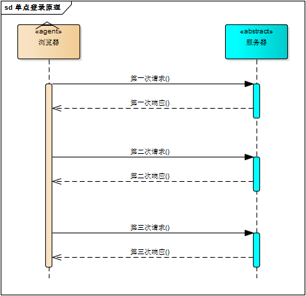
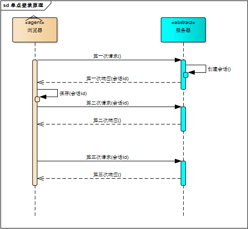
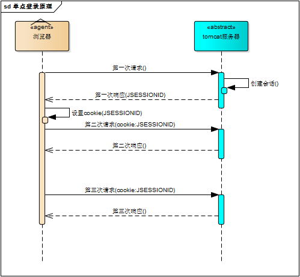
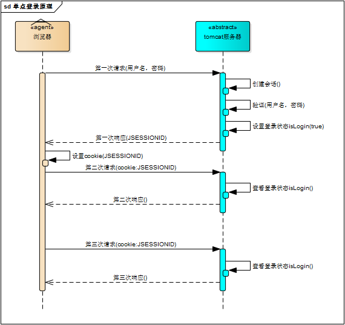
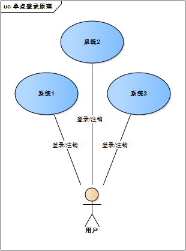
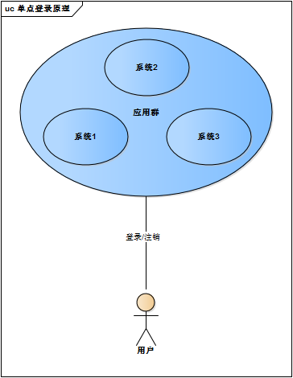
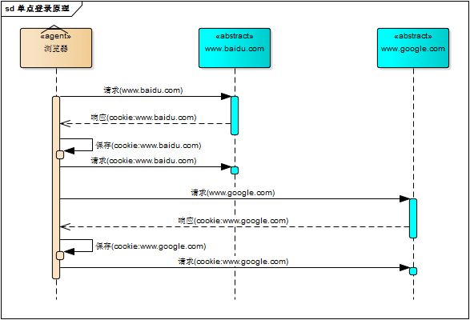
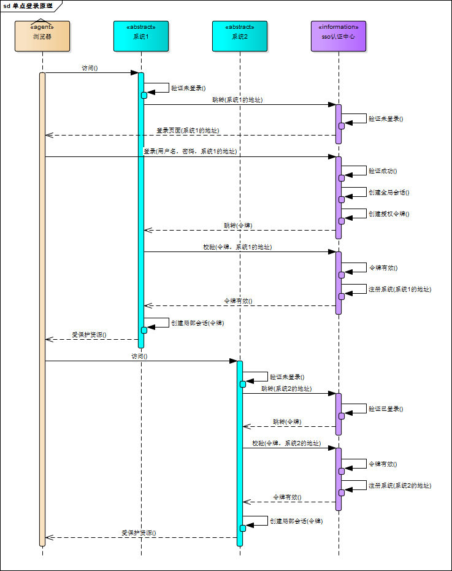
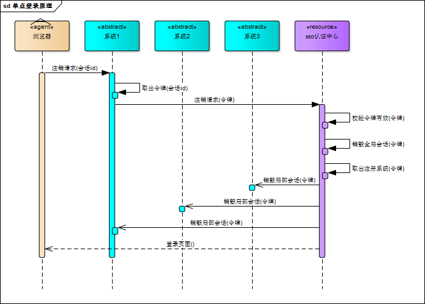
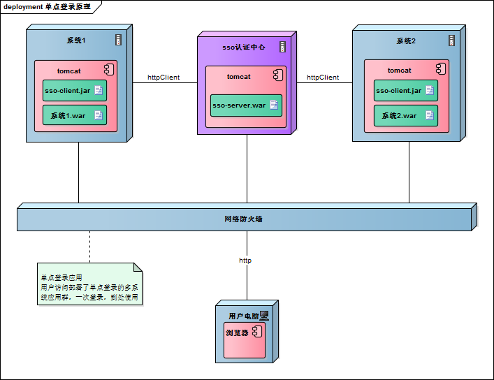

# 单点登录系统原理与实现

## 单系统登录机制

### http无状态协议

web应用采用browser/server架构，http作为通信协议。http是无状态协议，浏览器的每一次请求，服务器会独立处理，不与之前或之后的请求产生关联，这个过程用下图说明，三次请求/响应对之间没有任何联系。



但这也同时意味着，任何用户都能通过浏览器访问服务器资源，如果想保护服务器的某些资源，必须限制浏览器请求；要限制浏览器请求，必须鉴别浏览器请求，响应合法请求，忽略非法请求；要鉴别浏览器请求，必须清楚浏览器请求状态。既然http协议无状态，那就让服务器和浏览器共同维护一个状态吧！这就是会话机制

### 会话控制

浏览器第一次请求服务器，服务器创建一个会话，并将会话的id作为响应的一部分发送给浏览器，浏览器存储会话id，并在后续第二次和第三次请求中带上会话id，服务器取得请求中的会话id就知道是不是同一个用户了，这个过程用下图说明，后续请求与第一次请求产生了关联



服务器在内存中保存会话对象，浏览器怎么保存会话id呢？你可能会想到两种方式

1. 请求参数

2. cookie

将会话id作为每一个请求的参数，服务器接收请求自然能解析参数获得会话id，并借此判断是否来自同一会话，很明显，这种方式不靠谱。那就浏览器自己来维护这个会话id吧，每次发送http请求时浏览器自动发送会话id，cookie机制正好用来做这件事。cookie是浏览器用来存储少量数据的一种机制，数据以”key/value“形式存储，浏览器发送http请求时自动附带cookie信息

tomcat会话机制当然也实现了cookie，访问tomcat服务器时，浏览器中可以看到一个名为“JSESSIONID”的cookie，这就是tomcat会话机制维护的会话id，使用了cookie的请求响应过程如下图



### 登录状态

有了会话机制，登录状态就好明白了，我们假设浏览器第一次请求服务器需要输入用户名与密码验证身份，服务器拿到用户名密码去数据库比对，正确的话说明当前持有这个会话的用户是合法用户，应该将这个会话标记为“已授权”或者“已登录”等等之类的状态，既然是会话的状态，自然要保存在会话对象中，tomcat在会话对象中设置登录状态如下

```java
HttpSession session = request.getSession();``session.setAttribute(``"isLogin"``, ``true``);
```

用户再次访问时，tomcat在会话对象中查看登录状态

```java
HttpSession session = request.getSession();``session.getAttribute(``"isLogin"``);
```

实现了登录状态的浏览器请求服务器模型如下图描述



每次请求受保护资源时都会检查会话对象中的登录状态，只有 isLogin=true 的会话才能访问，登录机制因此而实现。

## 多系统的复杂性

web系统早已从久远的单系统发展成为如今由多系统组成的应用群，面对如此众多的系统，用户难道要一个一个登录、然后一个一个注销吗？就像下图描述的这样



web系统由单系统发展成多系统组成的应用群，复杂性应该由系统内部承担，而不是用户。无论web系统内部多么复杂，对用户而言，都是一个统一的整体，也就是说，用户访问web系统的整个应用群与访问单个系统一样，登录/注销只要一次就够了



虽然单系统的登录解决方案很完美，但对于多系统应用群已经不再适用了，为什么呢？

单系统登录解决方案的核心是cookie，cookie携带会话id在浏览器与服务器之间维护会话状态。但cookie是有限制的，这个限制就是cookie的域（通常对应网站的域名），浏览器发送http请求时会自动携带与该域匹配的cookie，而不是所有cookie。



既然这样，为什么不将web应用群中所有子系统的域名统一在一个顶级域名下，例如“*.baidu.com”，然后将它们的cookie域设置为“baidu.com”，这种做法理论上是可以的，甚至早期很多多系统登录就采用这种同域名共享cookie的方式。

然而，可行并不代表好，共享cookie的方式存在众多局限。首先，应用群域名得统一；其次，应用群各系统使用的技术（至少是web服务器）要相同，不然cookie的key值（tomcat为JSESSIONID）不同，无法维持会话，共享cookie的方式是无法实现跨语言技术平台登录的，比如java、php、.net系统之间；第三，cookie本身不安全。

因此，我们需要一种全新的登录方式来实现多系统应用群的登录，这就是单点登录。

## 单点登录

什么是单点登录？单点登录全称Single Sign On（以下简称SSO），是指在多系统应用群中登录一个系统，便可在其他所有系统中得到授权而无需再次登录，包括单点登录与单点注销两部分

### 登录

相比于单系统登录，sso需要一个独立的认证中心，只有认证中心能接受用户的用户名密码等安全信息，其他系统不提供登录入口，只接受认证中心的间接授权。间接授权通过令牌实现，sso认证中心验证用户的用户名密码没问题，创建授权令牌，在接下来的跳转过程中，授权令牌作为参数发送给各个子系统，子系统拿到令牌，即得到了授权，可以借此创建局部会话，局部会话登录方式与单系统的登录方式相同。这个过程，也就是单点登录的原理，用下图说明



下面对上图简要描述

1. 用户访问系统1的受保护资源，系统1发现用户未登录，跳转至sso认证中心，并将自己的地址作为参数

2. sso认证中心发现用户未登录，将用户引导至登录页面

3. 用户输入用户名密码提交登录申请

4. sso认证中心校验用户信息，创建用户与sso认证中心之间的会话，称为全局会话，同时创建授权令牌

5. sso认证中心带着令牌跳转会最初的请求地址（系统1）

6. 系统1拿到令牌，去sso认证中心校验令牌是否有效

7. sso认证中心校验令牌，返回有效，注册系统1

8. 系统1使用该令牌创建与用户的会话，称为局部会话，返回受保护资源

9. 用户访问系统2的受保护资源

10. 系统2发现用户未登录，跳转至sso认证中心，并将自己的地址作为参数

11. sso认证中心发现用户已登录，跳转回系统2的地址，并附上令牌

12. 系统2拿到令牌，去sso认证中心校验令牌是否有效

13. sso认证中心校验令牌，返回有效，注册系统2

14. 系统2使用该令牌创建与用户的局部会话，返回受保护资源

用户登录成功之后，会与sso认证中心及各个子系统建立会话，用户与sso认证中心建立的会话称为全局会话，用户与各个子系统建立的会话称为局部会话，局部会话建立之后，用户访问子系统受保护资源将不再通过sso认证中心，全局会话与局部会话有如下约束关系

1. 局部会话存在，全局会话一定存在

2. 全局会话存在，局部会话不一定存在

3. 全局会话销毁，局部会话必须销毁

你可以通过博客园、百度、csdn、淘宝等网站的登录过程加深对单点登录的理解，注意观察登录过程中的跳转url与参数

### 注销

单点登录自然也要单点注销，在一个子系统中注销，所有子系统的会话都将被销毁，用下面的图来说明



sso认证中心一直监听全局会话的状态，一旦全局会话销毁，监听器将通知所有注册系统执行注销操作

下面对上图简要说明

1. 用户向系统1发起注销请求

2. 系统1根据用户与系统1建立的会话id拿到令牌，向sso认证中心发起注销请求

3. sso认证中心校验令牌有效，销毁全局会话，同时取出所有用此令牌注册的系统地址

4. sso认证中心向所有注册系统发起注销请求

5. 各注册系统接收sso认证中心的注销请求，销毁局部会话

6. sso认证中心引导用户至登录页面

## 部署图

单点登录涉及sso认证中心与众子系统，子系统与sso认证中心需要通信以交换令牌、校验令牌及发起注销请求，因而子系统必须集成sso的客户端，sso认证中心则是sso服务端，整个单点登录过程实质是sso客户端与服务端通信的过程，用下图描述



sso认证中心与sso客户端通信方式有多种，这里以简单好用的httpClient为例，web service、rpc、restful api都可以。

