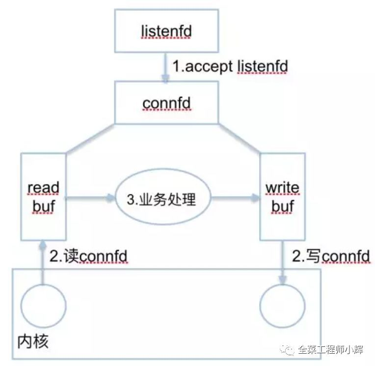
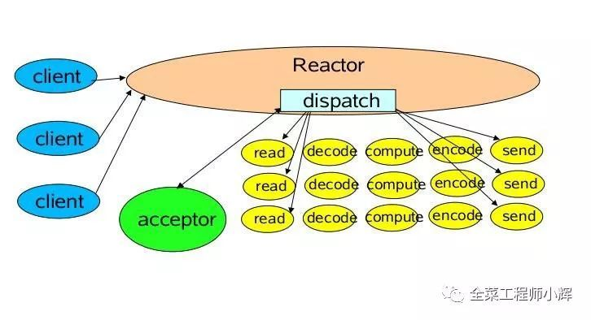
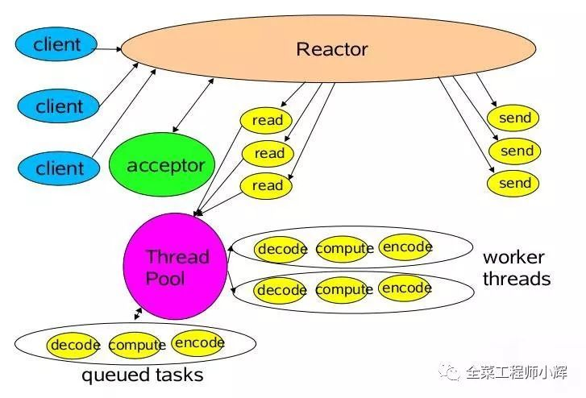
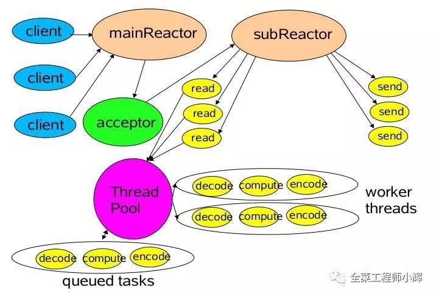
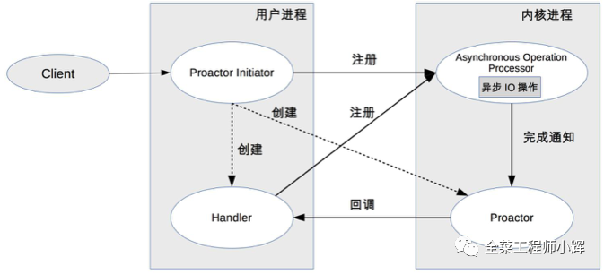

# 彻底搞懂Reactor模型和Proactor模型

在高性能的I/O设计中，有两个著名的模型：Reactor模型和Proactor模型，其中Reactor模型用于同步I/O，而Proactor模型用于异步I/O操作。想要了解两种模型，需要了解一些IO，同步异步的基础知识。

## 服务端的线程模型

无论是Reactor模型还是Proactor模型，对于支持多连接的服务器，一般可以总结为2种fd和3种事件，如下图：

### 2种fd

1. listenfd：一般情况，只有一个。用来监听一个特定端口(比如80)

2. connfd：每个连接都有一个connfd，用来收发数据。

### 3种事件

1. listenfd进行accept阻塞监听，创建一个connfd

2. 用户态/内核态copy数据。每个connfd对应着两个缓冲区：readbuf和writebuf

3. 处理connfd发来的数据。业务逻辑处理，准备response到writebuf。

## Reactor模型

无论是C++还是Java编写的网络框架，大多数都是基于Reactor模型进行设计和开发，Reactor模型基于事件驱动，特别适合处理海量的I/O事件。

Reactor模型中定义的三种角色：

- Reactor：负责监听和分配事件，将I/O事件分派给对应的Handler。新的事件包含连接建立就绪，读就绪，写就绪等。

- Acceptor：处理客户端新连接，并分派请求到处理器链中。

- Handler：将自身与事件绑定，执行非阻塞读/写任务，完成channel的读入，完成处理业务逻辑后，负责将结果写出channel，可用资源池来管理。

Reactor处理请求的流程：

1. 应用程序注册读就绪事件和相关联的事件处理器

2. 事件分离器等待事件的发生

3. 当发生读就绪事件的时候，事件分离器调用第一步注册的事件处理器

写入操作类似于读取操作，只不过第一步注册的是写就绪事件。

### 单Reactor单线程模型

Reactor线程负责多路分离套接字，accept新连接，并分派请求到handler。Redis使用单Reactor单进程的模型。

消息处理流程：

1. Reactor对象通过select监控连接事件，收到事件后通过dispatch进行转发。

2. 如果是连接建立的事件，则由acceptor接受连接，并创建handler处理后续事件。

3. 如果不是建立连接事件，则Reactor会分发调用Handler来响应。

4. handler会完成read->业务处理->send的完整业务流程。

单Reactor单线程模型只是在代码上进行了组件的区分，但是整体操作还是单线程，不能充分利用硬件资源。handler业务处理部分没有异步。

对于一些小容量应用场景，可以使用单Reactor单线程模型。但是对于高负载、大并发的应用场景却不合适，主要原因如下：

1. 即便Reactor线程的CPU负荷达到100%，也无法满足海量消息的编码、解码、读取和发送。

2. 当Reactor线程负载过重之后，处理速度将变慢，这会导致大量客户端连接超时，超时之后往往会进行重发，这更加重Reactor线程的负载，最终会导致大量消息积压和处理超时，成为系统的性能瓶颈。

3. 一旦Reactor线程意外中断或者进入死循环，会导致整个系统通信模块不可用，不能接收和处理外部消息，造成节点故障。

为了解决这些问题，演进出单Reactor多线程模型。

### 单Reactor多线程模型

该模型在事件处理器（Handler）部分采用了多线程（线程池）。

消息处理流程：

1. Reactor对象通过Select监控客户端请求事件，收到事件后通过dispatch进行分发。

2. 如果是建立连接请求事件，则由acceptor通过accept处理连接请求，然后创建一个Handler对象处理连接完成后续的各种事件。

3. 如果不是建立连接事件，则Reactor会分发调用连接对应的Handler来响应。

4. Handler只负责响应事件，不做具体业务处理，通过Read读取数据后，会分发给后面的Worker线程池进行业务处理。

5. Worker线程池会分配独立的线程完成真正的业务处理，如何将响应结果发给Handler进行处理。

6. Handler收到响应结果后通过send将响应结果返回给Client。

相对于第一种模型来说，在处理业务逻辑，也就是获取到IO的读写事件之后，交由线程池来处理，handler收到响应后通过send将响应结果返回给客户端。这样可以降低Reactor的性能开销，从而更专注的做事件分发工作了，提升整个应用的吞吐。

但是这个模型存在的问题：

1. 多线程数据共享和访问比较复杂。如果子线程完成业务处理后，把结果传递给主线程Reactor进行发送，就会涉及共享数据的互斥和保护机制。

2. Reactor承担所有事件的监听和响应，只在主线程中运行，可能会存在性能问题。例如并发百万客户端连接，或者服务端需要对客户端握手进行安全认证，但是认证本身非常损耗性能。

为了解决性能问题，产生了第三种主从Reactor多线程模型。

### 主从Reactor多线程模型

比起第二种模型，它是将Reactor分成两部分：

1. mainReactor负责监听server socket，用来处理网络IO连接建立操作，将建立的socketChannel指定注册给subReactor。

2. subReactor主要做和建立起来的socket做数据交互和事件业务处理操作。通常，subReactor个数上可与CPU个数等同。

Nginx、Swoole、Memcached和Netty都是采用这种实现。

消息处理流程：

1. 从主线程池中随机选择一个Reactor线程作为acceptor线程，用于绑定监听端口，接收客户端连接

2. acceptor线程接收客户端连接请求之后创建新的SocketChannel，将其注册到主线程池的其它Reactor线程上，由其负责接入认证、IP黑白名单过滤、握手等操作

3. 步骤2完成之后，业务层的链路正式建立，将SocketChannel从主线程池的Reactor线程的多路复用器上摘除，重新注册到Sub线程池的线程上，并创建一个Handler用于处理各种连接事件

4. 当有新的事件发生时，SubReactor会调用连接对应的Handler进行响应

5. Handler通过Read读取数据后，会分发给后面的Worker线程池进行业务处理

6. Worker线程池会分配独立的线程完成真正的业务处理，如何将响应结果发给Handler进行处理

7. Handler收到响应结果后通过Send将响应结果返回给Client

### 总结

Reactor模型具有如下的优点：

1. 响应快，不必为单个同步时间所阻塞，虽然Reactor本身依然是同步的；

2. 编程相对简单，可以最大程度的避免复杂的多线程及同步问题，并且避免了多线程/进程的切换开销；

3. 可扩展性，可以方便地通过增加Reactor实例个数来充分利用CPU资源；

4. 可复用性，Reactor模型本身与具体事件处理逻辑无关，具有很高的复用性

## Proactor模型

模块关系：

1. Procator Initiator负责创建Procator和Handler，并将Procator和Handler都通过Asynchronous operation processor注册到内核。

2. Asynchronous operation processor负责处理注册请求，并完成IO操作。完成IO操作后会通知procator。

3. procator根据不同的事件类型回调不同的handler进行业务处理。handler完成业务处理，handler也可以注册新的handler到内核进程。

消息处理流程：

读取操作：

1. 应用程序初始化一个异步读取操作，然后注册相应的事件处理器，此时事件处理器不关注读取就绪事件，而是关注读取完成事件，这是区别于Reactor的关键。

2. 事件分离器等待读取操作完成事件

3. 在事件分离器等待读取操作完成的时候，操作系统调用内核线程完成读取操作，并将读取的内容放入用户传递过来的缓存区中。这也是区别于Reactor的一点，Proactor中，应用程序需要传递缓存区。

4. 事件分离器捕获到读取完成事件后，激活应用程序注册的事件处理器，事件处理器直接从缓存区读取数据，而不需要进行实际的读取操作。

> 异步IO都是操作系统负责将数据读写到应用传递进来的缓冲区供应用程序操作。

Proactor中写入操作和读取操作，只不过感兴趣的事件是写入完成事件。

Proactor有如下缺点：

1. 编程复杂性，由于异步操作流程的事件的初始化和事件完成在时间和空间上都是相互分离的，因此开发异步应用程序更加复杂。应用程序还可能因为反向的流控而变得更加难以Debug；

2. 内存使用，缓冲区在读或写操作的时间段内必须保持住，可能造成持续的不确定性，并且每个并发操作都要求有独立的缓存，相比Reactor模型，在Socket已经准备好读或写前，是不要求开辟缓存的；

3. 操作系统支持，Windows下通过IOCP实现了真正的异步 I/O，而在Linux系统下，Linux2.6才引入，并且异步I/O使用epoll实现的，所以还不完善。

因此在 Linux 下实现高并发网络编程都是以Reactor模型为主。