# AMQP协议和RabbitMQ实现

## RabbitMQ模型架构

RabbitMQ整体上是一个生产者和消费者模型，主要负责接收，存储和转发消息。

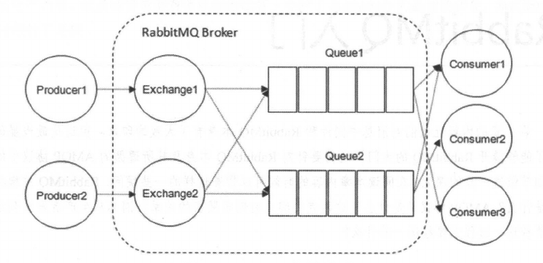

### 生产者和消费者

Producer：生产者，就是投递消息的一方。

生产者创建消息，然后发布到RabbitMQ中，消息一般可以包含两个部分：消息体(payload)和标签(label)。实际应用中，消息体一般是一个带有业务逻辑结构的数据，比如一个json字符串，当然也可以进一步对这个消息体进行序列化工作。消息的标签用来标识这条消息，比如一个交换器的名称和一个路由键。生产者把消息交由RabbitMQ，RabbitMQ根据标签把消息发送给感兴趣的消费者。

Consumer：消费者，就是接收消息的一方。

消费者连接到RabbitMQ服务器，并订阅到队列上。当消费者消费一条消息时，只是消费消息的主体(payload)，在消息路由的过程中，消息的标签会被丢弃，存入队列的只是消息的主体，消费者消费的也是消息的主体。

Broker：消息中间件的服务节点

对于RabbitMQ来说，一个RabbitMQ Broker可以简单看作一个RabbitMQ节点或实例。下图展示了生产到消费的整体流程：

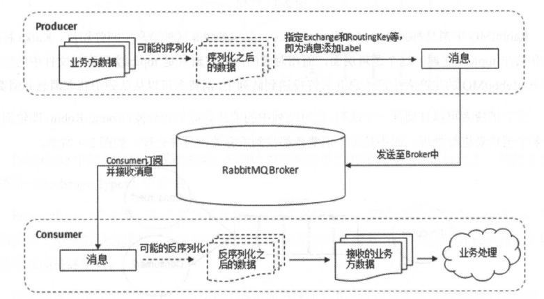

首先，生产者将业务方数据进行包装，封装成消息，发送(AMQP协议里这个动作对应的命令是Basic.Publish)到Broker中，消费者订阅并接收消息(AMQP协议里这个动作对应的命令是Basic.Consume或Basic.Get)，经过可能的解包处理得到原始数据，之后再进行业务处理逻辑。这个业务不一定和接收消息的逻辑使用同一个线程。消费者可以使用一个线程去接收消息，存入内存，另一个线程从内存读取数据并进行处理，这样可以将应用进一步解耦，提高处理效率。

### 队列

Queue:队列，是RabbitMQ的内部对象，用于存储消息。

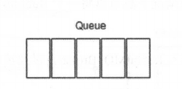

RabbitMQ中消息都只能存储在队列中，这一点和Kakfa这种消息中间件相反。Kafka将消息存储在topic(主题)这个逻辑层面，而对应的队列逻辑只是topic实际存储文件中的位移标识。RabbitMQ的生产者生产消息并最终投递到队列当中，消费者可以从队列中获取消息并消费。

多个消费者可以订阅同一个队列，这时队列中的消息会被平均分摊(Round-Robin，轮询)给多个消费者进行处理，而不是每个消费者都收到所有的消息并处理。

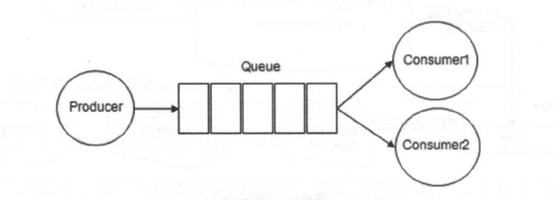

RabbitMQ不支持队列层面的广播消费，如果需要支持广播消费，需要在其上进行二次开发，处理逻辑会变得异常复杂，同时也不建议这么做。

### 交换器，路由键，绑定

Exchange：交换器。在RabbitMQ中，生产者将消息发送到Exchange(交换器，通常也可以用大写的"X"来表示)，由交换器将消息路由到一个或者多个队列中。如果路由不到，或者返还给生产者，或者直接丢弃。这里可以将RabbitMQ中的交换器看做一个简单的实体。

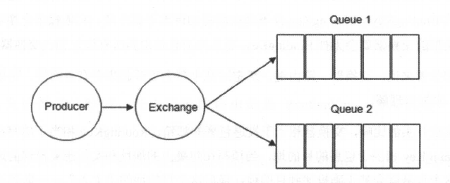

RabbitMQ中的交换器有四种类型，不同类型有着不同的路由策略。

RoutingKey：路由键。生产者将消息发送给交换器的时候，一般会指定一个RoutingKey，用来指定这个消息的路由规则，而这个RoutingKey需要与交换器和绑定键(BindingKey)联合使用才能最终生效。

在交换器和绑定键(BindingKey)固定的情况下，生产者可以在发送消息给交换器时，通过指定RoutingKey来决定消息流向哪里。

Binding：绑定。RabbitMQ中通过绑定将交换器和队列关联起来，在绑定的时候一般会指定一个绑定键(BindingKey)，这样RabbitMQ就知道如何正确的将消息路由到队列了

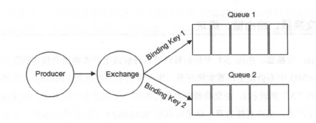

生产者将消息发送给交换器时，需要一个RoutingKey，当BindingKey和RoutingKey相匹配时，消息会被路由到响应的队列中。在绑定多个队列到同一个交换器的时候，这些绑定允许使用相同的BindingKey。BindingKey并不是在所有情况下都生效，它依赖于交换器类型，比如fanout类型的交换器就会无视BindingKey，而是将消息路由到所有绑定到该交换器的队列中。

在某些情况下，BindingKey和RoutingKey可以看作同一个东西，在direct交换器下，RoutingKey和BindingKey需要完全匹配才能使用，在topic交换器下，RoutingKey和BindingKey之间需要做模糊匹配。

BindingKey其实也属于路由键的一种，官房解释为：*the routing key to use for binding*，可以翻译为在绑定时使用的路由键。

- 在使用绑定时，其中需要的路由键是BindingKey。涉及的客户端方法：channel.exchangeBind，channel.queueBind，对应的AMQP命令Exchange.Bind，Queue.Bind。

- 在发送消息的时候，其中需要的路由键是RoutingKey。涉及的客户端方法：channel.basicPublish，对应的AMQP命令Basic.Publish。

大多数情况下，习惯性的把BindingKey写成RoutingKey，尤其在使用direct类型的交换器的时候。

### 交换器类型

RabbitMQ常见的交换器类型有fanout，direct，topic，headers这四种。AMQP协议里还提到另外两种类型：System和自定义。

- fanout 它会把所有发送到该交换器的消息路由到所有与该交换器绑定的队列中。

- direct 它会把消息路由到那些BindingKey和RoutingKey完全匹配的队列中。

   交换器类型为direct，如果我们发送一条消息，并在发送消息的时候设置路由键为"warning"，则消息会路由到Queue1和Queue2。如果在发送消息时设置路由键为"info"或"debug"，消息只会路由到Queue2。 

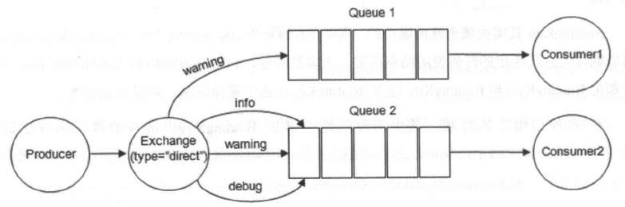

- topic topic类型的交换器在匹配规则上进行了扩展，它与direct类型的交换器类似，也是将消息路由到BindingKey和RoutingKey相匹配的队列中，但这里的匹配规则有些不同

  - RoutingKey为一个点好"."分隔的字符串(被点好"."分隔开的每一段独立的字符串称为一个单词)，如"com.rabbitmq.client"，"java.util.concurrent"，"com.hidden.client"。

  - BindingKey和RoutingKey一样也是点号"."分隔的字符串。

  - BindingKey中可以存在两种特殊字符串"\*"和"#"，用于做模糊匹配，其中"#"用于匹配一个单词，"\*"用于匹配多个单词

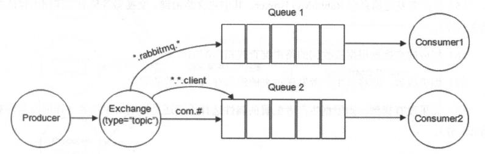  

  1. 路由键为"com.rabbitmq.client"的消息会同时路由到Queue1和Queue2中

  2. 路由键为"com.hidden.client"的消息只会路由到Queue2中

  3. 路由键为"java.rabbitmq.demo"的消息只会路由到Queue1中

  4. 路由键为"java.util.concurrent"的消息将会被丢弃或者返回给生产者(需要设置mandatory参数)，因为它没有匹配任何路由键。

- headers headers类型的交换器不依赖于路由键的匹配规则来路由消息，而是根据发送的消息内容中的headers属性进行匹配。在绑定队列和交换器时制定一组键值对，当发送消息到交换器时，RabbitMQ会获取到该消息的headers(也是一个键值对的形式)，对比其中的键值对是否完全匹配队列和交换器绑定时指定的键值对，如果完全匹配则消息会路由到该队列，否则不会路由到该队列。headers类型的交换器性能会很差，也不实用，基本上不会看到它的存在。

## 连接复用

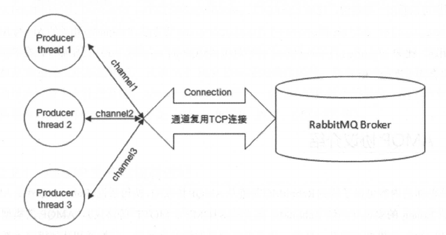

在RabbitMQ的连接管理中，引入了两个概念：Connection和Channel。无论是生产者还是消费者都需要和RabbitMQ Broker建立连接，这个连接就是一条TCP连接，也就是Connection。一旦TCP连接建立起来，客户端紧接着创建一个AMQP信道(Channel)，每个信道都会指派一个唯一ID。信道是建立在Connection之上的虚拟连接，RabbitMQ处理的每条AMQP指令都是通过信道完成的。

对于操作系统而言，建立和销毁TCP连接是非常昂贵的开销，如果遇到使用高峰，性能瓶颈也随之显现。RabbitMQ采用类似NIO的做法，选择了TCP连接复用，不仅可以减少性能开销，同时也便于管理。

每个线程把持一个信道，所以信道复用了Connection的TCP连接。同时RabbitMQ可以确保每个线程的私密性，就像拥有独立的连接一样。当每个信道的流量不是很大时，复用单一的Connection可以在产生性能瓶颈的情况下有效的节省TCP连接资源。但是当信道本身的流量很大时，这时候多个信道复用一个Connection会产生瓶颈，进而整体的流量被限制了。此时就需要开辟多个Connection，将这些信道均摊到这些Connection中。


## AMQP协议

RabbitMQ是遵从AMQP协议的，AMQP的模型架构和RabbitMQ的模型架构是一样的，生产者将消息发送给交换器，交换器和队列绑定。当生产者发送消息时所携带的RoutingKey与绑定时的BindingKey相匹配时，消息即被存入相应的队列中。消费者可以订阅相应的队列来获取消息。

RabbitMQ中的交换器，交换器类型，队列，绑定，路由键等都是遵循AMQP协议中相应的概念。

AMQP协议本身包含三层：

- Module Layer：位于协议最高层，主要定义了一些供客户端调用的命令，客户端可以利用这些命令实现自己的业务逻辑。比如，可以端可以使用Queue.Declare命令声明一个队列或者使用Basic.Consume订阅消费一个队列中的消息。

- Session Layer：位于中间层，主要负责将客户端的命令发送给服务器，再将服务器的响应返回给客户端，主要为客户端和服务器之间的通信提供可靠性同步机制和错误处理。

- Transport Layer：位于最底层，主要传输二进制流，提供帧处理，信道复用，错误检测和数据表示等。

AMQP说到底是一个通信协议，通信协议都会涉及到报文交互，从low-level举例来说，AMQP本身是应用层协议，其填充与TCP协议的数据部分。而从high-level来说，AMQP是通过协议命令进行交互的。AMQP协议可以看作一系列结构化命令的集合，类似与HTTP中的方法(GET POST PUT DELETE)。

### AMQP生产者的流转过程

生产者代码

```java
Connection connection = factory.newConnection();
Channel channel = connection.createChannel();

String message = "Hello World";
channel.basicPublish(EXCHANGE_NAME, ROUTING_KEY, MessageProperties.PERSISTENT_TEXT_PLAIN, message.getBytes());

channel.close();
connection.close();
```

- 当客户端与Broker建立连接的时候，会调用factory.newConnection方法，这个方法会进一步封装成Protocol Header 0-9-1的报文头发送给Broker，以此通知Broker本次交互采用的是AMQP 0-9-1协议，紧接着Broker返回Connection.Start来建立连接，在连接的过程中涉及Connection.Start/.Start-OK，Connection.Tune/.Tune-OK，Connection.Open/.Open-OK这6个命令的交互。

- 当客户端调用connection.createChannel方法准备开启信道的时候，其包装Channel.Open命令发送给Broker，等待Channel.Open-OK命令。

- 当客户端发送消息的时候，需要调用channel.basicPublish方法，对应的AMQP命令为Basic.Publish，注意这个命令和前面涉及的命令略有不同，这个命令还包含了Content Header和Content Body。Content Header里面包含的是消息体的属性，比如，投递模式，优先级等，而Content Body包含消息本身。

- 当客户端发送完消息需要关闭资源时，涉及Channel.Close/.Close-OK与Connection.Close/.Close-OK的命令交互

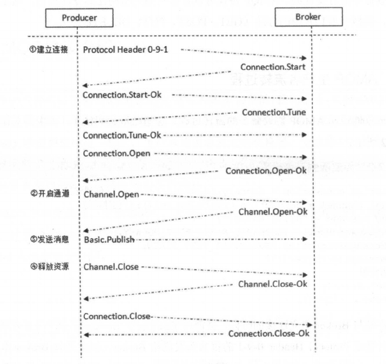

### AMQP消费者的流转过程

消费者代码

```java
Connection connection = factory.newConnection(addresses);
final Channel channel = connection.createChannel();

Consumer consumer = new DefaultConsumer(channel);
channel.basicQos(64);
channel.basicConsume(QUEUE_NAME, consumer);

TimeUnit.SECONDS.sleep(5);
channel.close();
connection.close();
```

- 消费者客户端同样需要与Broker建立连接，与生产者客户端一样，协议交互同样涉及Connection.Start/.Start-OK，Connection.Tune/.Tune-OK和Connection.Open/.Open-Ok等(图中省略)。

- 紧接着也少不了在Connection上建立Channel，和生产者客户端一样，协议涉及Channel.Open/.Open-Ok。

- 如果在消费之前调用了channel.basicQos(int prefetchCount)方法来设置消费者客户端最大能保持的未确认的消息数，那么协议的流转会涉及Basic.Qos/.Qos-Ok这两个AMQP命令。

- 在真正消费之前，消费者客户端需要向Broker发送Basic.Consume命令(即调用channel.basicConsume方法)将Channel设置为接收模式，之后Broker回执Basic.Consume-Ok以告诉消费者客户端准备好消费消息。紧接着Broker向消费者客户端推送(Push)消息，即Basic.Deliver命令，有意思的是和这个和Basic.Publish命令一样会携带Content Header和Content Body。

- 消费者接收到消息并正确消费之后，向Broker发送确认，即Basic.Ack命令。

- 在消费者停止消费的时候，主动关闭连接，这点和生产者不一样，设计Channel.Close/.Close-Ok和Connection.Close/.Close-Ok。

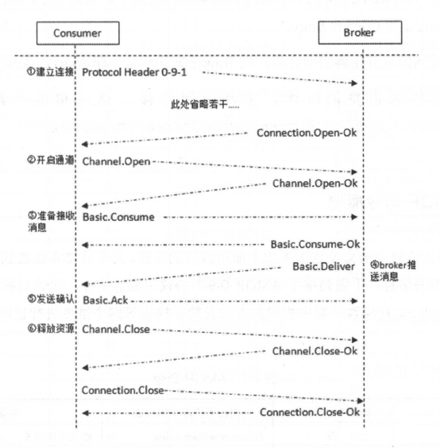


