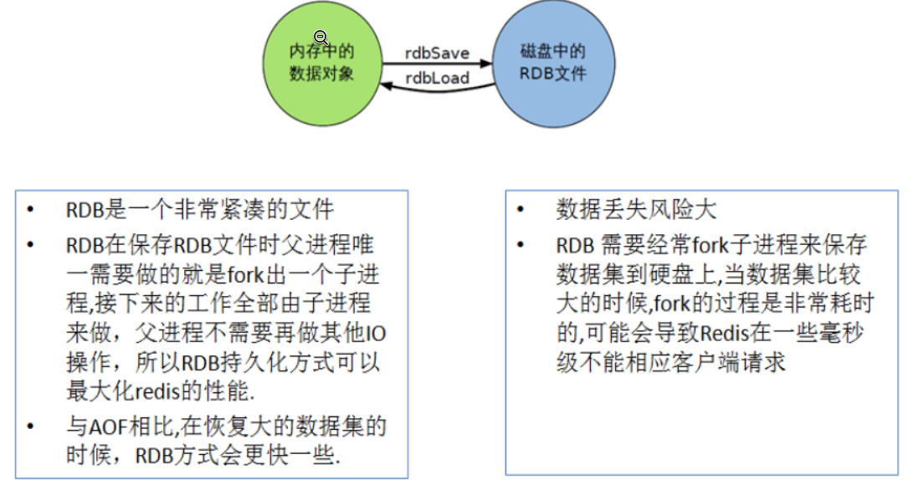
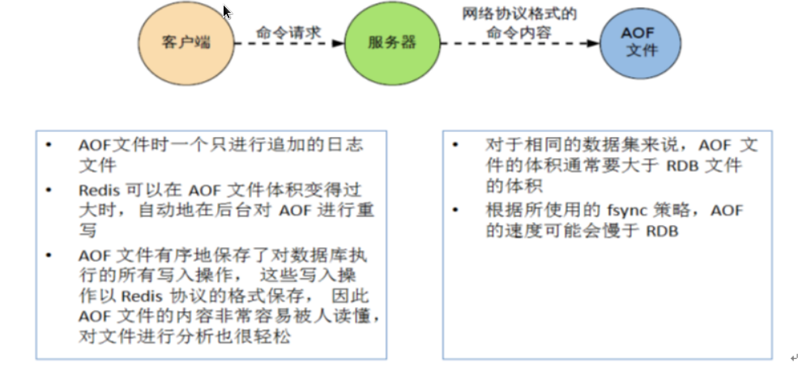

# Redis的两种持久化机制

从数据重用和故障恢复两个角度出发，redis提供了持久化功能，即将内存中的数据同步到磁盘中。Redis提供了两种不同的持久化方法，一种是快照的方式RDB，另一种是追加文件的方式AOF。

## RDB

RDB持久化是在指定的时间间隔内将内存中的数据集快照写入磁盘(Snapshot)，它恢复时是将快照文件直接读到内存里。

Redis会单独创建(fork)一个子进程来进行持久化，会先将数据写入一个临时文件中，待持久化过程结束了，再用这个临时文件替换上次持久化好的文件。整个过程中，主进程是不进行任何IO操作的，这就确保了极高的性能。

Fork一个新进程后，新进程的所有数据(变量，环境变量，程序计数器等)数值都和原进程一致，但是这是一个全新的进程，并作为原进程的子进程。RDB会生成一个dump.db文件。

### 如何触发RDB持久化

- 配置文件中默认的快照配置

- 命令save或者bgsave

  - save：save时只管保存，其他不管，全部阻塞。

  - bgsave：Redis会在后台异步进行快照操作，同时还可以响应客户端请求。可以通过lastsave命令获取最后一次成功执行快照的时间。

- 执行flushall命令，也会生成dump.db文件

### 如何恢复

将备份文件dump.db移动到redis安装目录并启动服务即可

### 如何停止

动态所有停止RDB保存规则的方法：redis-cli config set save " "

### 优缺点

- 如果需要进行大规模的数据恢复，且对于数据恢复的完整性不是非常敏感，那么RDB方式要比AOF方式更加高效。

- RDB的缺点是最后一次持久化后的数据可能丢失。

## AOF

AOF以日志的形式来记录每个写操作，将redis中执行过的所有写指令记录下来(读操作不记录)，只追加文件但不可以改写文件，redis启动之初会读取该文件并重新构建数据，换言之，redis重启后就会依据日志文件将写指令从前到后执行一遍以完成数据的恢复工作。AOF会产生appendonly.aof文件。

### AOF启动/修复/恢复

- 正常恢复：

   - 启动：修改默认的appendonly no，改为yes

   - 将有数据的aof文件复制一份保存到对应目录(config get dir)

   - 恢复：重启redis然后重新加载

- 异常恢复：

   - 启动：设置yes;修改默认的appendonly no，改为yes

   - 备份被写坏的AOF文件

   - 修复：Redis-check-aof --fix进行修复

   - 恢复：重启redis然后重新加载

### Rewrite

AOF采用文件追加方式，文件会越来越大为避免出现此种情况，新增了重写机制,当AOF文件的大小超过所设定的阈值时，Redis就会启动AOF文件的内容压缩，只保留可以恢复数据的最小指令集.可以使用命令bgrewriteaof

AOF文件持续增长而过大时，会fork出一条新进程来将文件重写(也是先写临时文件最后再rename)，遍历新进程的内存中数据，每条记录有一条的set语句。重写aof文件的操作，并没有读取旧的aof文件，而是将整个内存中的数据库内容用命令的方式重写了一个新的aof文件。

Redis会记录上次重写时的AOF大小，默认配置是当AOF文件大小是上次rewrite后大小的一倍且文件大于64M时触发。

### 优缺点

同步间隔设置粒度越细，性能越差，数据丢失风险越低。

- 每修改同步：appendfsync always 同步持久化,每次发生数据变更会被立即记录到磁盘,性能较差但数据完整性比较好

- 每秒同步：appendfsync everysec 异步操作，每秒记录,如果一秒内宕机，有数据丢失

- 不同步：appendfsync no 从不同步

- 相同数据集的数据而言aof文件要远大于rdb文件，恢复速度慢于rdb

- aof运行效率要慢于rdb,每秒同步策略效率较好，不同步效率和rdb相同

## 总结

- RDB持久化方式能够在指定的时间间隔能对你的数据进行快照存储。

- AOF持久化方式记录每次对服务器写的操作,当服务器重启的时候会重新执行这些命令来恢复原始的数据,AOF命令以redis协议追加保存每次写的操作到文件末尾.Redis还能对AOF文件进行后台重写,使得AOF文件的体积不至于过大。

- 只做缓存：如果你只希望你的数据在服务器运行的时候存在,你也可以不使用任何持久化方式。

如果同时开启两种持久化方式，当redis重启的时候会优先载入AOF文件来恢复原始的数据,因为在通常情况下AOF文件保存的数据集要比RDB文件保存的数据集要完整。

## 最佳实践

因为RDB文件只用作后备用途，建议只在Slave上持久化RDB文件，而且只要15分钟备份一次就够了，只保留save 900 1这条规则。
  
如果Enalbe AOF，好处是在最恶劣情况下也只会丢失不超过两秒数据，启动脚本较简单只load自己的AOF文件就可以了。代价一是带来了持续的IO，二是AOFrewrite的最后将rewrite过程中产生的新数据写到新文件造成的阻塞几乎是不可避免的。

只要硬盘许可，应该尽量减少AOFrewrite的频率，AOF重写的基础大小默认值64M太小了，可以设到5G以上。默认超过原大小100%大小时重写可以改到适当的数值。
 
如果不Enable AOF，仅靠Master-Slave Replication 实现高可用性也可以。能省掉一大笔IO也减少了rewrite时带来的系统波动。代价是如果Master/Slave同时倒掉，会丢失十几分钟的数据，启动脚本也要比较两个Master/Slave中的RDB文件，载入较新的那个,新浪微博就选用了这种架构。
