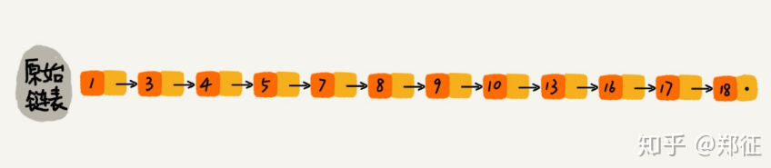
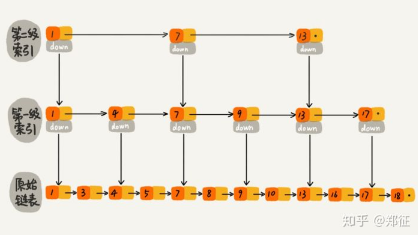
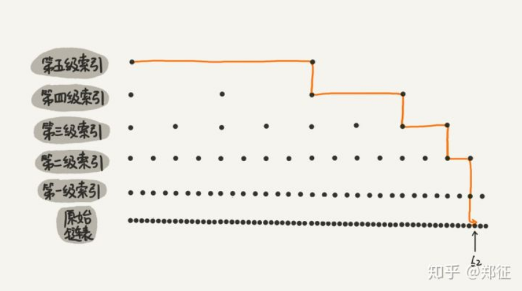
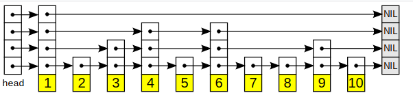

# 跳表的原理及实现

链表和数组是两种基本的数据结构，分别有各自的优缺点。数组支持随机访问一个元素，通过下标很容易定位元素，而链表不支持随机访问，只能从头到尾依次访问。数组需要连续的内存空间，插入删除操作会引起数组的扩容和元素移动，链表无需连续的内存空间，插入和删除效率高。在很多情况下，数据是通过链表这种数据结构存储的，跳表解决了有序链表提升查找效率的问题。

## 跳表的结构

一个简单的有序单链表，如果要查找某个数据，只能从头到尾遍历链表，查找到值与指定元素相等时返回结点，这样的查询效率低，时间复杂度为O(n)。



假如对链表进行改造，先对链表中每两个节点建立第一级索引，再对第一级索引每两个节点建立第二级索引



对于上图中的带二级索引的链表中，我们查询元素 16，先从第二级索引查询 1->7->13，发现16大于13 ，然后通过 13 的 down 指针找到第一级索引的 17，发现 16 小于17 ，再通过13 的 down 指针找到链表中的 16，只需要遍历 6 个节点就完成 16 的查找。如果在单链表中直接查找 16 的话，只能顺序遍历，需要遍历 10 个节点，如果数据量大，提升性能更高。



这种带多级索引的链表，就是跳表。

但是，这种方法在插入数据的时候有很大的问题。新插入一个节点之后，就会打乱上下相邻两层链表上节点个数严格的2:1的对应关系。如果要维持这种对应关系，就必须把新插入的节点后面的所有节点（也包括新插入的节点）重新进行调整，这会让时间复杂度重新蜕化成O(n)。删除数据也有同样的问题。

skiplist为了避免这一问题，它不要求上下相邻两层链表之间的节点个数有严格的对应关系，而是为每个节点随机出一个层数(level)。比如，一个节点随机出的层数是3，那么就把它链入到第1层到第3层这三层链表中。

从上面skiplist的创建和插入过程可以看出，每一个节点的层数（level）是随机出来的，而且新插入一个节点不会影响其它节点的层数。因此，插入操作只需要修改插入节点前后的指针，而不需要对很多节点都进行调整。这就降低了插入操作的复杂度。

## 时间复杂度分析

假如链表中有n个元素，每两个节点建立一个索引，那么第一级索引的结点个数就是n/2，第二级就是n/4，第三级就是n/8，以此类推，也就是第k级索引的节点个数就是第k-1索引节点个数的1/2，那么第k级索引的节点个数为n除以2的k次方，即n/(2^k)。

假设索引有h级，最高级的索引有2个节点，通过上面的公式，我们可以得到n/(2^h)=2，即h=log2n-1，包含原始链表这一层的话，跳表的高度就是log2n，假设每层需要访问m哥节点，那么总的时间复杂度就是O(m*log2n)。而每层需要访问的m个节点，m的最大值不超过3，因此跳表的时间复杂度为O(logn)

## 空间复杂度分析

时间复杂度能做到O(logn)是以建立在多级索引的基础之上的，这会导致内存占用增加。

假如有n个元素的链表，第一级索引为n/2个，第二级为n/4个，第三级为n/8个，...，最后一级为2个。这几级索引的总和就是n/2+n/4+n/8+...+8+4+2=n-2。所以跳表的空间复杂度是O(n)，也就是说，如果将包含n个节点的单链表构造成跳表，需要额外的接近n个节点的存储空间。

假如每3个节点抽取一个作为索引，同样的方法，可以计算出的空间复杂度为O(n/2)，已经节约一半的存储空间了。

在实际的开发中，原始链表中存储的有可能是很大的对象，而索引结点只需要存储几个指针，并不需要存储对象，所以当对象比索引结点大很多时，那索引占用的额外空间就可以忽略了。

## 跳表与平衡树，哈希表的比较

- 跳表和各种平衡树(如AVL，红黑树等)元素是有序排列的，而哈希表不是有序的。因此，在哈希表上只能做单个key的查找，不适宜做范围查找。

- 在做范围查找时，平衡树比跳表操作要复杂。在平衡树上，找到指定范围的小值之后，还需要中序遍历继续寻找其它不超过大值的节点。如果不对平衡树进行一定的改造，这里的中序遍历并不容易实现。而在跳表上进行范围查找非常简单，只需要查找到小值后，对第一层链表进行若干次遍历就可以实现。

- 平衡树的插入和删除操作可能引发子树的调整，逻辑复杂，而跳表的插入和删除只需要修改相邻节点的指针，操作简单。

- 从内存占用上看，跳表比平衡树更灵活一些，一般来说，平衡树每个节点包含两个指针(分别指向左右子树)，而跳表每个节点包含的指针数目平均为1/(1-p)，具体取决于参数p的大小。如果像redis里的实现，取p=1/4，那么平均每个节点包含1.33个指针，比平衡树有优势。

- 查找单个key，skiplist和平衡树的时间复杂度都为O(log n)，大体相当；而哈希表在保持较低的哈希值冲突概率的前提下，查找时间复杂度接近O(1)，性能更高一些。所以我们平常使用的各种Map或dictionary结构，大都是基于哈希表实现的。

- 从算法实现难度上来比较，skiplist比平衡树要简单得多。

## 跳表的代码实现

写代码之前，思考一下跳表应支持的基本功能： 

- 插入一个元素 

- 删除一个元素 

- 查找一个元素 

其实 redis 中有序集合支持的核心操作也就是这几个。为什么 redis 使用跳表而不使用红黑树？

- 红黑树在查找区间元素的效率没有跳表高，其他操作时间复杂度一致。 

- 相比红黑树，跳表的实现还是简单的，更好的支持并发操作。 

- 跳表更加灵活，通过改变索引构建策略，有效平衡效率和内存消耗。

Redis的作者在原文中这样说：

> There are a few reasons:
>
>1) They are not very memory intensive. It’s up to you basically. Changing parameters about the probability of a node to have a given number of levels will make then less memory intensive than btrees.
>
>2) A sorted set is often target of many ZRANGE or ZREVRANGE operations, that is, traversing the skip list as a linked list. With this operation the cache locality of skip lists is at least as good as with other kind of balanced trees.
>
>3) They are simpler to implement, debug, and so forth. For instance thanks to the skip list simplicity I received a patch (already in Redis master) with augmented skip lists implementing ZRANK in O(log(N)). It required little changes to the code.

## 跳表的Golang实现

看一下实际实现中，跳表的结构：



首先定义两个常量，MaxLevel表示跳表的最大高度，它决定了跳表的容量。Probability 是一个概率因子，插入数据时候, 通过生成一个随机整数来决定这个节点会被插入到哪几层链表中。

```go
const MaxLevel = 32
const Probability = 0.25 // 基于时间与空间综合 best practice 值, 越上层概率越小
```

跳表中每个节点保存一个值，同时保存一个指针数组，数组长度视节点的层数而定。

```go
type node struct {
    forward []*node
    key     int
}

func newNode(key, level int) *node {
    return &node{key: key, forward: make([]*node, level)}
}
```

跳表需要一个头节点，和一个level标识当前跳表高度，头节点是一个哑节点，层数为跳表的最大高度

```go
type skipList struct {
    head  *node
    level int
}

func newSkipList() *skipList {
    return &skipList{head: newNode(0, MaxLevel), level: 1}
}

```


插入一个元素

```go
func (s *skipList) insert(key int) {
    current := s.head
    update := make([]*node, MaxLevel) // 新节点插入以后的前驱节点
    for i := s.level - 1; i >= 0; i-- {
        if current.forward[i] == nil || current.forward[i].key > key {
            update[i] = current
        } else {
            for current.forward[i] != nil && current.forward[i].key < key {
                current = current.forward[i] // 指针往前推进
            }
            update[i] = current
        }
    }

    level := randLevel()
    if level > s.level {
        // 新节点层数大于跳表当前层数时候, 现有层数 + 1 的 head 指向新节点
        for i := s.level; i < level; i++ {
            update[i] = s.head
        }
        s.level = level
    }
    node := newNode(key, level)
    for i := 0; i < level; i++ {
        node.forward[i] = update[i].forward[i]
        update[i].forward[i] = node
    }
}
```

删除一个元素

```go
func (s *skipList) delete(key int) {
    current := s.head
    for i := s.level - 1; i >= 0; i-- {
        for current.forward[i] != nil {
            if current.forward[i].key == key {
                tmp := current.forward[i]
                current.forward[i] = tmp.forward[i]
                tmp.forward[i] = nil
            } else if current.forward[i].key > key {
                break
            } else {
                current = current.forward[i]
            }
        }
    }
}
```

查找一个元素

```go
func (s *skipList) search(key int) *node {
    current := s.head
    for i := s.level - 1; i >= 0; i-- {
        for current.forward[i] != nil {
            if current.forward[i].key == key {
                return current.forward
            } else if current.forward[i].key > key {
                break
            } else {
                current = current.forward[i]
            }
        }
    }
}
```

