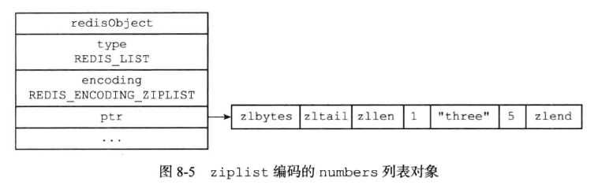
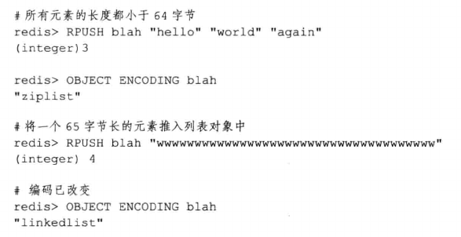
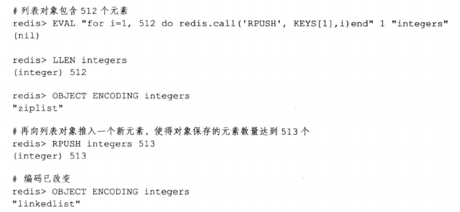

# 列表

列表对象的编码可以是ziplist或者linkedlist。

- ziplist编码的列表对象使用压缩列表作为底层实现，每个压缩节点(entry)保存了一个列表元素。

    

- linkedlist编码的列表对象使用双端链表作为底层实现，每个双端链表节点(node)都保存了一个字符串对象，而每个字符串对象都保存了一个列表元素。

    

    linkedlist编码的列表对象在底层的双端链表结构中包含了多个字符串对象，这种嵌套字符串对象的行为在哈希对象，集合对象和有序集合对象中都会出现，字符串对象是五种Redis类型中唯一一种会被其他四种类型嵌套的对象。

## 编码转换

当列表对象可以同时满足以下两个条件时，列表对象使用ziplist编码：

- 列表对象保存的所有字符串元素的长度都小于64字节

- 列表对象保存的元素数量小于512个

不能满足这两个条件的列表对象需要使用linkedlist编码。

> 以上两个条件的上限值是可以修改的，具体通过配置文件中关于list-max-ziplist-value和list-max-ziplist-entries选项进行配置。

对于使用ziplist编码的列表来说，当使用ziplist编码所需的两个条件的任意一个不满足时，对象的编码转换操作就会被执行，原本保存在压缩列表中的所有元素都会被转移并保存在双端链表里，对象的编码也从ziplist修改为linkedlist。

以下代码展示了列表对象因为保存长度太大的元素而进行编码转换的情况：

除此之外，以下代码展示了列表对象因为保存元素数量过多而进行编码转换的情况：

