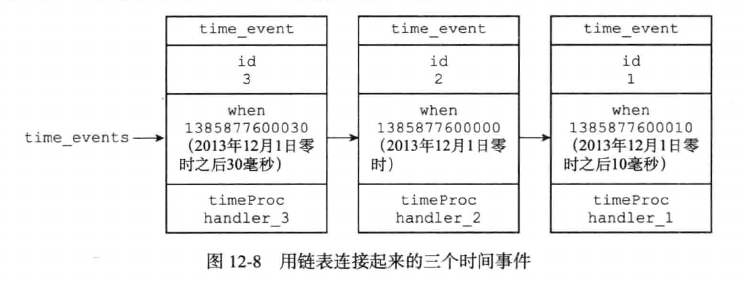

# 时间事件

Redis的时间事件分为以下两类：

- 定时事件：让一段程序在指定的时间之后执行一次。比如说，让程序X在当前时间的30毫秒后执行一次。

- 周期性事件：让一段程序每隔指定时间就执行一次。比如说，让程序Y每隔30毫秒就执行一次。

一个时间事件主要由以下三个属性组成

- id：服务器为时间事件创建的全局唯一ID(标识号)，ID号按从小到大的顺序递增，新的事件ID号比旧的事件ID号大

- when：毫秒精度的UNIX时间戳，记录了事件到达的时间。

- timeProc：时间事件处理器，一个函数。当时间事件到达时，服务器就会调用相应的处理器来处理事件。

一个时间事件是定时事件还是周期性事件取决于事件处理器的返回值：

- 如果事件处理器返回ae.h/AE_NOMORE，那么这个事件为定时事件：该事件在到达一次之后就会被删除，之后不再到达。

- 如果事件处理器返回一个非AE_NOMORE的整数值，那么这个事件为周期性事件，当一个事件到达之后，服务器会根据事件处理器的返回值，对时间事件的when属性进行更新，让这个事件在一段时间后再次到达，并以这种方式一直更新下去。

## 时间事件的实现

服务器将所有时间事件放在一个无序链表中，每当时间事件执行器去执行时，它就遍历整个链表，查找所有已经到达的时间事件(链表中记录的时间戳小于当前时间戳)，并调用相应的事件处理器。

如下所示的链表中保存了三个不同的时间事件：新的事件总是插入链表的表头，三个时间事件分别按ID逆序。



这里的无序链表不按when属性排序，所以当事件执行器运行的时候，它必须遍历链表中的所有时间事件，这样才能保证服务器中所有已到达的事件都会被处理。

正常情况下Redis服务器只使用serverCron一个时间事件，benchmark模式下，服务器只使用两个时间事件。在这种情况下服务器几乎是将无序链表退化为指针来使用，采用无序链表并不影响时间事件的执行性能。

## API

- ae.c/aeCreateTimeEvent函数接收一个毫秒数milliseconds和一个时间事件处理器proc作为参数，将一个新的时间事件添加到服务器，这个新的时间事件将在当前时间的milliseconds毫秒后到达，而事件的处理器为proc。

- ae.c/aeDeleteFileEvent函数接收一个时间事件ID作为参数，然后从服务器中删除该ID所对应的时间事件。

- ae.c/aeSearchNearestTimer函数返回到达时间距离当前时间最近的那个时间事件。

- ae.c/processTimerEvents函数是时间事件的执行器，这个函数会遍历所有已经到达的时间事件，并调用这些事件的处理器，其伪代码如下：

```
def processTimerEvents():
    # 遍历服务器中的所有时间事件
    for time_event in all_time_event():
        # 检查事件是否到达
        if time_event.when <= unix_ts_now():
            # 事件已到达
            # 执行事件处理器，并获取返回值
            retval = time_event.timeProc()
            # 如果是一个定时事件
            if retval == AE_NOMORE:
                #那么将该事件从服务器中删除
                delete_time_event_from_server(time_event)
            # 如果是一个周期事件
            else:
                # 那么按照事件处理器的返回值更新时间事件的when属性
                # 让这个事件在指定的时间之后再次到达   
                update_when(time_event, retval)
```

## 时间事件的应用

持续运行的Redis服务器需要定期对自身的资源和状态进行检查和调整，从而确保服务器长期稳定地运行，这些定期操作由redis.c/serverCron函数负责执行，它的主要工作包括：

- 更新服务器的各类统计信息，比如时间，内存占用，数据库占用等信息。

- 清理数据库中过期的键值对。

- 关闭和清理连接失效的客户端。

- 尝试进行AOF和RDB持久化操作。

- 如果服务器是主服务器，那么对从服务器进行定期同步。

- 如果处于集群模式，对集群进行定期同步和连接测试。

Redis服务器以周期性事件的方式来运行severCron函数，在服务器运行期间，每隔一段时间，serverCron就会执行一次，直到服务器关闭为止。

- 在Redis2.6版本，服务器默认规定的serverCron每秒运行10次，平均每间隔100毫秒运行一次。

- 从Redis2.8开始，用户可以通过修改hz选项来调整serverCron的每秒执行次数。

