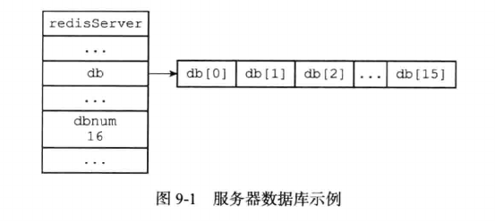
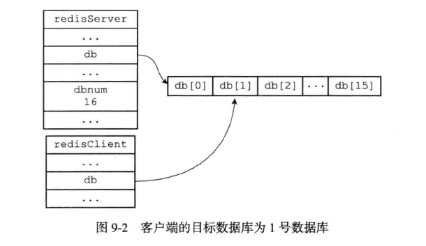
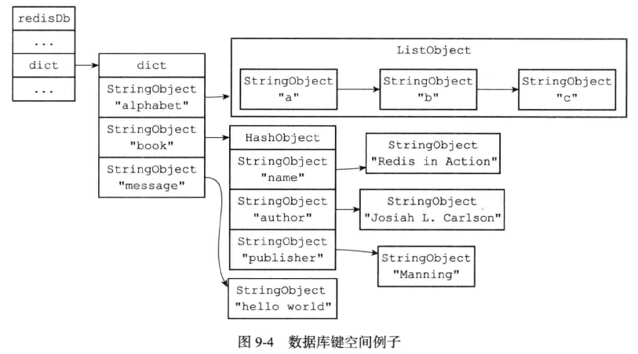
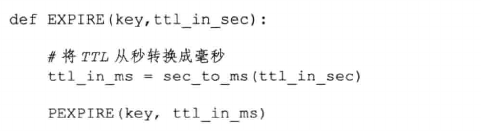
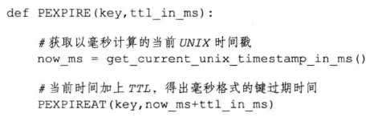
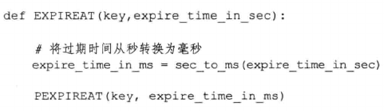
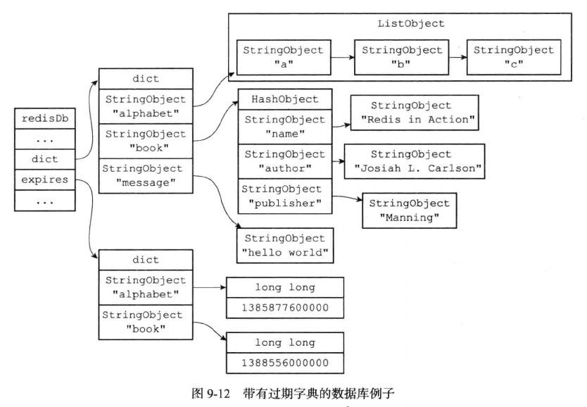

# 数据库的底层实现

Redis服务器将所有数据库保存在redis.h/redisServer结构的db数组中，db数组的每一项是一个redis.h/redisDb结构，每个redisDb结构代表一个数据库。

```c
struct redisServer {
    // ...
    // 一个数组，保存着服务器中所有数据库
    redisDb *db;
    // ...
}
```

在初始化服务器时，程序会根据服务器的dbnum属性来决定应该创建多少个数据库：

```c
struct redisServer {
    // ...
    // 服务器的数据库数量
    int dbnum;
    // ...
}
```
dbnum属性的值由服务器配置的database选项决定，默认情况下，该选项的值为16，所以Redis服务器默认创建16个数据库



## 切换数据库

每个Redis客户端都有自己的目标数据库，目标数据库是客户端执行命令的操作对象。

默认情况下，Redis客户端的目标数据库为0号数据库，客户端可以通过执行SELECT命令来切换目标数据库。

在服务器内部，客户端状态redisClient结构的db属性记录了客户端当前的目标数据库，这个属性是一个指向redisDb结构的指针：

```c
typedef struct redisClient {
    // ...
    // 记录当前客户端正在使用的数据库
    redisDb *db;
    // ...
} redisClient;
```
redisClient.db指针指向redisServer.db数组的一个元素，而被指向的元素就是客户端目标数据库



SELECT命令通过修改redisClient.db指针，让它指向服务器的不同数据库，从而实现切换数据库的功能。

Redis没有可以返回客户端目标数据库的命令，redis-cli会在命令提示符旁标注目标数据库。操作多库时，为防止误操作，建议先显示执行SELECT命令再执行别的命令。

## 数据库键空间

redisDb结构的dict字典保存了数据库中的所有键值对，这个字典称为键空间(key space)。

```c
typedef struct redisDb {
    // ...
    // 数据库键空间，保存着数据库中的所有键值对
    dict *dict;
    // ...
} redisDb;
```
- 键空间的每个键是一个字符串对象。

- 键空间的值是数据库中的值，每个值可以是字符串对象，列表对象，哈希表对象，集合对象和有序集合对象中任意一种Redis对象。

  

- 数据库的键空间是一个字典，所有针对数据库的操作(添加，删除，更新，取值)，都是通过对键空间字典进行操作实现的。

- 很多针对数据库本身的Redis命令，也是通过对键空间进行处理来完成的：

  - 用于清空整个数据库的FLUSHDB命令，通过删除键空间的所有键值对来实现。
  
  - 用于随机返回数据库中某个键的RANDOMKEY命令，通过在空间中随机返回一个键来实现。
  
  - 用于返回数据库键数量的DBSIZE命令，通过返回键空间中包含的键值对数量来实现。

## 读写键空间维护工作

当使用Redis命令对数据库进行读写时，服务器不仅会对键空间执行指定的读写操作，还会执行一些额外的维护操作。

- 在操作(读或写)一个键之后，服务器会根据键是否存在来更新服务器的键空间命中(hit)次数或键空间不命中(miss)次数，这两个值可以在INFO stats命令的keyspace_hits属性和keyspace_misses属性查看。

- 在读取一个键之后，服务器会更新键的LRU时间，这个值用于计算键的闲置时间，使用 OBJECT idletime \<key\> 可以查看键的闲置时间。

- 如果服务器在读取一个键时发现该键已经过期，那么服务器会删除这个过期键，然后才执行余下操作。

- 如果有客户端使用WATCH命令监视了某个键，那么服务器在对被监视的键进行修改之后，会将这个键标记为脏(dirty)，从而让事务注意到这个键已经被修改过。

- 服务器每修改一个键之后，都会对脏(dirty)键计数器值增1，这个计数器会触发服务器的持久化及复制操作。

- 如果服务器开启了数据库通知功能，那么在对键进行修改后，服务器将按配置发送相应的数据库通知。

## 设置过期时间

Redis有四个不同的命令可以用于设置键的生存时间(键可以存多久)或过期时间(键什么时候被删除)。

- EXPIRE key ttl 命令用于将键key的生存时间设置为ttl秒

- PEXPIRE key ttl 命令用于将键key的生存时间设置为ttl毫秒

- EXPIREAT key timestamp 命令用于将键的过期时间设置为timestamp所指定的秒数时间戳

- PEXPIREAT key timestamp 命令用于将键的过期时间设置为timestamp所指定的毫秒时间戳

虽然有多种不同单位和不同形式的设置命令，但实际上EXPIRE，PEXPIRE，EXPIREAT三个命令都是使用PEXPIREAT命令来实现的：无论客户端执行的是以上四个命令中的哪一个，经过转换后，最终的执行效果都和执行PEXPIREAT命令一样。

- EXPIRE命令转换为PEXPIRE命令：

  

- PEXPIRE命令转换为PEXPIREAT命令：

  

- EXPIREAT命令转换为PEXPIREAT命令：

  

## 保存过期时间

redisDb结构的expires字典保存了数据库中所有键的过期时间，这个dict称为过期字典。

- 过期字典的键是一个指针，这个指针指向键空间中的某个键对象。

- 过期字典的值是一个long long类型的整数，这个整数保存了键所指向的数据库键的过期时间，一个毫秒精度的时间戳。

```c
typedef struct redisDb {
    // ...
    // 过期字典，保存着过期时间
    dict *expires
    // ...
} redisDb;
```
下图展示了一个带有过期时间的数据库例子，在这个例子中，键空间保存数据库中所有键值对，而过期字典则保存了数据库键的过期时间。



- 当客户端执行PEXPIREAT命令为一个数据库键设置过期时间时，服务器会在数据库的过期字典中关联给定的数据库键和过期时间。

- PERSIST命令可以移除一个键的过期时间，该命令会在过期字典中找出给定的键，并解除键和值在过期字典中的关联。

- TTL和PTTL两个命令通过计算过期键的时间和当前时间的时间差返回剩余生存时间，一个以秒为单位，另一个以毫秒为单位。

通过过期字典，可以用以下步骤来检查一个键是否过期：

- 检查给定键是否存在于过期字典，如果存在，取得过期时间。

- 检查当前UNIX时间戳是否大于键的过期时间，如果大于，键已过期，否则未过期。


