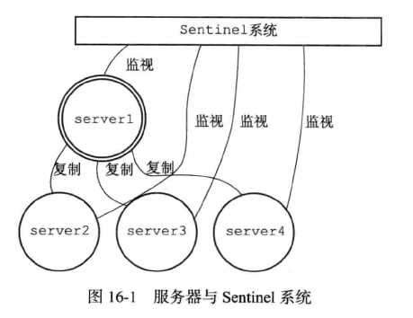
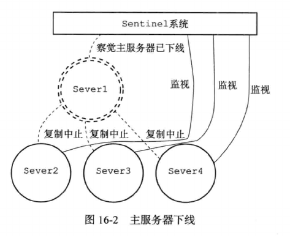
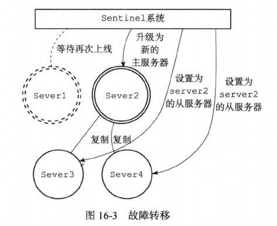
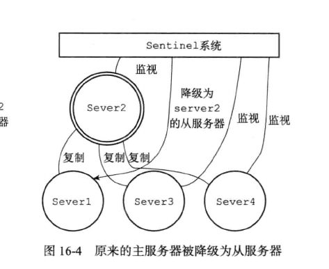

# 哨兵机制

为了解决主从复制模式下主节点宕机影响系统运行的问题，Redis提供了哨兵(Sentinel)的高可用解决方案。可以在一个架构中运行多个Sentinel进程，这些进程使用流言协议 (gossip protocols) 来接收关于主服务器是否下线的信息，并使用投票协议(agreement protocols)来决定是否执行自动故障迁移，以及选择哪个从服务器作为新的主服务器。

哨兵至少需要3个实例，来保证自己的健壮性。哨兵+redis主从的部署架构，是不会保证数据零丢失的，只能保证redis集群的高可用性。



Redis主从模式下有两种情况需要考虑：

1).从Redis宕机

这个相对而言比较简单,在Redis中从库重新启动后会自动加入到主从架构中,自动完成同步数据。在Redis2.8版本后,主从断线后恢复
的情况下实现增量复制。

2).主Redis宕机

这个相对而言就会复杂一些,需要以下2步才能完成

- 在从数据库中执行SLAVEOF NO ONE命令,断开主从关系并且提升为主库继续服务

- 第二步,将主库重新启动后,执行SLAVEOF命令,将其设置为其他库的从库,这时数据就能更新回来

哨兵机制主要解决了以下问题：

- 监控：监控哨兵节点，主节点和从节点的运行状态。

- 报警：当发现某个节点出问题时，通过API进行报警。

- 故障转移：当主节点宕机时，哨兵从原主节点下的所有可用从节点中选举出一个作为主节点，原主节点降为从节点，并将其他从节点的主节点配置改为指定新主节点。

- 配置中心：客户端连接的是哨兵节点集合，从中获取主节点的信息。

## 主观下线与客观下线

Sentinel以每秒1次的频率向所有与其建立了命令连接的实例(主节点，从节点，其他sentinel节点）发ping命令，通过判断ping回复是有效回复，还是无效回复来判断实例是否在线（对该sentinel来说是主观在线）。

Sentinel配置文件中的down-after-milliseconds设置了判断主观下线的时间长度，如果实例在down-after-milliseconds毫秒内，返回的都是无效回复，那么sentinel回认为该实例已（主观）下线，修改其flags状态为SRI_S_DOWN。

当Sentinel将一个主节点判断为主观下线后，为了确认这个主节点是否真的下线了，它会向同样监视这一节点的其他Sentinel进行询问，当认为主观下线的票数超过了quorum（选举）个数，此时哨兵节点则认为该主节点确实有问题，这样就客观下线了。

## 哨兵leader选举算法

如果哨兵主节点被判定为客观下线之后，就要选取一个哨兵节点来完成后面的故障转移工作，选举出一个leader的流程如下:

- 每个在线的哨兵节点都可以成为领导者，当它确认主节点下线时，会向其它哨兵发is-master-down-by-addr命令，征求判断并要求将自己设置为领导者，由领导者处理故障转移；

- 当其它哨兵收到此命令时，可以同意或者拒绝它成为领导者；

- 如果哨兵发现自己在选举的票数大于等于num(sentinels)/2+1时，将成为领导者，如果没有超过，继续选举

## 自动故障转移

- Sentinel状态数据结构中保存了主服务的所有从服务信息，Leader节点按照如下的规则从从节点列表中挑选出新的主节点：

  - 过滤掉主观下线的节点

  - 选择slave-priority最高的节点，如果由则返回没有就继续选择

  - 选择出复制偏移量最大的系节点，因为复制便宜量越大则数据复制的越完整，如果由就返回了，没有就继续

  - 选择run_id最小的节点

  

- 通过slaveof no one命令，让选出来的从节点成为主节点；并通过slaveof命令让其他节点成为其从节点。

  

- 将已下线的主节点设置成新的主节点的从节点，当其回复正常时，复制新的主节点，变成新的主节点的从节点。

  

## 主备切换的数据丢失问题

异步复制：因为master->slave的复制是异步的，所以可能有部分数据还没复制到slave，master就宕机了，这些数据就丢失了。

脑裂：某个master所在机器突然脱离了正常的网络，跟其他slave机器不能连接，但是实际上master还运行着, 这个时候，集群中就会出现两个master。

此时虽然某个slave被切换成了master，但是可能client还没来得及切换到新的master，还继续写向旧master数据可能就会丢失。因此master在恢复的时候，会被作为一个slave挂到新的master上，自己的数据会被清空，从新的master复制数据,

解决异步复制和脑裂导致的数据丢失问题，设置数据复制和同步的延迟时间:

```
min-slaves-to-write 1
min-slaves-max-lag 10
```

要求至少有1个slave，数据复制和同步的延迟不能超过10秒
如果说一旦所有slave，数据复制和同步的延迟都超过了10秒钟，那么这个时候，master就不会再接收任何请求了。

- 减少异步复制的数据丢失：有了min-slaves-max-lag这个配置，可以确保slave复制数据和ack延时太长，就认为master宕机后会损失很多数据，那么就拒绝写请求，这样可以把master宕机时由于部分数据未同步到slave导致的数据丢失降低的可控范围内

- 减少脑裂的数据丢失：如果一个master出现了脑裂，跟其他slave丢了连接，那么上面两个配置可以确保说，如果不能继续给指定数量的slave发送数据，而且slave超过10秒没有给自己ack消息，那么就直接拒绝客户端的写请求。如果跟任何一个slave丢了连接，在10秒后发现没有slave给自己ack，那么就拒绝新的写请求.因此在脑裂场景下，最多就丢失10秒的数据。

## 总结

哨兵架构，几乎可以做到了要实现的高可用，但是哨兵的选举还是需要时间的，而且中间会阻塞客户端的请求，假如我们的选举消耗了1秒（实际可能几秒，高则几十秒），就在这1秒的时候来了客户端的请求，那个请求也是不可用的，并且读写的节点实际还是单节点的。

