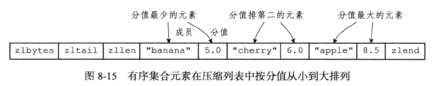
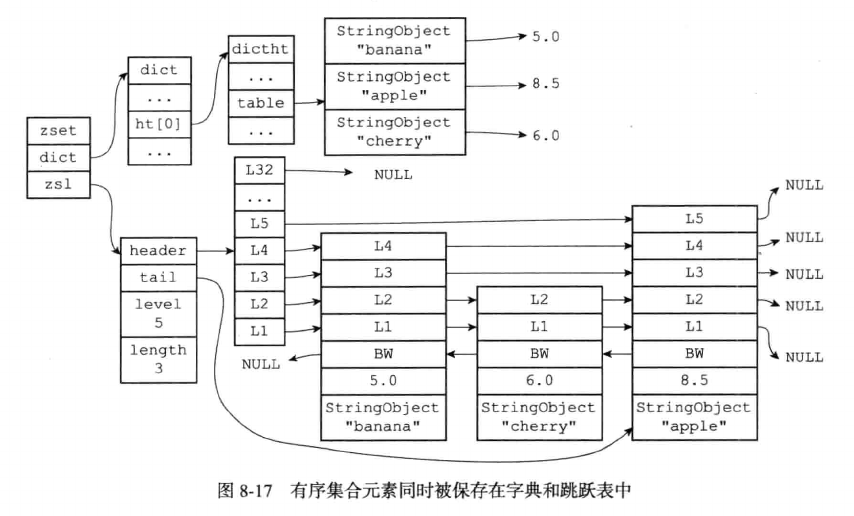
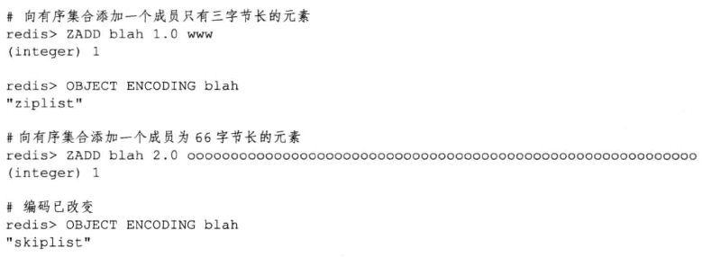

# 有序集合

有序集合的编码可以是ziplist和skiplist。

- ziplist编码的压缩列表对象使用压缩列表作为底层实现，每个集合元素使用两个紧邻的压缩列表节点来保存，第一个节点保存元素的成员(member)，第二个节点保存元素的分值(score)。

  压缩列表内的集合元素按分值从小到大进行排序，分值较小的元素被放置在靠近表头的方向，而分值较大的元素则被放置在靠近表尾的地方。

  

- skiplist编码的有序集合使用zset结构作为底层实现，一个zset结构同时也包含一个字典和一个跳表：

```c
typedef struct zset {
    zskiplist   *zsl;
    dict        *dict;
} zset;
```

- zset 结构中的zsl跳表按分值从小到大保存了所有集合元素，每个跳表节点都保存了一个集合元素：跳表节点的object属性保存了元素的成员，而跳表节点的score属性则保存了元素的分值。通过这个跳表，程序可以对有序集合进行范围型操作，比如ZRANK，ZRANGE等命令是通过跳表API实现的。

- zset 结构中的dict字典为有序集合创建了一个从成员到分值的映射，字典中的每个键值对都保存了一个集合元素：字典的键保存了元素的成员，字典的值保存了元素的分值。通过这个字典，程序可以用O(1)复杂度查找给定成员的分值，ZSCORE命令就是根据这个特性支持的，很多其他的有序集合命令都在实现的内部用到了这一特性。

- 有序集合每个元素成员都是一个字符串对象，每个元素的分值都是一个double类型的浮点数，虽然zset结构同时使用跳表和字典保存有序集合元素，但是这两种数据结构都会通过指针共享相同元素的成员和分值，所以同时使用两种结构不会带来内存浪费。



## 编码转换

当有序集合对象同时满足以下两个条件时，对象使用ziplist编码：

- 有序集合保存的元素数量小于128个

- 有序集合保存的元素成员的长度小于64字节

不能满足以上两个条件的有序集合将使用skiplist编码

> 以上两个条件的上限值是可以修改的，具体请看配置文件中关于zset-max-ziplist-entries选项和zset-max-ziplist-value选项的说明。

对于使用ziplist编码的有序集合对象来说，当使用ziplist编码所需的两个条件中的任意一个不能被满足时，就会执行对象的编码转换操作，原本保存在压缩列表里的所有集合元素都会被转移并保存在zset结构里，对象的编码也从ziplist变为skiplist

以下代码展示了有序集合对象因为包含过多的元素而引发编码转换的情况：



一下代码则展示了有序集合对象因为元素的成员过长而引发的编码转换情况：


