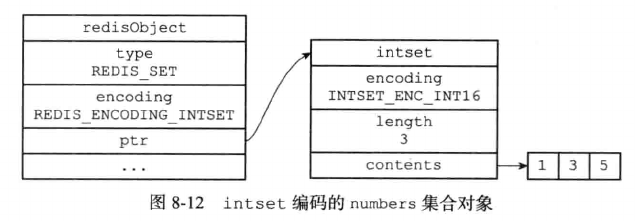
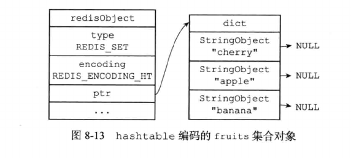
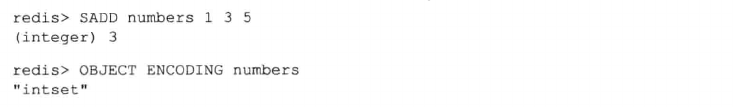
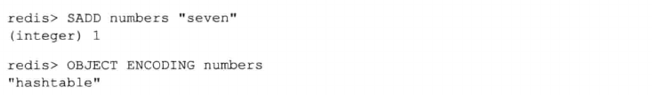
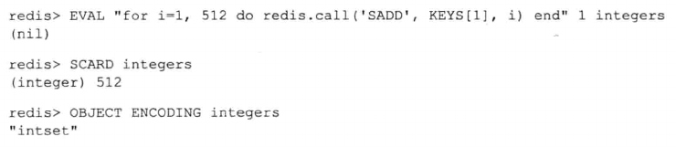

# 集合

集合的编码可以是intset或hashtable。

- intset编码的集合对象使用整数集合作为底层实现，集合对象包含的所有元素都被保存在整数集合里面。

  

- 另一方面，hashtable编码的集合对象使用字典作为底层实现，字典的每个键都是一个字符串对象，每个字符串对象包含了一个集合元素，而字典的值则全部被设置为NULL。

  

## 编码的转换

当集合对象可以同时满足以下两个条件时，对象使用intset编码：

- 集合对象保存的所有元素都是整数值

- 集合对象保存的元素数量不超过512个

不能满足这两个条件的集合对象需要使用hashtable编码

> 第二个条件的上限值可以修改，具体参见配置文件中关于set-max-intset-entries选项的说明

对于使用intset编码的集合对象来说，当使用intset编码所需的两个条件中任意一个不能满足时，就会执行对象的编码转换操作，原本保存在整数集合中的所有元素都会被转移保存在字典中，并且对象的编码也会从intset变为hashtable。

以下代码创建了一个只包含整数元素的集合对象，该对象的编码为intset

此时我们向这个只包含整数元素的集合添加一个字符串元素，集合对象的编码转换操作就会进行：

除此之外，如果我们创建了一个包含512个整数元素的集合对象，那么该对象的编码应该是intset：

但是只要我们再向集合中添加一个元素，使得这个集合的元素数量变成513，那么对象的编码转换操作就会被执行。

