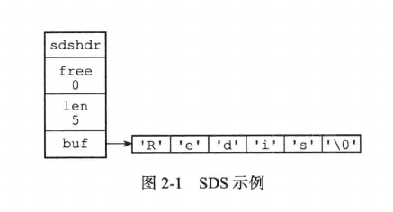
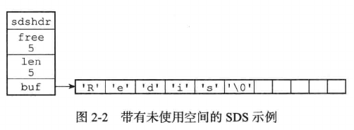

# 简单动态字符串SDS

Redis没有使用C语言中以空字符结尾的字符数组来表示字符串，而是自己构建了一种简单动态字符串(SDS)的类型，并将SDS作为Redis的默认字符串表示。

SDS的定义如下：

```c
struct sdshdr {
    int len;         //记录buf中已经使用的字节数量
    int free;        //记录buf中未使用的字节数量
    char buf[];      //字节数组，用于保存字符串
}
```
下图展示了一个SDS实例：

- len属性值为5，表示这个SDS保存了一个五字节长的字符串。

- free属性值为0，表示这个SDS未分配任何未使用空间。

- buf属性是一个char类型的数组，数组前五个字节保存'R'，'e'，'d'，'i'，'s'五个字符，最后一个字节则保存了空字符'\0'

SDS中的char数组遵循C字符串以空字符结尾的惯例，这样做的好处是可以重用部分C字符串中的函数。



下面是一个存在未使用空间的SDS



## 应用

在Redis中，C字符串只会作为字符串字面量用在一些无需对字符串进行修改的地方，比如打印日志：

```
redisLog(REDIS_WARNING, "Redis is now ready to exit, bye bye...")
```

当Redis需要一个可以被修改的字符串值时，Redis就会使用SDS来表示字符串，比如包含字符串的键值对都是使用SDS实现的：

```
redis> SET msg "hello world"
OK
```

- 键值对的键是一个字符串对象，对象的底层是一个保存着字符串"msg"的SDS

- 键值对的值也是一个字符串对象，对象的底层是一个保存着字符串"hello world"的SDS

## SDS相比C字符串的优势

### 获取字符串长度

在C字符串中，获取一个字符串的长度需要遍历整个字符串，这个操作的时间复杂度为O(n)，

SDS的len属性记录了SDS的长度，所以获取一个SDS的长度时间复杂度为O(1)。

这确保了统计字符串长度的工作不会成为Redis的性能瓶颈。

### 防止缓冲区溢出

对一个C字符串进行拷贝或者拼接时，目标地址如果空间不足会造成缓冲区溢出，C字符串并不会自动扩容。

SDS的空间分配策略杜绝了缓冲区溢出的可能性：当SDS的API对SDS进行修改时，会先检查空间是否满足修改的需求，如果不满足会自动将SDS的空间扩展至所需的大小。

### 减少内存分配次数

一个包含N个字符的C字符串的底层实现总是一个长度为N+1的字符串数组，每次增长或者缩短一个字符串，都会对底层的数组进行内存重分配操作：

- 如果执行的是增长字符串的操作，那么执行这个操作前需要先通过内存重分配来扩展底层数组空间的大小-否则会产生内存溢出。

- 如果执行的是缩短字符串的操作，那么执行这个操作后需要释放字符串不使用的那部分的内存空间-否则会产生内存泄漏。

频繁的内存分配会产生耗时的系统调用，对性能造成很大影响。

SDS实现了空间预分配和惰性空间释放两种策略

- 空间预分配：空间预分配用于优化SDS字符串的增长操作，当对SDS进行空间扩展的时候，程序不仅会为SDS分配修改所必须的空间，还会为SDS分配额外的未使用空间。

    其中额外分配的未使用空间大小如下：

    - 如果SDS修改之后，SDS的长度小于1MB，那么程序分配和len属性同样大小的未使用空间，此时SDS的free属性的值将和len相同。

    - 如果SDS修改之后，SDS的长度大于或等于1MB，那么程序会分配1MB的未使用空间。

通过上述的空间预分配策略，Redis可以减少连续执行字符串增长操作带来的内存重分配次数。N次增长的内存重分配次数由N次降低为最多N次。

在扩展SDS空间之前，SDS API会先检查未使用空间是否足够，如果足够的话，API就会直接使用未分配的空间，而无需执行内存重分配。

- 惰性空间释放：惰性空间释放用于优化SDS字符串的缩短操作，当SDS缩短字符串时，程序不立即使用内存重分配来回收缩短后剩余的字节，而是使用free属性将这些字节记录起来，并等待将来使用。

通过惰性空间释放策略，SDS避免缩短字符串所需的内存重分配操作，并为未来可能的增长操作带来优化。

与此同时，SDS也提供了相应的API，允许用户在有需要时真正的释放SDS的未使用空间，所以不用担心惰性空间释放带来的内存浪费。

### 二进制安全

C字符串的字符必须符合某种编码(比如ASCII)，并且除了字符串末尾之外，字符串里面不能包含任何字符，否则最先被程序读入的空字符将被认为是字符串结尾，这些限制使得C字符串只能保存文本数据，而不能保存图片，音频，视频，压缩文件等二进制数据。

SDS的API都是二进制安全的(binary safe)，所有SDS API都会以处理二进制的方式处理存放在buf中的数据，buf是一个字节数组，程序不会做任何限制，过滤或者假设，数据在写入的时候是什么样的，被读取的时候就是什么样的。

### 兼容C函数

SDS遵循C字符串空字符结尾的惯例，这样做可以保证SDS可以重用一部分<string.h>定义的函数。这样Redis就不用专门编写SDS中不存在而C标准库存在的那些函数了，减少了代码重复。

