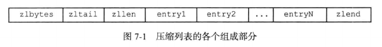
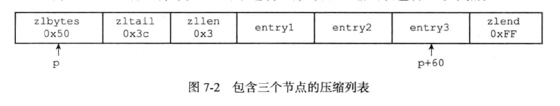
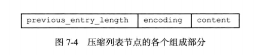
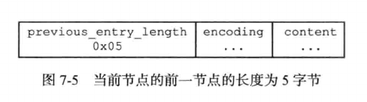
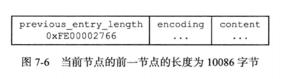
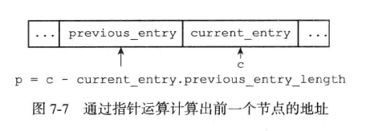
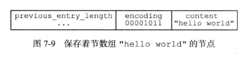
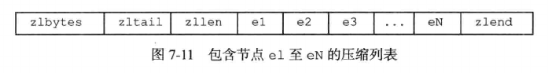
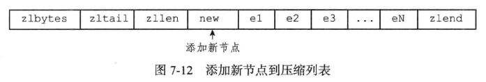

# 压缩列表

压缩列表(ziplist)是Redis为了节约内存而开发的，是由一系列特殊编码的连续内存块组成的顺序型(sequential)数据结构。一个压缩列表可以包含任意多个节点(entry)，每个节点可以保存为一个字节数组或者一个整数值。

一个压缩列表的组成部分如下：

- zlbytes：记录整个压缩列表占用的内存字节数，在对压缩列表进行内存重分配或者计算zlend位置时使用。

- zltail：记录压缩列表表尾节点距离压缩列表的起始地址有多少字节，通过这个偏移量，程序无需遍历整个压缩列表就可以确定表尾节点的地址。

- zllen：记录了压缩列表包含的节点数量

- entry：压缩列表的各个节点

- zlend：特殊值0xFF，用于标记压缩列表的末端

- 列表zlbytes属性的值为0x50(十进制80)，表示压缩列表的总长为80个字节。

- 列表zltail属性的值为0x3c(十进制60)，表示如果有一个指向压缩列表起始地址的指针p，那么指针p加上偏移量60，就可以计算出表尾节点entry3的值。

- 列表zllen属性的值为0x3(十进制3)，表示压缩列表含有3个节点。

## 列表节点的构成

每个压缩列表节点可以保存一个字节数组或者一个整数值。

其中，字节数组可以是以下三种长度中的一种：

- 长度小于等于63字节(2^6-1)的字节数组

- 长度小于等于16383字节(2^14-1)的字节数组

- 长度小于等于4294967295(2^32-1)的字节数组

整数值可以是以下六种长度中的一种：

- 4位长，0-12之间的无符号整数

- 1字节长的有符号整数

- 3字节长的有符号整数

- int16_t类型整数

- int32_t类型整数

- int64_t类型整数

每个压缩列表节点有previous_entry_length，encoding，content三个部分组成：

- previous_entry_length：以字节为单位，记录了压缩列表中前一节点的长度。previous_entry_length属性的长度为1个字节或5个字节：

    - 如果前一个节点长度小于254个字节，那么previous_entry_length属性的长度为1个字节

    - 如果前一个节点长度大于254个字节，那么previous_entry_length属性的长度为5个字节，其中属性的第一字节会被设置为0xFE，而后面的四个字节用于保存前一节点的长度

        

        

    只要我们有一个指向某个节点起始地址的指针，那么通过这个指针以及这个节点的previous_entry_length属性，程序就可以一直向前回溯，最终到达压缩列表的头节点。

    

- 节点的encoding属性记录了节点的content属性保存数据类型和长度

    - 一字节，两字节或者五字节长度，值的最高位为00，01或者10的是字节数组编码：
    这种编码表示节点的content属性保存着字节数组，数组的长度由编码除去最高两位之后的其他位记录

    - 一字节长，值的最高位以11开头的是整数编码：这种编码表示节点的content属性保存者整数值，整数值的类型和长度由编码除去最高两位之后的其他位记录

- 节点的content属性负责保存节点的值，节点值可以是一个字节数组或者整数，值的类型和长度由节点的encoding属性决定。

- 编码的最高两位00表示节点保存的是一个字节数组

- 编码的后六位001011记录了字节数组的长度11

- content属性保存着节点的值"hello world"

## 连锁更新问题

在一个压缩列表中，如果有多个连续的，长度介于250字节到253字节的节点e1至eN，那么这些节点的previous_entry_length属性都是1字节长的

这时，如果把一个长度大于等于254字节的新节点new设置为压缩列表的表头节点，那么带来的连锁反应就是：e1，e2，e3...eN都要进行空间重分配工作。

Redis将这种特殊情况下产生的连续多次的空间扩展操作称为“连锁更新”(cascade update)，除了添加节点可能会引发连锁更新，删除节点也有可能导致连锁更新。

因为连锁更新在最坏情况下需要对压缩列表执行N次空间重分配操作，而每次空间重分配的最坏复杂度为O(N)，所以连锁更新的最坏复杂度为O(N^2)

但是实际上由此引起的性能问题几率是很低的：

- 压缩列表里恰好有很多连续的长度介于250-253字节的节点，这种情况并不多见

- 出现了连锁更新，但是只要节点数量不多，对性能的影响不大

所以ziplistPush等命令的平均复杂度为O(N)

## 压缩列表的应用

压缩列表是列表键和哈希键的底层实现之一，当一个列表键只包含少量列表项，并且每个列表项要么是小整数值，要么是长度比较短的字符串，那么Redis就会使用压缩列表来做列表键的底层实现。

当一个哈希键只包含少量键值对时，且每个键值对要么就是小整数，要么就是比较短的字符串，那么Redis就会使用压缩列表来做哈希键的底层实现。
