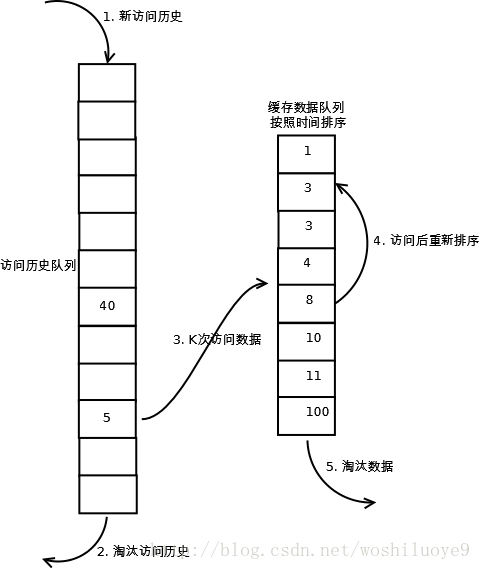
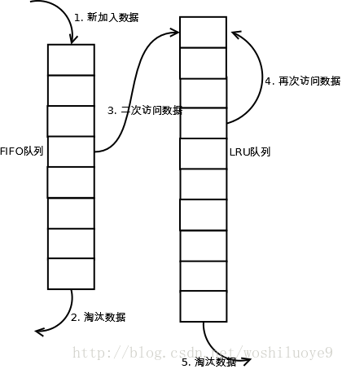
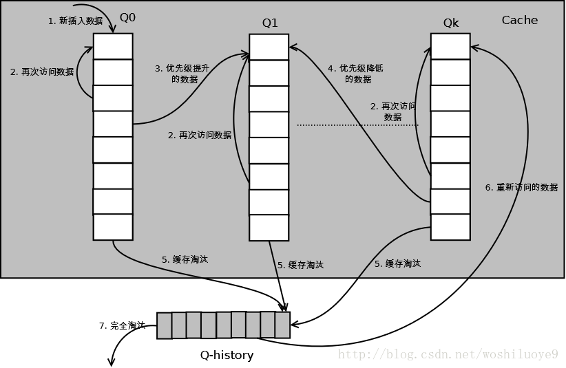

# 缓存淘汰策略之LRU算法改进

## LRU算法与LFU算法

前面两篇介绍了LRU和LFU两种缓存置换算法：

- LRU(Least recently used)，基于访问时间淘汰最近最少使用的数据。

  - 新数据插入到链表头部。

  - 每当缓存命中，则将数据移到链表头部。

  - 当链表满的时候，将链表尾部的数据丢弃。

当存在热点数据时，LRU的效率很好，但是偶发性的，周期性的批量操作会导致LRU命中率急剧下降，缓存污染比较严重。

- LFU(Least frequently used)，基于访问频率淘汰使用频率最低的数据。

  - 新加入数据插入到队列尾部。(引用计数为1)

  - 队列中的数据被访问后，引用计数增加，队列重新排列。

  - 当需要淘汰数据的时候，将已经排序的列表最后的数据块删除。

一般情况下，LFU效率要优于LRU，且能够避免周期性或者偶发性的操作导致缓存命中率下降的问题。但LFU需要记录数据的历史访问记录，一旦数据访问模式改变，LFU需要更长时间来适用新的访问模式，即：LFU存在历史数据影响将来数据的"缓存污染"效用。

## LRU-K算法

### 原理

LRU-K中的K代表最近使用的次数，因此LRU可以认为是LRU-1。LRU-K的主要目的是解决LRU算法中的缓存污染问题，其核心思想是将"最近使用过1次"的判断标准扩展为"最近使用K次"。

### 实现

相比LRU，LRU-K需要多维护一个队列，用于记录所有缓存数据被访问的历史。只有当数据的访问次数达到K次的时候，才将数据放入缓存。当需要淘汰数据时，LRU-K会淘汰第K次访问时间距当前时间最大的数据。详细过程如下：

1. 数据第一次被访问时，加入到访问历史列表

2. 如果数据在访问历史列表里没有达到K次访问，则按照一定的规则(FIFO LRU)淘汰

3. 当访问历史队列中的数据访问次数达到K次后，将数据索引从历史队列删除，将数据移到缓存队列中，并缓存此数据，缓存队列重新按照时间排序

4. 缓存数据队列中被再次访问后，重新排序

5. 需要淘汰数据时，淘汰缓存队列中排在尾部的数据，即：淘汰"倒数第K次访问离现在最久"的数据。

### 分析

**命中率** LRU-K降低了“缓存污染”带来的问题，命中率比LRU要高。

**复杂度** LRU-K队列是一个优先级队列，算法复杂度和代价比较高。

**代价** 由于LRU-K还需要记录那些被访问过、但还没有放入缓存的对象，因此内存消耗会比LRU要多；当数据量很大的时候，内存消耗会比较可观。

LRU-K需要基于时间进行排序（可以需要淘汰时再排序，也可以即时排序），CPU消耗比LRU要高。

## Two queues (2Q)

### 原理

Two queues算法类似于LRU-2，不同点在于2Q将LRU-2算法中的访问历史队列改为一个FIFO缓存队列，即：2Q算法有两个缓存队列，一个是FIFO队列，一个是LRU队列。

### 实现

当数据第一次访问时，2Q算法将数据缓存在FIFO队列里面，当数据第二次被访问时，则将数据从FIFO队列移到LRU队列里面，两个队列各自按照自己的方法淘汰数据。详细实现如下：

1. 新访问的数据插入到FIFO队列；

2. 如果数据在FIFO队列中一直没有被再次访问，则最终按照FIFO规则淘汰；

3. 如果数据在FIFO队列中被再次访问，则将数据移到LRU队列头部；

4. 如果数据在LRU队列再次被访问，则将数据移到LRU队列头部；

5. LRU队列淘汰末尾的数据。

上图中FIFO队列比LRU队列短，但并不代表这是算法要求，实际应用中两者比例没有硬性规定。

### 分析

**命中率** 2Q算法的命中率要高于LRU

**复杂度** 需要两个队列，但两个队列本身都比较简单。

**代价** FIFO和LRU的代价之和。

2Q算法和LRU-2算法命中率类似，内存消耗也比较接近，但对于最后缓存的数据来说，2Q会减少一次从原始存储读取数据或者计算数据的操作。

## Multi Queue (MQ)

### 原理

MQ算法根据访问频率将数据划分为多个队列，不同的队列具有不同的访问优先级，其核心思想是：优先缓存访问次数多的数据。

### 实现

MQ算法将缓存划分为多个LRU队列，每个队列对应不同的访问优先级。访问优先级是根据访问次数计算出来的。

详细的算法结构图如下，Q0，Q1….Qk代表不同的优先级队列，Q-history代表从缓存中淘汰数据，但记录了数据的索引和引用次数的队列：

1. 新插入的数据放入Q0；

2. 每个队列按照LRU管理数据；

3. 当数据的访问次数达到一定次数，需要提升优先级时，将数据从当前队列删除，加入到高一级队列的头部；

4. 为了防止高优先级数据永远不被淘汰，当数据在指定的时间里访问没有被访问时，需要降低优先级，将数据从当前队列删除，加入到低一级的队列头部；

5. 需要淘汰数据时，从最低一级队列开始按照LRU淘汰；每个队列淘汰数据时，将数据从缓存中删除，将数据索引加入Q-history头部；

6. 如果数据在Q-history中被重新访问，则重新计算其优先级，移到目标队列的头部；

7. Q-history按照LRU淘汰数据的索引。

### 分析

**命中率** MQ降低了“缓存污染”带来的问题，命中率比LRU要高。

**复杂度** MQ需要维护多个队列，且需要维护每个数据的访问时间，复杂度比LRU高。

**代价** MQ需要记录每个数据的访问时间，需要定时扫描所有队列，代价比LRU要高。

虽然MQ的队列看起来数量比较多，但由于所有队列之和受限于缓存容量的大小，因此这里多个队列长度之和和一个LRU队列是一样的，因此队列扫描性能也相近。

## LRU类算法对比

由于不同的访问模型导致命中率变化较大，此处对比仅基于理论定性分析，不做定量分析。

命中率

LRU-2 > MQ(2) > 2Q > LRU

复杂度

LRU-2 > MQ(2) > 2Q > LRU

代价

LRU-2 > MQ(2) > 2Q > LRU

实际应用中需要根据业务的需求和对数据的访问情况进行选择，并不是命中率越高越好。例如：虽然LRU看起来命中率会低一些，且存在”缓存污染“的问题，但由于其简单和代价小，实际应用中反而应用更多。

