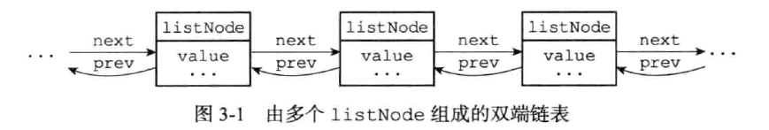
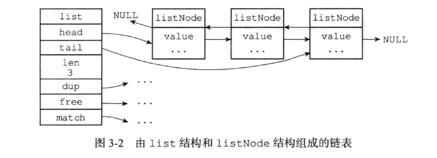

# 链表

作为一种常用的数据结构，很多高级语言内置了链表这种数据结构，由于C语言中没有实现，所以Redis实现了自己的链表结构。

每个链表节点使用一个adlist.h/listNode结构来表示：

```c
typedef struct listNode {
    //前置节点
    struct  listNode *prev;
    //后置节点
    struct  listNode *next;
    //节点的值
    void    *value;
}
```

多个listNode通过prev和next组成双端链表，如下所示：



一个链表使用一个adlist.h/list结构表示：

```c
typedef struct list {
    //表头节点
    listNode    *head;
    //表尾节点
    listNode    *tail;
    //链表包含的节点数量
    unsigned long len;
    //节点值复制函数
    void *(*dup) (void *ptr);   
    //节点值释放函数
    void (*free) (void *ptr);
    //节点值对比函数 
    int (*match) (void *ptr, void *key);
} list;
```

list结构为链表提供了表头指针head，表尾指针tail，以及链表长度计数器len，而dup，free和match成员则是用于实现多态链表所需的类型特定函数：

- dup函数用于复制链表节点所保存的值。

- free函数用于释放链表节点所保存的值。

- match函数用于对比链表节点所保存的值和另一个输入值是否相等。



## 链表的特性

Redis的链表特性可以总结如下：

- 双端：链表节点带有prev和next指针，获取某个节点的前置节点和后置节点的复杂度都是O(1)

- 无环：表头节点的prev指针和表尾节点的next指针都指向NULL，对链表的访问以NULL为终点。

- 带表头指针和表尾指针：通过list结构head指针和tail指针，程序获取链表的表头节点和表尾节点的复杂度为O(1)。

- 带链表长度计数器：程序使用list结构的len属性来对list持有的链表节点进行计数，程序获取链表中节点数量的复杂度为O(1)。

- 多态：链表节点使用void*指针来保存节点值，并且可以通过list结构的dup，free，match三个属性为节点值设置类型特定函数，所以链表可以用于保存各种类型不同的值。


## 链表的应用

链表在Redis中的应用非常广泛，列表键的底层实现就是一个链表。当一个列表键包含了数量比较多的元素，或者列表中包含的元素都是比较长的字符串时，Redis会使用链表作为列表键的底层实现。

除了列表键之外，发布订阅，慢查询，监视器等功能也用到了链表，Redis服务器本身还使用链表来保存多个客户端状态信息，以及使用链表来构建客户端输出缓冲区(output buffer)。


