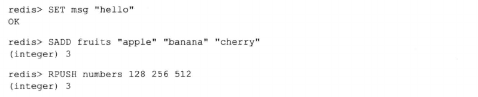
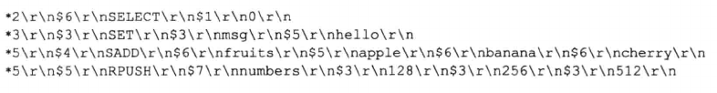
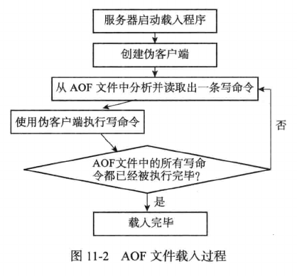
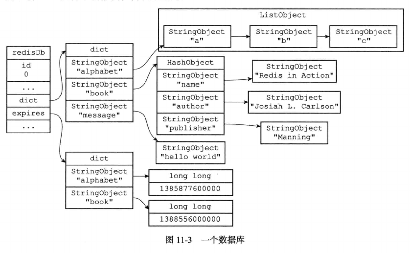
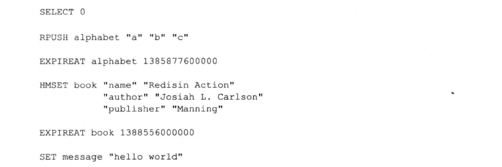

# AOF持久化

Redis提供了AOF(Append Only File)持久化功能，AOF持久化通过保存Redis服务器执行的写命令来记录数据库状态。



上面的命令对应的AOF文件内容如下：



- 被写入AOF文件的所有命令都是以Redis命令请求协议格式保存的，Redis命令请求协议是纯文本格式，因此AOF文件是文本文件，可以直接打开。

- 服务器在启动时，可以通过载入和执行AOF文件中保存的命令来还原服务器关闭之前的数据库状态。

## AOF持久化实现

AOF持久化功能可以分为命令追加(append)，文件写入，文件同步(sync)三个步骤。

### 命令追加

当AOF持久化功能处于打开状态时，服务器在执行完一个命令后，会以协议格式将被执行的写命令追加到服务器状态的aof_buf缓冲区末尾。

```c
struct redisServer {
    // ...
    // AOF 缓冲区
    sds aof_buf;
    // ...    
}
```
如果客户端发送以下命令：

```
redis> SET KEY VALUE
OK
```

那么服务器在执行这个SET命令后，会将以下协议内容追加到aof_buf缓冲区的末尾

```
*3\r\n$3\r\nSET\r\n$3\r\nKEY\r\n$5\r\nVALUE\r\n
```

### 文件写入与同步

Redis服务器进程是一个事件循环(loop)，这个循环中的文件事件负责接收客户端的命令请求，以及向客户端发送命令回复，而时间事件负责执行像serverCron函数这样需要定时运行的函数。

在多数操作系统中，当用户调用write函数将数据写入文件时，操作系统通常会将写入数据保存在一个内存缓冲区中，等到缓冲区被填满或到了指定期限时才真正将数据写入磁盘中。

- 这种做法虽然提高了效率，但也为写入数据带来了安全问题，因为如果计算机发生停机，那么未进行同步的数据会丢失。

- 系统专门提供了fsync和fdatasync两个同步函数，它们可以强制让操作系统立即将缓冲区中的数据同步到磁盘中，从而确保写入数据安全性。

因为服务器在处理文件事件时可能会执行写命令，使得一些内容被追加到aof_buf缓冲区里，所以服务器每次结束一个事件循环之前，都会调用flushAppendOnlyFile函数，考虑是否需要将aof_buf缓冲区中的内容写入和保存到AOF文件中。这个过程可以用下面的伪代码表示：

```
def eventLoop():
    while true:
        # 处理文件事件，接受命令请求以及发送命令回复
        # 处理命令请求时可能会有新内容被追加到aof_buf缓冲区
        processFileEvents()

        # 处理时间时间
        processTimeEvents()

        # 考虑是否将aof_buf中的内容写入和保存到AOF文件中
        flushAppendOnlyFile()
```
flushAppendOnlyFile函数的行为由服务器配置的appendfsync选项值来决定，各个不同的值的同步行为如下：

- always：每个事件循环将aof_buf缓冲区的所有内容写入并同步到AOF文件。从效率上讲是三者中最慢的，从安全性上讲是最安全的。出现故障停机，会丢失一个事件循环中产生的命令。

- everysec：每个事件循环将aof_buf缓冲区的所有内容写入到AOF文件，如果上次同步AOF文件的时间距离现在超过1秒钟，那么再次对AOF文件进行同步，并且这个同步操作是由一个线程专门负责执行的。从效率上讲足够快，出现故障停机，会丢失一秒钟的数据。

- no：每个事件循环将aof_buf缓冲区中的所有内容写入到AOF文件，但并不对AOF文件进行同步，何时同步由操作系统来决定。写入速度是最快的，出现故障停机时，会丢失上次同步AOF命令的所有写命令。

如果用户未指定appendfsync选项的值，那么appendfsync选项的默认值为everysec。

## AOF文件载入与数据还原

因为AOF文件里包含了重建数据库状态的所有写命令，所以只要服务器读入并重新执行一遍AOF文件里保存的写命令，就可以还原服务器关闭之前的数据库状态。



Redis读取AOF文件并还原数据库状态的详细步骤如下：

- 创建一个不带网络连接的伪客户端(fake client)：Redis命令只能在客户端上下文执行，载入AOF文件时命令来源于AOF文件，伪客户端用于执行AOF文件中的命令。

- 从AOF文件中分析并读取一条写命令。

- 使用伪客户端执行被读出的命令。

- 重复上述步骤，直到AOF文件中所有命令被执行完为止

## AOF重写

随着服务器运行时间流逝，AOF文件的内容越来越多，文件体积越来越大。为了解决AOF文件体积膨胀问题，Redis提供了AOF文件重写(rewrite)功能，通过该功能，Redis服务器可以创建一个新的AOF文件替代现有的AOF文件，新的AOF文件不包含冗余命令，体积比旧的小很多。

### AOF重写的实现

AOF重写是通过读取当前数据库状态来实现的，而非读取原来的AOF文件。从数据库读取键现在值，然后用一条命令去记录键值对，代替之前记录这个键值对的多条命令。

- 创建新的AOF文件。

- 遍历数据库，忽略空的数据库。

- 遍历数据库中的所有键，忽略过期键

- 根据键的类型进行语句重写

- 如果有过期时间则设置过期时间



上面的数据库经过AOF重写后，AOF文件内容如下：



> 为了避免在执行命令时造成客户端输入缓冲区的溢出，重写程序在处理列表，哈希表，集合和有序集合这四种可能会带有多个元素的键时，会检查键包含的元素数量，如果元素数量超过了redis.h/REDIS_AOF_REWRITE_ITEMS_PER_CMD常量的值，那么重写命令将使用多条命令来记录键的值，而不使用一条命令。

### AOF后台重写

Redis的BGREWRITEAOF命令将AOF重写程序放到子进程中执行，这样做有两点好处：

- 子进程在AOF重写期间，服务器进程(父进程)可以继续处理命令请求。

- 子进程带有父进程数据的副本，使用子进程而不是线程，可以避免锁的竞争，同时保证数据安全。

子进程在进行AOF重写期间，服务器还要继续处理命令请求，新的命令会对数据库状态进行修改，从而使当前数据库状态和重写后的AOF文件保存的数据库状态不一致。

为了解决这种不一致的问题，Redis服务器设置了一个AOF重写缓冲区，这个缓冲区在服务器创建子进程之后开始使用，当Redis服务器执行完一个写命令后，它会同时将这个写命令发送给AOF缓冲区和AOF重写缓冲区。

- AOF缓冲区的内容会定期被写入和同步到AOF文件中，对现有AOF文件处理工作会正常进行。

- 从创建子进程开始，服务器执行的所有写命令都会被记录到AOF重写缓冲区里面。

当子进程完成AOF重写工作之后，它会向父进程发送一个信号，父进程收到该信号后，调用一个信号处理函数，并执行以下工作：

- 将AOF重写缓冲区中所有内容写入到新的AOF文件中，这时新AOF文件所保存的数据库状态将和服务器当前的数据库状态一致。

- 对新的AOF文件进行改名，原子的覆盖现有AOF文件，完成新旧两个AOF文件替换。

这个信号处理完成后，父进程可以继续像往常一样接受命令请求了。

整个AOF后台重写过程中，只有信号处理函数会对服务器进程造成阻塞，其他时候不会阻塞服务器进程，把对服务器性能的影响降到了最低。

