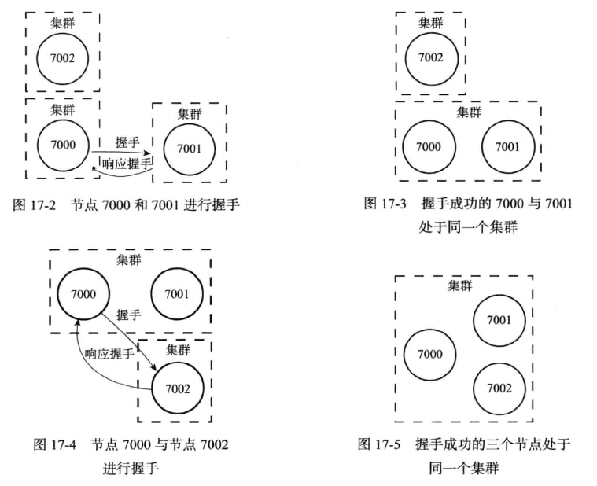
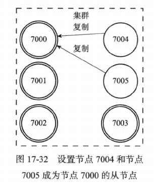
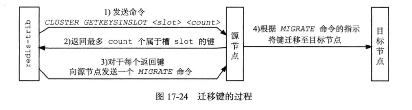

# 集群

在哨兵模式中如果主从中master宕机了，是通过哨兵来选举出新的master，在这个选举切换主从的过程，整个redis服务是不可用的。

哨兵模式中只有一个主节点对外提供服务，因此没法支持更高的并发。

当个主节点的内存设置也不宜过大。否则会导致持久化文件过大，影响数据恢复或主从同步的效率。

## Redis集群工作原理

redis集群是由一系列的主从节点群组成的分布式服务器群，它具有复制、分片和高可用特性。

方便水平扩展，可以根据业务规模可以随时加减配置。据官方文档称可以线性扩展到上万个节点(但是官方推荐不超过1000个节点)。

Redis集群不需要sentinel哨兵也能完成节点移除和故障转移的功能。需要将每个节点设置成集群模式，这种集群模式没有中心节点。

- 启动节点：各个节点设置配置项cluster-enabled值为yes来开启服务器集群模式。

- 连接节点：node节点通过CLUSTER MEET \<IP\> \<PORT\>命令与指定的节点进行握手，握手成功后node节点将指定节点添加到node节点所在集群中。

  

- 设置主从：一个节点向NODE_ID节点发送命令CLUESTER REPLICATE \<NODE_ID\>从而成为NODE_ID节点的从节点。

  

## 槽指派

Redis集群通过分片的方式来保存数据库中的键值对：集群的整个数据库被分为16384个槽(slot)，数据库中每个键都属于这16384个槽其中的一个，集群中的每个节点可以处理0个或最多16384个槽。

- 通过CLUSTER ADDSLOTS命令将数据库中的槽指定给相关节点。

- 当数据库中的16384个槽都有节点在处理时，集群处于上线状态(ok)，相反的如果数据库中任何一个槽没有得到处理，那么集群处于下线状态(fail)。

- 一个节点除了将自己负责处理的槽记录在自身节点信息中，还会将该信息同步给其他节点，以告知其它节点自己处理的槽信息。集群中每个节点都知道16384个槽分别由哪些节点处理。

## 客户端

当客户端发送命令时，接收命令的节点通过CRC16算法对key进行hash计算出所在的槽，计算出要处理的数据库键属于哪个槽，并检查这个槽是否指派给了自己。

- 如果键所在的槽正好指派给了当前节点，那么节点直接执行这个命令。

- 如果键所在的槽没有指派给当前节点，向客户端返回一个MOVED错误，把客户端转向新的节点。

- 客户端根据MOVED错误提供的IP和端口连接节点，重新发送请求。

## 重新分片

重新分片可以将任意数量已经指派给某个节点的槽改为指派给另一个节点，并且相关槽所属的键值对会从源节点移动到目标节点。

重新分片操作可以在线进行，在重新分片过程中，集群不需要下线，源节点和目标节点可以继续处理请求。

重新分片操作由集群管理软件redis-trib负责执行，具体执行步骤如下：

- redis-trib对目标节点发送CLUSTER SETSLOT \<slot\> \<source_id\>命令，让目标节点准备好从源节点导入属于槽slot的键值对。

- redis-trib对源节点发送CLUSTER SETSLOT MIGRATING \<target_id\>命令，让源节点准备好将属于槽slot的键值对迁移到目标节点。

- redis-trib向源节点发送CLUSTER GETKEYSINSLOT \<slot\> \<count\>命令，获得最多count个属于槽slot的键值对的键名。

- 对于上面的每一个键名，redis-trib向源节点发送一个MIGRATE <target_ip> <target_port> <key_name> 0 <timeout>命令，将被选中的键原子的从源节点迁移至目标节点。

- 重复上述两步，直到源节点保存的所有属于槽slot的键值对都被迁移到目标节点为止。

- redis-trib向集群中每个节点发送CLUSTER SETSLOT <slot> NODE <target_id>命令，将槽节点指派给目标节点的消息通知整个集群。

在进行重新分片过程中，当客户端向源节点发送一个与数据库键有关的命令，并且命令要处理的数据库键恰好属于被迁移的槽时：

- 源节点先在自己的数据库中查找指定的键，如果找到，直接执行客户端命令。

- 如果源节点在自己的数据库中找不到指定键，向客户端返回一个ASK错误，引导客户端转向导入槽的目标节点。

## 故障检测

集群中每个节点都会定时向集群中其他节点发送PING消息，以检测对方是否在线，如果接收了PING消息的节点没有在规定时间内返回PONG消息，那么发送PING消息的节点将该节点标记为疑似下线(PFAIL)。

如果在一个集群里面，半数以上负责处理槽的主节点都将某个节点x报告为疑似下线，那么这个主节点x将被标记为已下线(FAIL)，将主节点x标记为已下线的节点会向集群广播一条关于节点x下线的消息，收到消息的节点都会将主节点x标记为已下线。

## 故障转移

当一个节点发现自己正在复制的主节点已进入下线状态时，从节点将开始对下线主节点进行故障转移：

- 复制下线主节点的从节点中，会有一个从节点被选中

- 被选中的从节点执行SLAVEOF no one命令，成为新的主节点

- 新的主节点撤销所有下线节点的槽指派，并将这些槽指派给自己。

- 新的主节点向集群广播一条PONG消息，通知集群中的其他节点这个节点已经由从节点变成主节点，并接管了原来主节点的槽。

- 新的主节点开始接收和处理自己负责的槽的相关命令，故障转移完成。

## 集群选举机制

以下是集群选举新的主节点的方法：

- 集群纪元是一个初始值为0的自增计数器。

- 集群中某个节点开始故障转移操作时，集群配置纪元值增加1

- 对于每个配置纪元，集群中每个负责处理槽的主节点有一次投票机会，第一个要求投票的从节点会获得主节点的投票。

- 每个参与选举的从节点都会接收主节点的票选信息，并统计自己受多少主节点的支持。

- 集权中具有N个具有投票权的节点，当从节点获得大于等于N/2+1张票时，从节点当选新的主节点

如果在一个配置纪元中没有从节点收到足够多的支持票，那么集群会进入一个新的配置纪元，再次进行选举，直到选出新的节点为止。

## gossip协议

Redis 节点之间使用的是gossip协议进行通信，每个节点之间都会互相通信。gossip协议包含多种消息，包括 ping，pong，meet，fail等等。

gossip 协议的优点在于元数据的更新比较分散，不是集中在一个地方，更新请求会陆陆续续，打到所有节点上去更新， 有一定的延时，降低了压力;缺点在于元数据更新有延时可能导致集群的一些操作会有一些滞后

