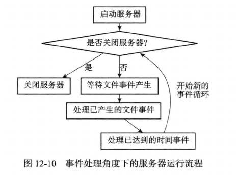
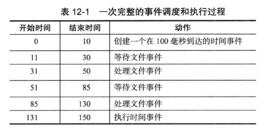

# 事件的调度与执行

Redis服务器中同时存在文件事件和时间事件两种事件类型，所以服务器必须对这两种事件进行调度，决定何时处理文件事件，何时处理时间事件，以及花多少时间处理。

事件的调度和执行由ae.c/aeProcessEvents函数负责，下面是该函数的伪代码：

```
def aeProcessEvents():
    # 获取到达时间离当前时间最接近的时间事件
    time_event = aeSearchNerestTimer()

    # 计算最接近的时间事件距离到达还有多少毫秒
    remaind_ms = time_event.when - unix_ts_now()

    # 如果事件已到达，那么remaind_ms的值可能为负数，将它设置为0
    if remaind_ms < 0:
        remaind_ms = 0

    # 根据remaind_ms的值，创建timeval结构    
    timeval = create_timeval_with_ms(remaind_ms)

    # 阻塞并等待文件事件产生，最大阻塞时间由传入的timeval结构决定
    # 如果remaind_ms值为0，那么aeApiPoll调用后马上返回，不阻塞
    aeApiPoll(timeval)

    # 处理所有已产生的文件事件
    processFileEvents()
    # 处理所有已到达的时间事件
    processTimeEvents()
```

实际上，processFileEvents()函数并不存在，处理已产生的文件事件的代码是直接写在aeProcessEvents函数里的。

将aeProcessEvents函数置于一个循环中，加上初始化和清理函数，就构成了Redis服务器的主函数，以下是伪代码表示：

```
def main():
    # 初始化服务器
    init_server()

    # 一直处理事件，直到服务器关闭为止
    while_server_is_not_shutdown():
        aeProcessEvents()
    
    # 服务关闭，执行清理操作   
    clean_server() 
```



事件的调度和执行流程如下：

- aeApiPoll函数的最大阻塞时间由到达时间最接近当前时间的时间事件决定，这个方法既可以避免服务器对时间事件进行频繁轮询(忙等待)，也可以确保aeApiPoll函数不会阻塞过长时间。

- 因为文件事件是随机出现的，如果处理完一次文件事件后，仍未有任何时间事件到达，那么服务器将再次等待并处理文件事件。随着文件事件的不断执行，时间最终到达时间事件的执行时间，这时服务器开始处理时间事件。

- 对文件事件和时间事件的处理都是同步，有序，原子地执行的，服务器不会中途中断事件处理，也不会对事件进行抢占，因此，不管是文件事件处理器还是时间事件处理器，它们都尽可能的减少程序的阻塞时间，并在有需要时主动让出执行权，从而降低造成事件饥饿的可能性：

    - 命令回复处理器将一个命令回复写入客户端套接字时，如果写入字节超过一个预设常量，命令回复处理器主动break跳出循环，将余下的数据留到下次再写。

    - 时间事件会将非常耗时的持久化操作放到子线程或者子进程中执行。

- 时间事件在文件事件之后执行，并且事件之间不会出现抢占，所以时间事件的实际处理时间通常会比事件设定的到达时间晚一些。



如上述例子，因为处理事件过程中不会出现抢占，所以实际处理时间事件的时间比100毫秒慢了30毫秒。


