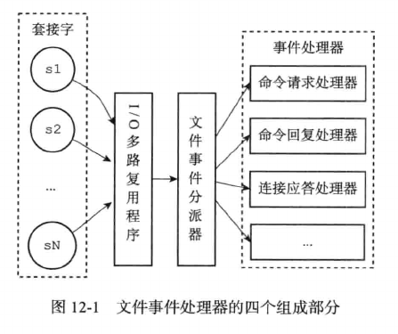
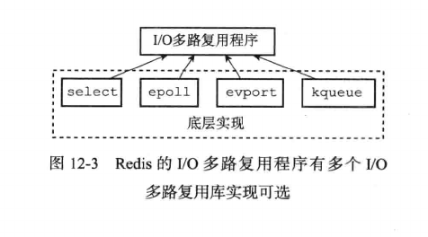
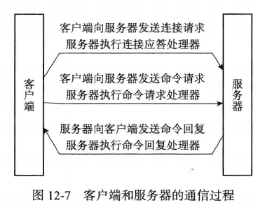

# 事件驱动模型

Redis服务器是一个事件驱动程序，服务器需要处理以下两类事件：

- 文件事件(file event)：Redis服务器通过套接字与客户端进行连接，文件事件就是对套接字操作的抽象。服务器与客户端的通信会产生相应的文件事件，服务器通过监听并处理这些事件来完成网络通信操作。

- 时间事件(time event)：Redis服务器中的一些操作需要在给定的时间点执行，而时间事件就是服务器对这类定时操作的抽象。

## 文件事件

Redis基于Reactor模式开发了自己的网络事件处理器，这个处理器被称为文件事件处理器(file event handler)。

- 文件事件处理器使用I/O多路复用(multiplexing)程序来同时监听多个套接字，并根据套接字当前执行的任务来为套接字关联不同的事件处理器。

- 当被监听的套接字准备好连接应答(accept)，读取(read)，写入(write)，关闭(close)等操作时，与操作相对应的文件时间就会产生，这时文件处理器会调用套接字之前关联好的事件处理器来处理这些事件。

虽然文件事件处理器以单线程方式运行，但通过使用I/O多路复用程序监听多个套接字，文件事件处理器既实现了高性能的网络通信模型，又可以很好的与Redis服务器中其他同样单线程运行的模块进行对接，保持了Redis内部单线程设计的简单性。

### 文件事件模型

文件事件模型有四个组成部分：套接字，I/O多路复用程序，文件事件分派器(dispatcher)以及事件处理器。

- 文件事件是对套接字操作的抽象，每当一个套接字准备好执行连接应答(accept)，写入，读取，关闭等操作时，就会产生一个文件事件。因为一个服务器通常会连接多个套接字，所以多个文件事件会并发出现。

- I/O多路复用程序负责监听多个套接字，并向文件事件分派器传送那些产生了事件的套接字。尽管多个文件事件会并发出现，但I/O多路复用程序总是将所有产生事件的套接字都放到一个队列里面，然后通过这个队列，以有序，同步，每次一个的方式向文件事件分派器传送套接字。当上一个套接字产生的事件被处理完后(该套接字关联事件处理器执行完成)，I/O多路复用程序才会继续向文件事件分派器传送下一个套接字。

- 文件事件分派器接收I/O多路复用程序传来的套接字，并根据套接字产生的事件类型，调用相关的事件处理器。

- 服务器会为不同任务的套接字关联不同的事件处理器，这些处理器是一个个函数，它们定义了某个事件发生时，服务器应该做的工作。

I/O多路复用程序的实现：

- Redis的I/O多路复用程序的所有功能都是通过包装常见的select，epoll，evport和kqueue这些I/O多路复用函数库实现的，每个I/O多路复用函数库在Redis源码中都有对应的一个单独的文件，比如ae_select.c，ae_epoll.c，ae_kqueue.c等。

- Redis为每个I/O多路复用函数库实现了相同的API，所以I/O多路复用程序的底层实现是可以互换的。Redis在I/O多路复用程序的实现源码中用#include宏定义了相应的规则，程序会在编译时自动选择系统中性能最高的I/O多路复用函数作为Redis的I/O多路复用底层实现

  

### 一次完整的请求

- 假设一个Redis服务器正在运行，那么这个服务器的监听套接字的AE_READABLE事件应该处于监听状态之下，而该事件对应的处理器为连接应答处理器。

- 如果这时有一个Redis客户端向服务器发起连接，那么监听套接字将产生AE_READABLE事件，触发连接应答处理器执行。处理器对客户端连接请求进行应答，然后创建客户端套接字，以及客户端状态，并将客户端套接字的AE_READABLE事件与命令请求处理器进行关联，使得客户端可以向服务器发送命令请求。

- 之后，假设客户端向主服务器发送一个命令请求，那么客户端套接字将产生AE_READABLE事件，引发命令请求处理器执行，处理器读取客户端的命令内容然后传递给相关程序执行。

- 执行命令执行相应的命令回复，为了将这些命令回复传回客户端，服务器会将客户端套接字的AE_WRITABLE事件与命令回复处理器进行关联，当客户端尝试读取回复命令时，将产生AE_WRITABLE事件，触发命令回复处理器执行，当命令回复处理器将命令回复全部写入套接字后，服务器会解除客户端套接字的AE_WRITABLE事件与命令回复处理器之间的关联。

  

## 时间事件

Redis的时间事件分为以下两类：

- 定时事件：让一段程序在指定的时间之后执行一次。比如说，让程序X在当前时间的30毫秒后执行一次。

- 周期性事件：让一段程序每隔指定时间就执行一次。比如说，让程序Y每隔30毫秒就执行一次。

### 时间事件实现

服务器将所有时间事件放在一个无序链表中，每当时间事件执行器去执行时，它就遍历整个链表，查找所有已经到达的时间事件(链表中记录的时间戳小于当前时间戳)，并调用相应的事件处理器。

如下所示的链表中保存了三个不同的时间事件：新的事件总是插入链表的表头，三个时间事件分别按ID逆序。

这里的无序链表不按when属性排序，所以当事件执行器运行的时候，它必须遍历链表中的所有时间事件，这样才能保证服务器中所有已到达的事件都会被处理。

>正常情况下Redis服务器只使用serverCron一个时间事件，benchmark模式下，服务器只使用两个时间事件。在这种情况下服务器几乎是将无序链表退化为指针来使用，采用无序链表并不影响时间事件的执行性能。

### 时间事件的应用

持续运行的Redis服务器需要定期对自身的资源和状态进行检查和调整，从而确保服务器长期稳定地运行，这些定期操作由redis.c/serverCron函数负责执行，它的主要工作包括：

- 更新服务器的各类统计信息，比如时间，内存占用，数据库占用等信息。

- 清理数据库中过期的键值对。

- 关闭和清理连接失效的客户端。

- 尝试进行AOF和RDB持久化操作。

- 如果服务器是主服务器，那么对从服务器进行定期同步。

- 如果处于集群模式，对集群进行定期同步和连接测试。

Redis服务器以周期性事件的方式来运行severCron函数，在服务器运行期间，每隔一段时间，serverCron就会执行一次，直到服务器关闭为止。

- 在Redis2.6版本，服务器默认规定的serverCron每秒运行10次，平均每间隔100毫秒运行一次。

- 从Redis2.8开始，用户可以通过修改hz选项来调整serverCron的每秒执行次数。

## 事件的调度与执行

Redis服务器中同时存在文件事件和时间事件两种事件类型，所以服务器必须对这两种事件进行调度，决定何时处理文件事件，何时处理时间事件，以及花多少时间处理。

事件的调度和执行流程如下：

- 阻塞并等待文件事件产生，最大阻塞时间由到达时间最接近当前时间的时间事件决定，既避免服务器对时间事件进行频繁轮询(忙等待)，也可以确保不会因执行文件事件而阻塞过长时间。

- 因为文件事件是随机出现的，如果处理完一次文件事件后，仍未有任何时间事件到达，那么服务器将再次等待并处理文件事件。随着文件事件的不断执行，时间最终到达时间事件的执行时间，这时服务器开始处理时间事件。

- 对文件事件和时间事件的处理都是同步，有序，原子地执行的，服务器不会中途中断事件处理，也不会对事件进行抢占，因此，不管是文件事件处理器还是时间事件处理器，它们都尽可能的减少程序的阻塞时间，并在有需要时主动让出执行权，从而降低造成事件饥饿的可能性：

  - 命令回复处理器将一个命令回复写入客户端套接字时，如果写入字节超过一个预设常量，命令回复处理器主动break跳出循环，将余下的数据留到下次再写。

  - 时间事件会将非常耗时的持久化操作放到子线程或者子进程中执行。

- 时间事件在文件事件之后执行，并且事件之间不会出现抢占，所以时间事件的实际处理时间通常会比事件设定的到达时间晚一些。

