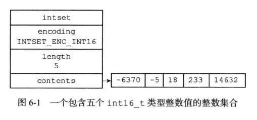
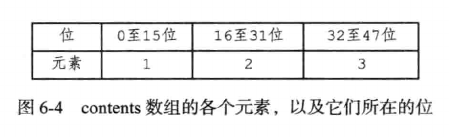
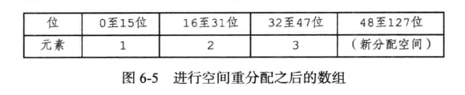
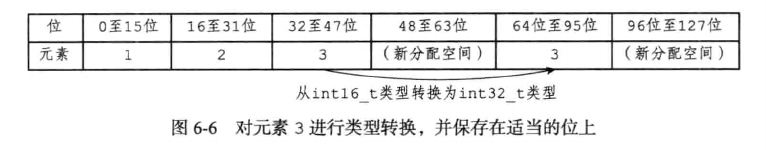
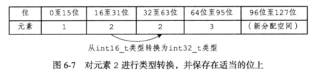
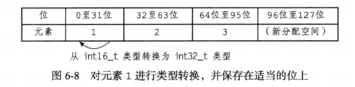
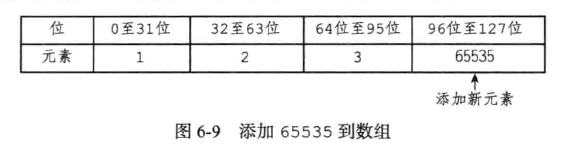

# 整数集合

整数集合(intset)是Redis用于保存整数类型集合的抽象数据结构，它可以保存为int16_t，int32_t或者int64_t的整数值，并且保证集合中不会出现重复元素。

intset.h/intset结构表示一个整数集合：

```c
typedef struct intset {
    // 编码方式
    uint32_t    encoding;
    // 集合包含的元素数量
    uint32_t    length;
    // 保存元素的数组
    int8_t      contents[];
} intset;
```

- contents是数组集合的底层实现：整数集合的每个元素都是contents数组的一个数据项(item)，各个项在数组中按值从小到大有序排列，其中不包含任何重复项。

- length属性记录了整数集合包含的元素数量，也就是contents数组长度。

- encoding属性的值决定了contents数组中元素的真正类型：

    - 如果encoding属性的值为INTSET_ENC_INT16，那么contents就是一个int_16_t类型的数组。

    - 如果encoding属性的值为INTSET_ENC_INT32，那么contents就是一个int_32_t类型的数组。

    - 如果encoding属性的值为INTSET_ENC_INT64，那么contents就是一个int_64_t类型的数组。



上图展示了一个整数集合是示例：

- encoding属性的值为INTSET_ENC_INT16，表示整数集合的底层实现为int16_t类型的数组，而集合保存的都是int16_t类型的整数值。

- length属性值为5，表示整数集合包含5个元素。

- contents数组按从小到大顺序保存集合中的5个元素。

- 因为每个集合元素都是int16_t类型的整数值，所以contents数组的大小等于sizeof(int16_t)*5 = 16 * 5 = 80位。

## 升级

当把一个新元素添加到整数集合里时，如果新元素的类型比整数集合中所有元素的类型都长，整数集合需要先进行升级(upgrade)，然后才能将新元素添加到整数集合里面。

升级整数集合并添加新元素步骤如下：

- 根据新元素的类型，扩展整数集合底层数组空间的大小，并为新元素分配空间。 

- 将底层数组现有的所有元素都转换成与新元素相同的类型，并将类型转换后的元素放置到正确的位上，而且在放置元素的过程中，需要继续维持底层数组的有序性。

- 将新元素添加到底层数组里面。

假设当前有一个INTSET_ENC_INT16编码的整数集合，集合中包含三个int16_t类型的元素，如图所示



现在假设我们要将类型为int32_t的整数值65535添加到整数集合里面，因为65535的类型int32_t比整数集合当前所有元素的类型都长，所以在将65535添加到整数集合之前，程序需要先对整数集合进行升级。

首先要做的是根据新类型的长度，以及集合元素数量，对底层数组空间重分配。

整数集合目前有三个元素，再加上新元素65535，整数集合需要分配四个元素空间，每个int32_t整数值占用32位空间，所以空间重分配后，底层数组大小为32 * 4 = 128位。



首先，因为元素3在1，2，3，65535四个元素中排名第三，所以它被移动到contents数组的索引2位置上，也即是数组64位到95位的空间内



接着，因为元素2在1，2，3，65535四个元素中排名第二，所以将它移动到contents数组的索引1位置上，也即是32位到63位的空间内



之后，因为元素1在1，2，3，65535四个元素中排名第一，所以它将被移动到contents数组的索引0的位置上，即数组的0位至31位的空间里



然后，因为元素65535在1，2，3，65535四个元素中排名第四，所以它将被添加到contents数组的索引3位置上，也就是数组的96位到127位之间。



最后，程序将整数集合encoding属性的值从INTSET_ENC_INT16改为INTSET_ENC_INT32，并将length属性的值从3改为4。

其余类型的升级操作类似。

每次向整数集合中添加新元素都有可能触发升级，每次升级都会对底层数组中已有的所有元素尽心类型转换，所以向整数集合添加新元素的时间复杂度为O(N)。

## 升级的优点

整数集合的升级功能优点如下：

- 提升灵活性：由于C语言是静态语言，只使用特定长度的数组存储特定长度的元素，这样做缺乏了一定灵活性，在Redis中通过自动升级来适应长度不同的元素，而不必担心类型错误，这种做法提高了灵活性。

- 节约内存：整数集合在必要时升级的做法，既可以让集合同时保存三种不同类型的值，又可以尽量节省内存。

在Redis中整数集合不支持降级操作，一旦对数组进行了升级，编码就一直会保持在升级后的状态。

## 整数集合的应用

整数集合是集合键的实现之一，当一个集合只包含整数值元素，并且这个集合的元素数量不多时，Redis就会使用整数集合作为集合键的底层实现。

