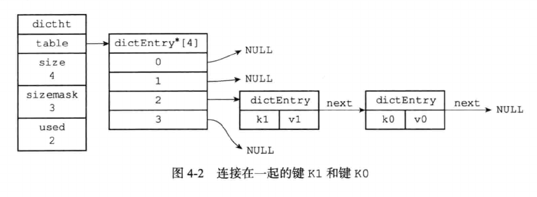
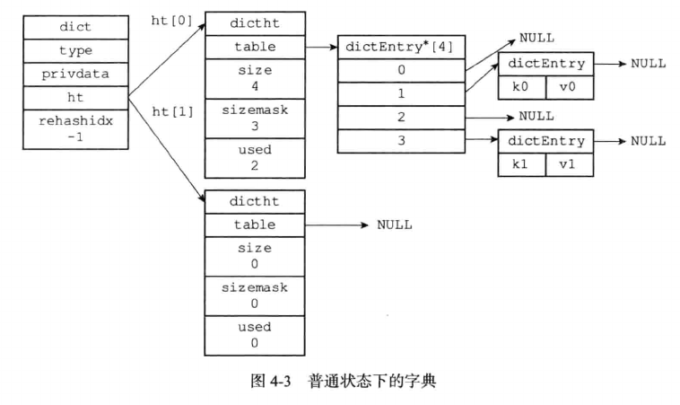

# 字典

字典是一种用来保存键值对(key-value pair)的数据结构，经常被内置在高级语言中，C语言中没有内置这种数据结构，因此Redis实现了自己的字典。

Redis字典使用哈希表作为底层实现，一个哈希表中可以包含多个节点，每个节点保存了字典中的一个键值对。

## 哈希表

Redis所使用的哈希表由dict.h/dictht结构定义：

```c
typedef struct dictht {
    //哈希表数组
    dictEntry   **table;
    //哈希表大小
    unsigned long  size;
    //哈希表大小的掩码，用于计算索引值
    //总是等于size-1
    unsigned long sizemask;
    //哈希表已有节点数量
    unsigned long used;
}
```

- table属性是一个数组，数组中的每个元素都是一个指向dict.h/dictEntry结构的指针，每个dictEntry结构保存着一个键值对。

- size属性记录了哈希表的大小，也就是table数组的大小。

- used属性记录了哈希表目前已有节点的数量。

- sizemask属性的值总是等于size-1，这个属性和哈希值一起决定一个键应该被放到table数组的哪个索引上面。


## 哈希表节点

哈希表节点使用dictEntry结构表示，每个dictEntry结构都保存着一个键值对：

```c
typedef struct dictEntry {
    //键
    void    *key;
    //值
    union {
        void *val;
        uint_64_tu64;
        int64_ts64;
    }
    struct dictEntry *next;
}
```
- key属性保存着键值中的键，而v属性则保存着键值对中的值，其中键值对的值可以是一个指针，或者是一个uint64_t整数，又或者是一个int64_t整数。

- next属性是指向另一个哈希表的节点的指针，这个指针可以将多个哈希值相同的键值对连接在一起，以解决键冲突(collision)的问题。



## 字典

Redis中的字典由dict.h/dict结构表示：

```c
typedef struct dict {
    //类型特定函数
    dictType    *type;
    //私有数据
    void        *privatedata;
    //哈希表
    dictht      ht[2];
    //rehash 索引
    //当未进行rehash时，值为-1
    int         rehashidx;
} dict;
```

- type属性和privdata属性是针对不同类型的键值对，为创建多态字典而设置的：

    - type属性是一个指向dictType结构的指针，每个dictType结构保存了一簇用于操作特定值类型键值对的函数，Redis会为用途不同的字典设置不同的类型特定函数。

    - 而privdata属性则保存了需要传给那些特定函数的可选参数。

- ht属性是一个包含两个项的数组，数组中每个项都是一个dictht哈希表，一般情况下，字典只使用ht[0]哈希表，ht[1]哈希表只会在对ht[0]哈希表进行rehash时使用。

- rehashidx记录了当前rehash的进度，如果当前没有在进行rehash，那么它的值为-1。



## 哈希算法

当要添加一个新的键值对到字典中时，程序需要先根据键计算出哈希值，再根据哈希值计算出索引值，最后将包含新键值对的哈希表节点放到哈希表数组的指定索引上面。

计算哈希值和索引值的方法如下：

```
hash = dict->type->hashFunction(key);
//根据情况不同ht[i]可以是ht[0]或ht[1]
index = hash & dict->ht[x].sizemask;
```

当字典被用作数据库的底层实现，或者哈希键的底层实现时，Redis使用MurmurHash2算法来计算键的哈希值。

MurmurHash算法最初由Austin Appleby于2008年发明，这种算法的优点在于，即使输入的键是有规律的，算法仍然能给出一个很好的随机分布性，并且计算速度很快。

## 解决键冲突

当有两个或两个以上的键被分配到哈希表数组的同一个数组上面时，会产生键冲突。Redis采用链地址法(separate chaining)来解决冲突，多个冲突的节点通过指针连接成一个链表。

出于速度考虑，程序总是将新节点添加到链表的表头位置，排在其他节点前面，复杂度为O(1)。

## rehash

随着操作不断进行，对哈希表保存的键值对会逐渐增多或减少，为了让负载因子(load factor)维持在一个合理的范围内，当哈希表保存的键值对数量太多或者太少时，需要对哈希被的大小进行扩展或者收缩。

扩展和收缩由rehash来完成，rehash过程如下：

- 为字典的ht[1]哈希表分配空间，这个哈希表的空间大小取决于要执行的操作，以及ht[0]当前包含键值对数量(ht[0].used属性值)

    - 如果执行的是扩展操作，那么ht[1]的大小为第一个大于等于ht[0].used*2的2^n

    - 如果执行的是收缩操作，那么ht[1]的大小为第一个大于等于ht[0].used的2^n

- 将保存在ht[0]中的所有键值对rehash到ht[1]上面，rehash指的是重新计算键的哈希值和索引值，然后将键值对放置到ht[1]哈希表的指定位置上。

- 当ht[0]包含的所有键值对都迁移到了ht[1]之后，(ht[0]变为空表)，释放ht[0]，将ht[1]设置为ht[0]，并在ht[1]新创建一个空白的哈希表，为下次rehash做准备。

触发时机：

当以下条件中的任意一个被满足时，程序会自动开始对哈希表进行扩展操作：

- 服务器目前没有执行BGSAVE命令或者BGREWRITEAOF命令，并且哈希表的负载因子大于1

- 服务器目前正在执行BGSAVE命令或者BGREWRITEAOF命令，并且哈希被的负载因子大于5

- 当哈希表的负载因子小于0.1时，程序自动开始对哈希表执行收缩操作。

在执行BGSAVE或者BGREWRITEAOF命令时，Redis需要创建当前服务进程的子进程，在这期间避免对哈希表的扩展操作，减少不必要的内存写入，最大限度节约内存。

渐进式rehash：

为了避免rehash对服务器性能的影响，服务器不是一次性将ht[0]里的所有键值对全部rehash到ht[1]，而是分多次，渐进地将ht[0]里面的键值对rehash到ht[1]

- 为ht[1]分配空间，让字典同时持有ht[0]和ht[1]两个哈希表。

- 在字典中维持一个索引计数器变量rehashidx，并将它的值置为0，表示rehash工作正式开始。

- 在rehash期间，每次对字典添加，删除，查找或者更新操作时，除了执行指定操作，还会顺带将ht[0]哈希表在rehashidx索引上的所有键值对rehash到ht[1]，当rehash工作完成后，程序将rehashidx的值增加1。

- 当ht[0]所有的键值对都被rehash到ht[1]上时，程序将rehashidx的值置为-1，标识rehash操作已完成。

在进行渐进式的rehash过程中，字典会同时使用ht[0]和ht[1]两个哈希表，所以在渐进式rehash进行期间，字典的删除，更新，插入，查询等操作会作用在两个表上。新添加的键值对保存着ht[1]上，ht[0]不再进行添加操作，ht[0]只减不增，直到rehash完成。

## 字典的应用

Redis数据库就是使用字典作为底层实现的，对数据库的增删改查都作用在字典的结构上。

字典还是哈希键的底层实现结构，当哈希键包含的键值比较多，或者键值对中元素都是比较长的字符串时，Redis就会使用字典作为哈希键的底层实现。


