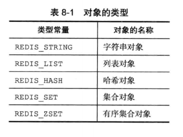
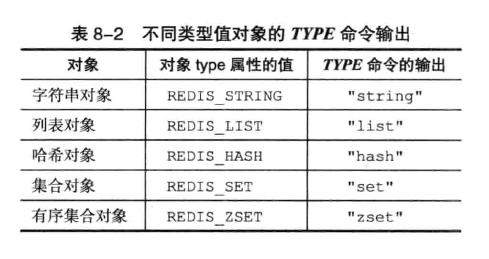
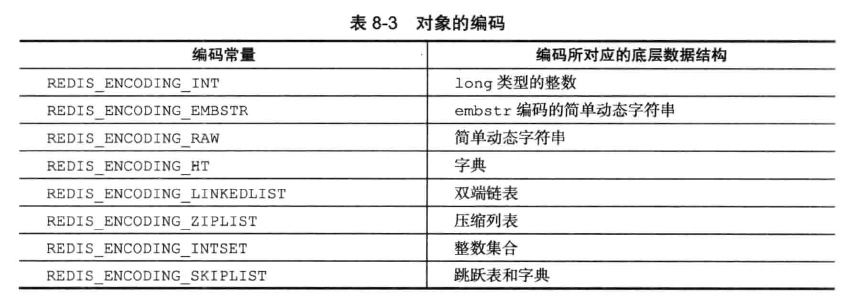
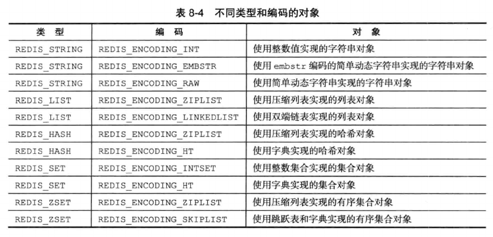
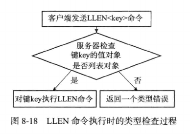
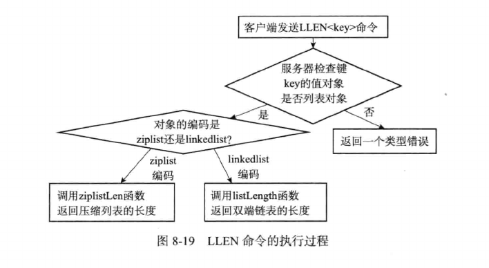
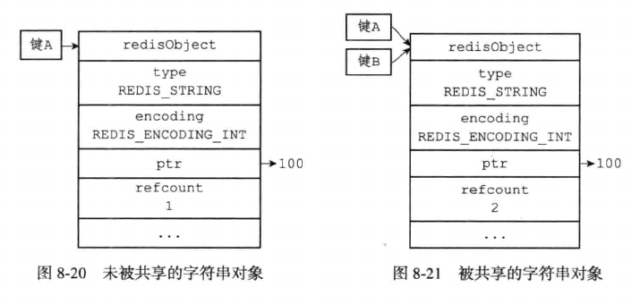

# 对象系统

Redis并没有直接使用底层的数据结构来实现键值对数据库，而是基于这些数据结构创建了一个对象系统，这个对象系统包含字符串对象，列表对象，哈希对象，集合对象和有序集合对象这五种类型的对象，每种对象至少使用了一种底层数据结构。

当我们在Redis数据库中新创键一个键值对时，我们会创建至少两个对象，一个对象用作键值对的键，另一个对象用作键值对的值。

Redis中每个对象都由一个redisObject结构表示，该结构中保存数据有关的三个属性分别是type属性，encoding属性和ptr属性。

```c
typedef struct redisObject {
    // 类型
    unsigned    type:4;
    // 编码
    unsigned    encoding:4;
    //指向底层实现数据结构的指针
    void        *ptr; 
} robj;
```

构建对象系统的优点如下：

- 通过构建五种类型对象，Redis可以在执行命令之前，根据对象的类型来判断一个对象是否可以执行给定的命令。

- 同时可以针对不同的使用场景，为对象设置多种不同的数据结构实现，从而优化对象在不同场景下的使用效率。

- Redis对象系统实现了基于引用计数的内存回收机制，当程序不再使用某个对象的时候，这个对象占用的内存就会被释放。

- Redis通过引用计数实现了对象共享机制，这一机制可以在适当的条件下，通过让多个数据库键共享一个对象来节约内存。

- 最后，Redis的对象带有访问时间记录信息，该信息用于计算数据库键的空转时长，在服务器启动了maxmemory功能情况下，空转时长较大的键会优先被服务器删除。

## 对象类型

对象的type属性记录了对象的类型，这个属性的值可以是如下常量中的一个：



对于Redis数据库保存的键值对来说，键总是一个字符串对象，而值则可以是字符串对象，列表对象，哈希对象，集合对象和有序集合对象中的一种。

当我们对一个数据库键执行TYPE命令时，会返回数据库值对象的类型：



上面列出了TYPE命令在面对不同类型的值的对象时产生的输出。

## 编码和底层实现

encoding属性记录了对象所使用的编码，也就是对象的底层实现的数据结构，这个属性的值可以是下面列表中的一个：



其中每种类型的对象至少使用了两种编码，下面列出了每种对象使用的编码：



对一个数据库键执行OBJECT ENCODING命令时会输出对象的编码。

## 类型检查与命令多态

Redis中用于操作键的命令基本上可以分为两种类型：

- 一种可以对任何类型的键执行，比如DEL命令，EXPIRE命令，RENAME命令，TYPE命令，OBJECT命令等

- 另一种只能对特定类型的键执行，比如

    - SET，GET，APPEND，STRLEN等命令只能对字符串键执行

    - HDEL，HSET，HGET，HLEN等命令只能对哈希键执行

    - RPUSH，LPOP，LINSERT，LLEN等命令只能对列表键执行

    - SADD，SPOP，SINTER，SCARD等命令只能对集合键执行

    - ZADD，ZCARD，ZRANK，ZSCORE等命令只能对有序集合执行

### 类型检查的实现

为了确保只有指定类型的键可以执行某些特定的指令，在执行一个类型特定的命令之前，Redis会先检查输入键的类型是否正确，然后再决定是否执行给定的命令。

- 在执行LLEN命令之前，服务器会先检查输入数据库键值对象是否为列表类型，检查redisObject结构的type属性是否为REDIS_LIST，如果是，对键执行LLEN命令

- 否则服务器拒绝执行命令并向客户端返回一个类型错误。

  

### 多态命令的实现

Redis除了会根据对象的值类型来判断键是否能够执行指定命令外，还会根据对象的编码方式，选择正确的命令实现代码来执行。

如果我们对一个键执行LLEN命令，那么服务器除了要确保执行命令的是列表键以外，还需要根据键的值对象所使用的编码来选择正确的LLEN命令：

- 如果列表对象编码为ziplist，那么说明列表对象的实现为压缩列表，将使用ziplistLen函数来返回列表长度

- 如果列表对象编码为linkedlist，那么说明列表对象的实现为双端链表，将使用listLength函数来返回双端链表的长度

实际上，DEL，EXPIRE，TYPE等命令都是多态命令，与LEN不同的是，前者是类型的多态，后者是编码的多态。



## 内存回收

因为C语言不具备内存回收的功能，所以Redis在自己的对象系统中构建了一个引用计数(reference counting)技术实现内存回收机制，通过这一机制，程序可以通过跟踪对象的引用计数信息，在适当的时候自动释放对象并进行内存回收。

每个对象的引用计数信息由redisObject结构的refcount属性记录：

```c
typedef struct redisObject {
    // ...
    // 引用计数
    int refcount;
    // ...
}
```
对象的引用计数信息会随着对象的使用状态而不断变化：

- 在创建一个对象时，引用计数的值会被初始化为1

- 当对象被一个新程序使用时，它的引用计数的值会加1

- 当对象不再被一个程序使用时，它的引用计数的值会减1

- 当对象的引用计数为0时，对象占用的内存会被释放

## 对象共享

对象的引用计数还带有对象共享的作用，假设键A创建了一个包含整数值100的字符串对象作为值对象，这时如果键B也要创建一个同样保存了整数值100的字符串对象作为值对象，那么服务器有如下做法：

1. 为键B新建一个包含整数值100的字符串对象

2. 让键A和键B共享一个字符串对象

在Redis中，让多个键共享同一个值对象需要执行以下两个步骤

1. 将数据库键的值指针指向一个现有的值对象

2. 将被共享的值对象的引用计数加1



Redis在初始化服务器时，创建了一万个字符串对象，这些对象包含了从0到9999的所有整数值，当服务器需要用到值为0到9999的字符串对象时，服务器就会使用这些共享对象，而不是新创建对象。

> 创建共享字符串对象的数量可以通过修改redis.h/REDIS_SHARED_INTEGERS常量来修改。

这些共享对象不限于字符串键可以使用，在数据结构中嵌套了字符串对象的对象都可以使用这些共享对象。

只有在共享对象和目标对象完全相同的情况下，程序才会将共享对象用作键的值对象，共享对象越复杂，验证的成本就越高。因此为了节省资源，Redis只对包含整数值的字符串对象进行共享。

## 缓存淘汰

redisObject结构包含一个lru属性，该属性记录了对象最后一次被程序访问的时间：

```c
typedef struct redisObject {
    // ...
    unsigned lru:22;
    // ...
}
```

OBJECT IDLETIME命令可以打印出给定键的空转时长，这一空转时长是通过当前时间减去键值对象的lru时间计算得出的

> OBJECT IDLETIME命令在访问键的值对象时，不会修改对象的lru属性。

如果服务器打开了maxmemory选项，并且服务器用于内存回收的算法为volatile-lru或者allkeys-lru，那么当服务器内存占用超过了maxmemory选项所设置的上限值时，空转时长较高的那部分键会优先被服务器释放，从而回收内存。

> 配置文件的maxmemory选项和maxmemory-policy选项说明介绍了关于这方面的更多信息。

