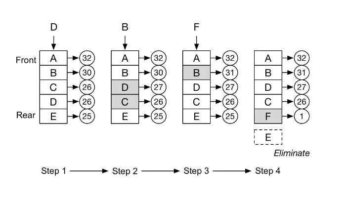
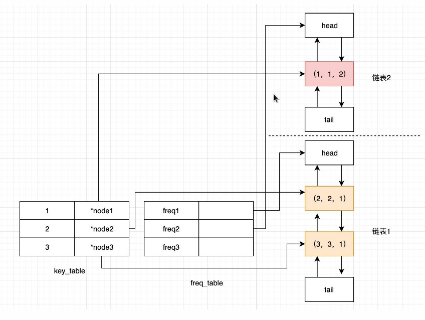

# 缓存淘汰策略之LFU算法分析

LFU全称最不经常使用算法(Least Frequently Used)，LFU算法的基本思想和所有的缓存算法一样，都是基于locality假设(局部性原理)。

> 如果一个信息正在被访问，那么在近期它很可能还会被再次访问。

LFU是基于这种思想进行设计：一定时期内被访问次数最少的页，在将来被访问的机率也是最小的。

相比于LRU(Least Recenty Use)算法，LFU更加注重于使用效率。

## 原理

LFU将数据和数据的访问频次保存在一个容量有限的容器中，当访问一个数据时：

1. 该数据在容器中，则将该数据的访问频次加1。

2. 该数据不在容器中，则将该数据加入到容器中，且访问频次为1。

当数据量达到容器的限制后，会剔除掉访问频次最低的数据，下图是一个简易的LFU算法示意图



上图中的LRU容器是一个链表，会动态地根据访问频次调整数据在链表中的位置，方便进行数据的淘汰，可以看到，在第四步时，因为需要插入数据F，而淘汰了数据E。

## LFU和LRU对比

区别：LFU是基于访问频次的模式，而LRU是基于访问时间的模式。

LRU：当缓存的访问是循环的顺序遍历，而且缓存容量不足以容纳遍历的项时，缓存项就会频繁进出影响效率。

LFU：克服了 LRU 在大规模遍历时的缺点。但是容易导致旧数据的积累。同时新数据因为使用次数少容易反复被移出缓存导致长期无法积累跟大的使用次数。

优势：在数据访问符合正态分布时，相比LRU算法，LFU算法的缓存命中率会更高一些。

劣势：

1. LFU的复杂度要比LRU更高一些。

2. 需要维护数据的访问频次，每次访问都需要更新。

3. 早期的数据相比于后期的数据更容易被缓存下来，导致后期的数据很难被缓存。

4. 新加入缓存的数据很容易被剔除，像是缓存的末端发生“抖动”。

## LFU算法的优化方向

1. 更加紧凑的数据结构，避免维护访问频次的高消耗。

2. 避免早期的热点数据一直占据缓存，即LFU算法也需有一些访问时间模式的特性。

3. 消除缓存末端的抖动。

## LFU算法的实现

### 基于双端链表+哈希表

```java
public class LFUCache {
    private Node head; // 头结点 简化null判断
    private Node tail; // 尾结点 简化null判断
    private int capacity; // 容量限制
    private int size; // 当前数据个数
    private Map<Integer, Node> map; // key和数据的映射

    public LFUCache(int capacity) {
        this.capacity = capacity;
        this.size = 0;
        this.head = new Node(0, 0, 0);
        this.tail = new Node(0, 0, 0);
        this.head.next = tail;
        this.tail.pre = head;
        this.map = new HashMap<>();
    }
    
    public int get(int key) {
        // 从哈希表中判断数据是否存在
        Node node = map.get(key);
        if (node == null) {
            return -1;
        }
        // 如果存在则增加该数据的访问频次
        freqPlus(node);
        return node.value;
    }

    public void put(int key, int value) {

        if (capacity <= 0) {
            return;
        }

        Node node = map.get(key);
        if (node != null) {
            // 如果存在则增加该数据的访问频次
            node.value = value;
            freqPlus(node);
        } else {
            // 淘汰数据
            eliminate();
            Node newNode = new Node(key, value, 0);
            map.put(key, newNode);
            size++;

            // 将新数据插入到末尾
            Node tailPre = tail.pre;
            tail.pre = newNode;
            newNode.pre = tailPre;
            newNode.next = tail;
            tailPre.next = newNode;
            // 增加访问频次
            freqPlus(newNode);
        }
    }

    private void freqPlus(Node node) {

        node.frequency++;
        Node temp = node.pre;
        int freq = node.frequency;
        while(temp != null) {

            // 使用大于号的原因是将最后访问的数据排在旧数据之前
            if (temp.frequency > freq  || temp == head) {
                node.pre.next = node.next;
                node.next.pre = node.pre;

                // 根据访问频次排序调整位置
                Node tempNext = temp.next;
                temp.next = node;
                tempNext.pre = node;
                node.next = tempNext;
                node.pre = temp;
                break;
            }
            temp = temp.pre;
        }
    }


    private void eliminate() {

        if (size < capacity) {
            return;
        }

        // 从尾结点的pre节点之间删除即可
        Node last = tail.pre;
        last.pre.next = tail;
        tail.pre = last.pre;
        map.remove(last.key);
        size--;
        last = null;
    }
}

class Node {
    int key;
    int value;
    int frequency;

    Node pre;
    Node next;

    Node(int key, int value, int frequency) {
        this.key = key;
        this.value = value;
        this.frequency = frequency;
    }
}
```

### 基于双哈希表

```java
class LFUCache {

    private int capacity; // 容量限制
    private int size;     // 当前数据个数
    private int minFreq;  // 当前最小频率

    private Map<Integer, Node> map; // key和数据的映射
    private Map<Integer, LinkedHashSet<Node>> freqMap; // 数据频率和对应数据组成的链表

    public LFUCache(int capacity) {
        this.capacity = capacity;
        this.size = 0;
        this.minFreq = 1;
        this.map = new HashMap<>();
        this.freqMap = new HashMap<>();
    }

    public int get(int key) {

        Node node = map.get(key);
        if (node == null) {
            return -1;
        }
	    // 增加数据的访问频率
        freqPlus(node);
        return node.value;
    }

    public void put(int key, int value) {

        if (capacity <= 0) {
            return;
        }

        Node node = map.get(key);
        if (node != null) {
            // 如果存在则增加该数据的访问频次
            node.value = value;
            freqPlus(node);
        } else {
            // 淘汰数据
            eliminate();
            // 新增数据并放到数据频率为1的数据链表中
            Node newNode = new Node(key, value);
            map.put(key, newNode);
            LinkedHashSet<Node> set = freqMap.get(1);
            if (set == null) {
                set = new LinkedHashSet<>();
                freqMap.put(1, set);
            }

            set.add(newNode);
            minFreq = 1;
            size++;
        }

    }

    private void eliminate() {

        if (size < capacity) {
            return;
        }

        LinkedHashSet<Node> set = freqMap.get(minFreq);
        Node node = set.iterator().next();
        set.remove(node);
        map.remove(node.key);

        size--;
    }

    void freqPlus(Node node) {

        int frequency = node.frequency;
        LinkedHashSet<Node> oldSet = freqMap.get(frequency);
        oldSet.remove(node);

        // 更新最小数据频率
        if (minFreq == frequency && oldSet.isEmpty()) {
            minFreq++;
        }

        frequency++;
        node.frequency++;
        LinkedHashSet<Node> set = freqMap.get(frequency);
        if (set == null) {
            set = new LinkedHashSet<>();
            freqMap.put(frequency, set);
        }
        set.add(node);
    }
}

class Node {
    int key;
    int value;
    int frequency = 1;

    Node(int key, int value) {
        this.key = key;
        this.value = value;
    }
}
```



