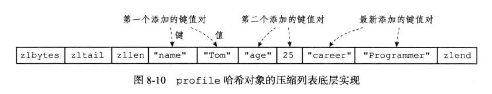
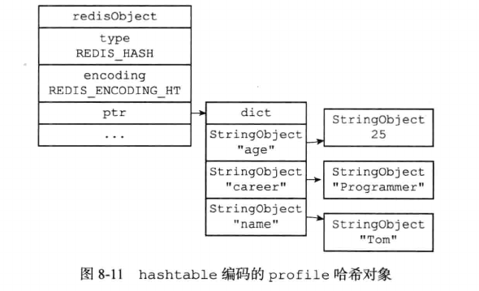
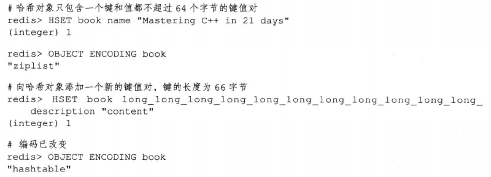
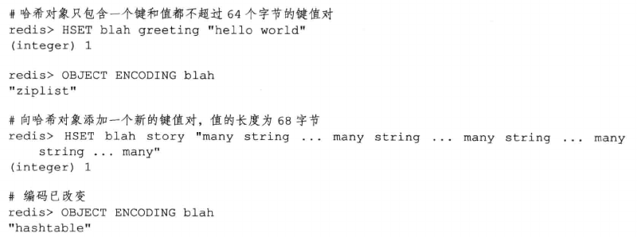
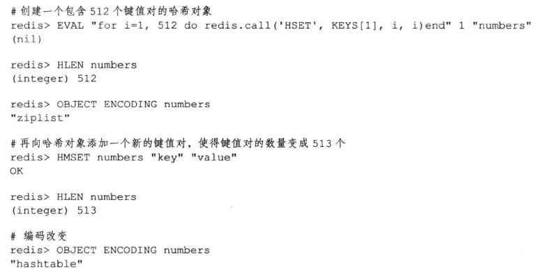

# 哈希

哈希对象的编码可以是ziplist或者hashtable。

- ziplist编码的哈希对象使用压缩列表作为底层实现，每当有新的键值对要加入到哈希对象中时，程序会先将保存了键的压缩列表节点推入到压缩列表结尾，然后再将保存了值的压缩列表节点推入到压缩列表结尾。

    - 保存了同一键值对的两个节点总是紧挨在一起，保存键的节点在前，保存值的节点在后。

    - 先添加到哈希对象中的键值对会被放在压缩列表的表头方向，而后来添加到哈希对象中的键值对会被放在压缩列表的表尾方向。

    

- 另一方面，hashtable编码的哈希对象使用字典作为底层实现，哈希对象中的每个键值对都使用一个字典键值对来保存。

    - 字典的每个键都是一个字符串对象，对象中保存了键值对的键

    - 字典的每个值都是一个字符串对象，对象中保存了键值对的值

    

## 编码转换

当哈希对象可以同时满足以下两个条件时，哈希对象使用ziplist编码：

- 哈希对象保存的所有键值对的键和值的字符串长度都小于64字节

- 哈希对象保存的键值对数量小于512个

不能满足这两个条件的哈希对象需要使用hashtable编码。

> 这两个条件的上限值是可以修改的，具体参见配置文件中关于hash-max-ziplist-value选项和hash-max-ziplist-entries选项的说明。

对于使用ziplist编码的列表对象来说，当使用ziplist编码所需的两个条件的任意一个不能被满足时，对象的编码转换操作就会被执行，原本保存在压缩列表里的所有键值对都会保存到字典里，对象的编码由ziplist修改为hashtable

以下代码展示了哈希对象因为键值对的键太长而引起编码转换的情况：

除了键的长度太长会引起编码转换外，值的长度太大也会引起编码转换，下面举一个例子：

下面的代码展示了哈希对象因为包含的键值对数量过多而引起编码转换的情况：

