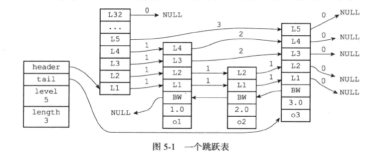

# 跳表

跳表是一种有序的数据结构，它通过在每个节点维持多个指向其它节点的指针，从而达到快速访问节点的目的。

跳表支持平均O(logN)，最坏O(N)的复杂度的节点查找，空间复杂度为O(N)。

在大部分情况下，跳表的插入，删除和查找效率可以和平衡树相当，优点是跳表的实现比平衡树要简单。

## 跳表的实现

Redis的跳表由redis.h/zskiplistNode和redis.h/zskiplist两个结构定义，其中zskiplistNode结构用于表示跳表节点，而zskiplist结构用于保存跳表节点的相关信息，比如节点数量，以及表头节点和表尾节点的指针等。



上图展示了一个跳表的结构，位于图片最左边的是zskiplist结构，该结构包含如下属性：

- header：指向跳表的表头节点。

- tail：指向跳表的表尾节点。

- level：记录目前跳表内层数最大的那个节点的层数(表头节点不算在内)。

- length：记录跳表的长度，跳表目前的节点数量(表头节点不算在内)

这个跳表维护了四个zskiplistNode结构，该结构包含以下属性：

- 层(level)：节点中用L1，L2，L3等字样标记节点的各个层，每个层有两个属性：前进指针和跨度。前进指针用于访问位于表尾方向的其他节点，而跨度则记录了前进指针所指向节点到当前节点的距离。当程序从表头向表尾遍历时，访问会从高层到低层沿着指针方向进行。

- 后退指针(backward)：节点中用BW字样标记节点的后退指针，它指向位于当前节点的前一个节点。后退指针在程序从表尾向表头遍历时使用。

- 分值(score)：各个节点中1.0，2.0和3.0是节点保存的分值，在跳表中，节点按各自保存的分值从小到大排列。

- 成员对象(obj)：各个节点中的o1，o2和o3是节点保存的成员对象，底层是一个SDS。

表头节点的构造和其他节点的是一样的：表头节点也有后退指针，分值和成员对象，不过这些属性不会被使用到。

跳表的操作：

- 插入：按顺序查找定位插入位置，根据跳表的层数level设计随机函数，生成单个节点的层数，并维护层数中的索引。

- 删除：删除时，除了摘除元素，还要将前后节点的层数指针连接起来。

- 查找：从第一个节点开始，从高层索引向下逐层查找。

### 跳表节点

跳表节点的实现如下：

```c
typedef struct zskiplistNode {
    // 层
    struct zskiplistLevel {
        //前进指针
        struct zskiplistNode *forward;
        //跨度
        unsigned int span;
    } level [];
    // 后退指针
    struct zskiplistNode *backward;
    // 分值
    double score;
    // 成员对象
    robj *obj;
} zskiplistNode;
```

### 跳表

跳表的实现如下：

```c
typedef struct zskiplist {
    // 表头节点和表尾节点
    struct zskiplistNode *head *tail;
    // 表中节点的数量
    unsigned  long length;
    // 表中层数最大节点层数
    int level;
}
```

## 跳表的应用

Redis使用跳表来作为有序集合键的底层实现之一，如果一个有序集合包含的元素数量比较多，又或者有序集合中元素的成员(member)是比较长的字符串时，Redis就会使用跳表来作为有序集合键的底层实现。

此外，Redis集群节点的内部数据结构也有用到跳表。

