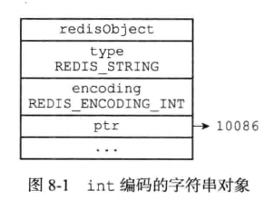
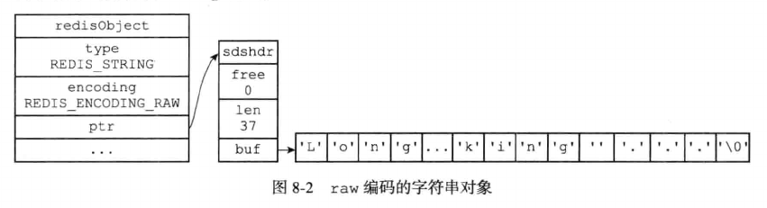
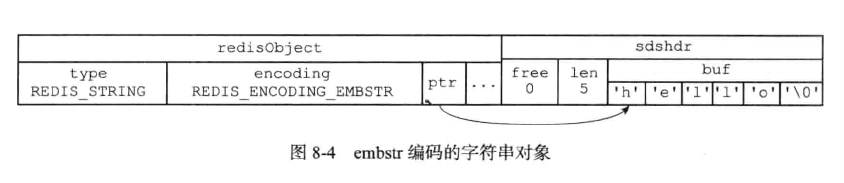
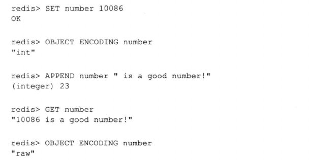
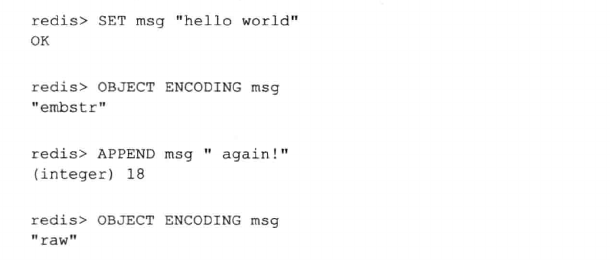

# 字符串

## 整型与字符串

字符串对象的编码可以是int，raw或embstr。

- 如果字符串对象保存的是整数值，并且这个整数值可以用long来表示，那么字符串对象会将整数值保存在字符串对象结构的ptr属性里面，并将字符串的编码设置为int。

    

- 如果字符串对象保存的是一个字符串值，并且这个字符串值的长度大于32字节，那么字符串对象将使用一个简单动态字符串SDS来保存这个值，并将字符串的编码设置为raw

    

- 如果字符串对象保存的是一个字符串值，并且这个字符串值的长度小于32字节，那么字符串对象将使用emberstr的编码方式来保存这个字符串值。

  emberstr编码是专门用于保存短字符串的一种优化编码方式，通过调用一次内存分配函数分配一块连续的内存空间，空间中依次包含redisObject和sdshdr两个结构。

  emberstr编码的字符串对象在执行命令时，产生的效果和raw编码的字符串执行相应命令的效果是相同的，但是使用emberstr编码的字符串对象来保存短字符串值有以下好处：

    - emberstr编码的字符串可以减少内存分配和释放的次数。

    - emberstr编码的字符串所有数据都保存在一块连续的内存中，这种编码的字符串对象比起raw编码字符串对象可以更好利用缓存带来的优势。

  

## 浮点型

可以用long double类型来表示的浮点数在Redis中也是作为字符串值来保存的。如果我们要保存一个浮点数到字符串对象里面，那么Redis会先将这个浮点数转为字符串值，然后再保存转换所得的字符串值。

在有需要的时候，程序会将保存在字符串中的字符串转回浮点数值，执行某些操作，然后再将执行结果转回字符串值，并继续保存在字符串对象里面。

## 编码转换

int和embstr编码类型的字符串对象在满足条件下，会被转换成raw编码的字符串对象。

- 对于int编码的字符串来说，如果向对象执行一些命令，使得这个对象保存的不再是整数值，而是一个字符串值，那么字符串对象的编码从int变为raw。

  下面的代码展示了向一个整数值追加字符串，先将整型转为字符串，再执行追加操作，结果是一个raw编码的字符串对象：

  

- Redis没有为emberstr编码的字符串对象编写任何修改程序，所以emberstr编码的字符串对象实际上是只读的，对emberstr编码对象执行任何写命令时，程序会将对象的编码从emberstr转换成raw，然后再执行修改命令。

  以下的代码展示了一个emberstr编码的字符串对象在执行APPEND命令后，对象的编码从emberstr转换为raw的例子：

  
