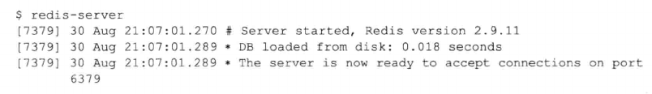
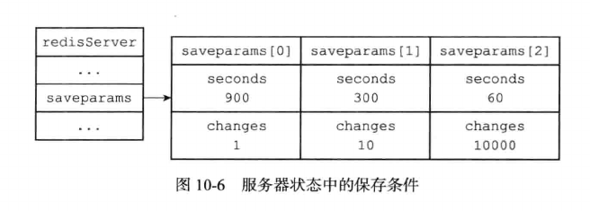
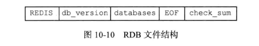
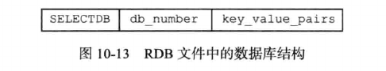
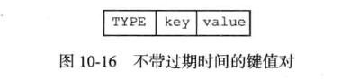
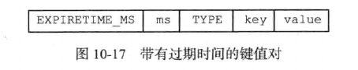

# RDB持久化

Redis提供了RDB持久化功能，这个功能可以将Redis在内存中的数据库状态保存到磁盘中，避免数据意外丢失。

- RDB持久化既可以手动执行，也可以根据服务器配置选项定期执行，该功能可以将某个时间点上的数据库状态保存到一个RDB文件中。

- RDB持久化功能生成的RDB文件是一个经过压缩的二进制文件，通过该文件可以还原生成RDB文件时的数据库状态。

- RDB由Redis启动时自动检测并载入。

## RDB文件创建与载入

有两个Redis命令可以用于生成RDB文件，一个是SAVE，另一个是BGSAVE。

- SAVE命令会阻塞Redis服务器进程，直到RDB文件创建完成为止，在服务器进程阻塞期间，服务器不能处理任何命令请求

- BGSAVE命令会派生出一个子进程，然后由子进程来负责创建RDB文件，服务器进程(父进程)继续处理命令请求

创建RDB文件的实际工作由rdb.c/rdbSave函数完成，SAVE命令和BGSAVE命令会以不同的方式调用这个函数，通过以下伪代码可以明显看出这两个命令之间的区别：

```
def SAVE():
    # 创建RDB文件
    rdbSave()

def BGSAVE():
    # 创建子进程
    pid = fork()
    if pid == 0:    
        # 子进程复制创建RDB文件
        rdbSave()
        # 完成之后向父进程发送信号
        signal_parent()
    elif pid > 0:
        # 父进程继续处理命令请求，并通过轮询等待子进程的信号
        handle_request_and_wait_signal()
    else:
        # 处理错误情况
        handle_fork_error()      
```

- RDB文件的载入工作是在服务器启动时自动执行的，所以Redis并没有专门用于载入RDB文件的命令，只要Redis服务器在启动时检测到RDB文件的存在，它就会自动载入RDB文件。载入过程中服务器处于阻塞状态，直到载入完成。

    

- 通常AOF文件的更新频率会比RDB文件的更新频率高，因此如果服务器开启了AOF持久化功能，那么服务器会优先使用AOF文件来还原数据库状态。如果AOF持久化功能被关闭，服务器才会使用RDB文件来还原数据库状态。

载入RDB文件是由rdb.c/rdbLoad函数完成。

在服务器执行BGSAVE命令期间，如果发送SAVE或者BGSAVE命令会被服务器拒绝，防止两个操作产生竞争条件。BGSAVE命令和BGWRITEAOF不能同时执行，如果BGSAVE命令正在执行，BGWRITEAOF命令会延迟到BGSAVE命令执行后执行。如果BGWRITEAOF正在执行，BGSAVE命令会被服务器拒绝。防止避免IO任务过于繁重影响服务性能。

## 自动间隔保存

Redis允许用户通过设置服务器配置的save选项，让服务器每隔一段时间自动执行一次BGSAVE命令。用户可以通过save选项设置多个保存条件，只要其中任意一个条件满足，服务器就会执行BGSAVE命令。

```
save 900 1          # 服务器在900秒之内，对数据库进行了至少1次修改
save 300 10         # 服务器在300秒之内，对数据库进行了至少10次修改
save 60 10000       # 服务器在60秒之内，对数据库进行了至少10000次修改
```

上面是Redis设置的默认save条件，服务器会根据save选项所设置的保存条件，设置服务器状态redisServer结构的saveparams属性：

```c
struct redisServer {
    // ...
    // 记录了保存条件的数组
    struct saveparam *saveparams;
    // ...
}
```

saveparams属性是一个数组，数组中每个元素都是一个saveparam结构，每个saveparam结构都保存了一个save选项设置保存条件：

```c
struct saveparam {
    // 秒数
    time_t seconds;
    // 修改数
    int changes;
}
```



服务器状态还维护了一个dirty计数器和一个lastsave属性：

```c
struct redisServer {
    // ... 
    // 修改计数器
    long long dirty;

    //上一次执行保存的时间
    time_t lastsave;
    // ...
}
```

- dirty计数器记录距离上一次执行SAVE命令或BGSAVE命令之后，服务器对数据库状态(服务器中所有数据库)进行了多少次修改(包括写入，删除和更新操作)。当数据库成功执行一个修改命令后，会对dirty计数器进行更新。

- lastsave属性是一个UNIX时间戳，记录了服务器上一次成功执行SAVE命令或者BGSAVE命令的时间。

Redis服务器的周期性操作函数serverCron默认每100毫秒就会执行一次，该函数对正在运行的服务器进行维护，其中的一项工作就是检查save选项设置的条件是否满足，如果满足就执行BGSAVE命令。

```
def serverCron():
    # ...
    # 遍历所有保存条件
    for saveparam in server.saveparams:
        # 计算距离上次执行保存操作有多少秒
        save_interval = unixtime_now() - server.lastsave

        # 如果数据库状态的修改次数超过条件所设置的次数
        # 并且举例上次保存的时间超过条件所设置的时间
        # 那么执行保存操作
        if server.dirty >= saveparam.changes and save_interval > saveparam.seconds:
            BGSAVE();
    # ...
```

## RDB文件结构

一个RDB文件包含五个部分：



- RDB文件的开头部分是REDIS部分，这个部分长度为5个字节，保存着"REDIS"五个字符。通过这五个字符，程序可以在载入文件时，快速检查载入的是否是RDB文件。

- db_version长度为4个字节，它的值是一个字符串表示的整数，这个整数记录了RDB文件的版本号。比如"0006"代表RDB文件的版本为第六版。

- databases部分包含着零个或多个数据库，以及各个数据库中键值对数据。

- EOF常量长度为1字节，这个常量标志着RDB文件内容的结束，当程序读入这个值时，表示所有数据库的键值对都载入完毕了。

- check_num是一个8字节长的无符号整数，保存着一个校验和，这个校验和是程序通过对REDIS，db_version，databases，EOF四个部分内容进行计算得出的。服务器载入数据时，会把这四个部分计算出来的校验值和文件中保存的校验值进行比较，检查RDB文件是否损坏。

### databases部分

一个RDB文件的databases部分可以保存任意多个非空数据库，每个非空数据库在RDB文件中可以保存为SELECTDB，db_number，key_value_pairs三个部分。



- SELECTDB常量的长度为1个字节，当读入程序遇到这个值的时候，它知道接下来要读入一个数据库号码。

- db_number保存着一个数据库号码，根据号码不同，这个部分可以是1个字节，2个字节或者5个字节，当程序读入db_number后，服务器调用SELECT命令，切换数据库。

- key_value_pairs保存了数据库中所有的键值对，如果键值对带有过期时间，那么过期时间会和键值对保存在一起

### key_value_pairs部分

不带过期时间的键值对在RDB文件中由TYPE，key，value三部分组成的



- TYPE记录了value的类型，程序会根据读入的TYPE来决定如何读入和解释value数据。

- key和value分别保存了键值对的键和值对象。

带有过期时间的键值对由EXPIRETIME_MS，ms，TYPE，key，value五个部分组成。



- EXPIRETIME_MS常量长为1字节，它告知读入程序，接下来要读入的是一个以毫秒为单位的过期时间。

- ms是一个8字节长的带符号整数，记录一个以毫秒为单位的UNIX时间戳，这个时间戳就是键的过期时间。


