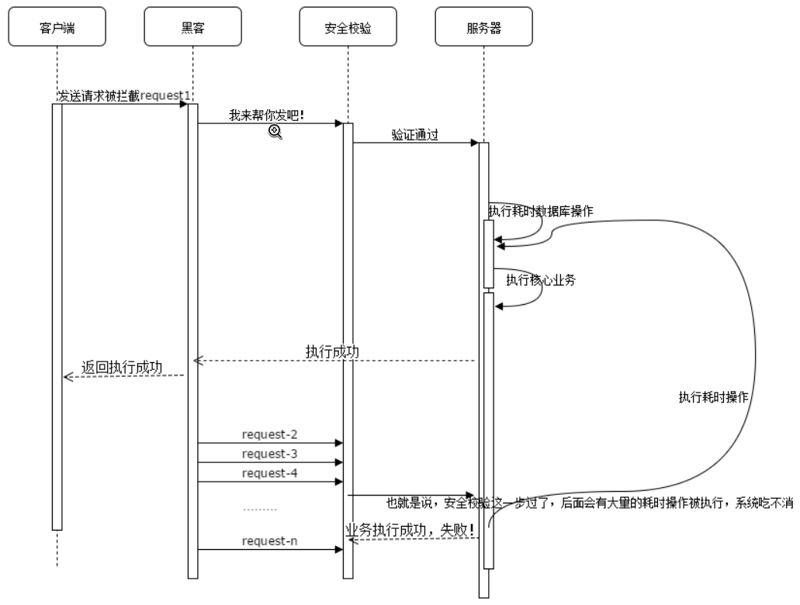

# Web安全之防止重放攻击

## 什么是重放攻击

在开发接口的时候通常会考虑接口的安全性，比如说通常会要求请求的url携带一个经过算法加密的签名sign到服务端进行验证，如果验证通过，证明请求是合法的。比如以下的url:

```
http://wokao66.com/in.json?uid=7&sign=xxxxx
```

其中sign的常用加密算法为MD5，MD5算法是一种不可逆算法，也就是说你加密之后就不能解密了。这通常要求通讯双方约定好一个私钥appSecret，这个私钥是约定好的，不能在网络上进行传输。

但单单有这个加密是远远不够的，比如说我是一名黑客，我抓包了你当前执行成功的请求信息，我们假设为request-1,既然你都执行成功了，也就是说你的这次请求的所有参数都是合法的，那么作为黑客的我，我就想能不能将你request-1的请求数据再封装成另外一个请求request-2,然后再去请求接口，如果此时系统未作任何处理，那么系统肯定是认为request-2是合法的，肯定还是会放行，但至于业务上成不成功，那么是另外一个问题了，倘若在执行业务前需要进行一个相对耗时的数据库操作，那么大量的request-2,request-3势必会使服务器瘫痪。



首先正常的请求系统会要求校验，当你的合法请求被黑客拦截之后，黑客就会重复地发送该合法请求，从而达到欺骗系统的目的！这种重复利用合法请求进行攻击成为重放。

## 如何防止重放攻击

重放攻击的原理其实很简单，无非就是系统没有对合法请求进行唯一性校验。什么意思呢？就是说系统要知道你第一次的合法请求request-1不能被重复执行，要保证每次请求的唯一性。那么怎么去防止重放攻击呢？

大概有以下两种方式：

- 时间戳(timestamp)

这种方式的做法就是，首先我们认为一次HTTP请求从发出到到达服务器的时间是不会超过60s的，当你发送一个请求时必须携带一个时间戳timestamp,假设值为10，当请求到达服务器之后，服务器会取出当前时间,假设为t2=80,很明显t2-timestamp>60s，那么服务器就认为请求不合法。

这个时间戳是需要加入MD5加密签名的，不然黑客修改了时间戳t2=20,那就是白费功夫了。

首先黑客从抓包到发起请求一般会超过60s，再者我们不需担心黑客修改了时间戳timestamp,因为如果修改了时间戳，那么对应的签名sign也就失效了，因为MD5是不可逆的，你想伪造MD5，必须知道双方约定的密钥appSecret。

缺点是如果黑客在60s内发起攻击，那么我们就束手无策了。

- 时间戳(timestamp) + 随机数(nonce)

上面说到时间戳是有缺点的，那么我们加入一个随机数nonce,每次成功请求，服务器会保存当前成功请求的随机数nonce,比如存放在redis和数据库中，当请求再次进到服务器，先验证时间戳是否有效，如果有效，再判断携带的随机数nonce是否在缓存或者数据库中已经存在，如果存在，则认为请求非法。

但你会发现，如果系统请求非常多，这个存放nonce的缓存也好，数据库也好势必会越来越大，那么我们只需要保存服务器当前时间60秒内的nonce值即可。

缺点是必须保证nonce的绝对唯一

- 基于record的方案

什么是基于record的验证方式呢？就是说我现在不需要随机数，我利用MD5加密的唯一性，采用多维度（多个字段），将每次请求的记录保存到数据库中，每次请求先校验签名记录是否存在，如果存在，则认为请求非法，不存在，则将MD5签名结合其他参数一起保存到数据库中。当然这里也可以结合时间戳只保存60s内的数据。

第三点主要是不考虑采用随机数机制，同时对自己业务可以有不同的扩展，或者说加入业务参数方便运维监控等。

综合上面几种方案，都有缺点，其中一个致命的缺点是服务器的时间和客户端的时间是存在时间差的，当然你也可以通过校验时间戳解决此问题。

