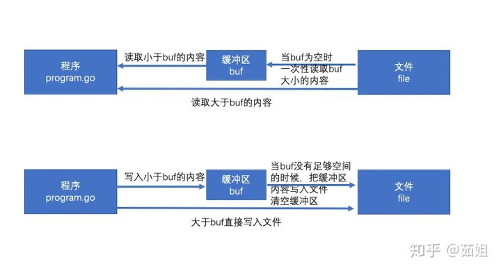

# bufio读写机制剖析

Go语言在IO操作中，提供了一个bufio包，使用这个包可以大幅提高文件读写的效率。

## 使用示例

读取数据

```go
package main
​
import (
    "os"
    "fmt"
    "bufio"
)
​
func main() {
    /*
    bufio:高效io读写
        buffer缓存
        io：input/output
​
    将io包下的Reader，Write对象进行包装，带缓存的包装，提高读写的效率
​
        ReadBytes()
        ReadString()
        ReadLine()
​
     */
​
     fileName:="/Users/ruby/Documents/pro/a/english.txt"
     file,err := os.Open(fileName)
     if err != nil{
        fmt.Println(err)
        return
     }
     defer file.Close()
​
     //创建Reader对象
     //b1 := bufio.NewReader(file)
     //1.Read()，高效读取
     //p := make([]byte,1024)
     //n1,err := b1.Read(p)
     //fmt.Println(n1)
     //fmt.Println(string(p[:n1]))
​
     //2.ReadLine()
     //data,flag,err := b1.ReadLine()
     //fmt.Println(flag)
     //fmt.Println(err)
     //fmt.Println(data)
     //fmt.Println(string(data))
​
     //3.ReadString()
    // s1,err :=b1.ReadString('\n')
    // fmt.Println(err)
    // fmt.Println(s1)
    //
    // s1,err = b1.ReadString('\n')
    // fmt.Println(err)
    // fmt.Println(s1)
    //
    //s1,err = b1.ReadString('\n')
    //fmt.Println(err)
    //fmt.Println(s1)
    //
    //for{
    //  s1,err := b1.ReadString('\n')
    //  if err == io.EOF{
    //      fmt.Println("读取完毕。。")
    //      break
    //  }
    //  fmt.Println(s1)
    //}
​
    //4.ReadBytes()
    //data,err :=b1.ReadBytes('\n')
    //fmt.Println(err)
    //fmt.Println(string(data))
​
​
    //Scanner
    //s2 := ""
    //fmt.Scanln(&s2)
    //fmt.Println(s2)
​
    b2 := bufio.NewReader(os.Stdin)
    s2, _ := b2.ReadString('\n')
    fmt.Println(s2)
}
```

写入数据

```go
package main
​
import (
    "os"
    "fmt"
    "bufio"
)
​
func main() {
    /*
    bufio:高效io读写
        buffer缓存
        io：input/output
​
    将io包下的Reader，Write对象进行包装，带缓存的包装，提高读写的效率
​
        func (b *Writer) Write(p []byte) (nn int, err error)
        func (b *Writer) WriteByte(c byte) error
        func (b *Writer) WriteRune(r rune) (size int, err error)
        func (b *Writer) WriteString(s string) (int, error)
​
     */
​
     fileName := "/Users/ruby/Documents/pro/a/cc.txt"
     file,err := os.OpenFile(fileName,os.O_CREATE|os.O_WRONLY,os.ModePerm)
     if err != nil{
        fmt.Println(err)
        return
     }
     defer file.Close()
​
     w1 := bufio.NewWriter(file)
     //n,err := w1.WriteString("helloworld")
     //fmt.Println(err)
     //fmt.Println(n)
     //w1.Flush() //刷新缓冲区
​
     for i:=1;i<=1000;i++{
        w1.WriteString(fmt.Sprintf("%d:hello",i))
     }
     w1.Flush()
}
```
## 读写过程

bufio通过缓冲来提高效率。IO操作本身效率并不低，低的是频繁访问本地磁盘文件，所以bufio就提供了缓冲区(分配一块内存)，读和写都先在缓冲区中，最后再读写文件，来降低访问本地磁盘的次数，从而提高效率。

简单的说就是，把文件读取进缓冲区(内存)之后再读取的时候就可以避免文件系统的频繁IO从而提高速度。同理，在进行写操作时，先把文件写入缓冲(内存)，然后由缓冲写入文件系统。缓冲区的设计是为了存储多次的写入，最有一口气把缓冲区内容写入文件。



### Reader对象

bufio.Reader是bufio中对io.Reader的封装

```go
// Reader implements buffering for an io.Reader object.
type Reader struct {
    buf          []byte
    rd           io.Reader // reader provided by the client
    r, w         int       // buf read and write positions
    err          error
    lastByte     int // last byte read for UnreadByte; -1 means invalid
    lastRuneSize int // size of last rune read for UnreadRune; -1 means invalid
}
```

bufio.Read(p []byte) 相当于读取大小len(p)的内容，思路如下：

1. 当缓存区有内容的时，将缓存区内容全部填入p并清空缓存区

2. 当缓存区没有内容的时候且len(p)>len(buf),即要读取的内容比缓存区还要大，直接去文件读取即可

3. 当缓存区没有内容的时候且len(p)<len(buf),即要读取的内容比缓存区小，缓存区从文件读取内容充满缓存区，并将p填满（此时缓存区有剩余内容）

4. 以后再次读取时缓存区有内容，将缓存区内容全部填入p并清空缓存区（此时和情况1一样）

```go
// Read reads data into p.
// It returns the number of bytes read into p.
// The bytes are taken from at most one Read on the underlying Reader,
// hence n may be less than len(p).
// To read exactly len(p) bytes, use io.ReadFull(b, p).
// At EOF, the count will be zero and err will be io.EOF.
func (b *Reader) Read(p []byte) (n int, err error) {
    n = len(p)
    if n == 0 {
        return 0, b.readErr()
    }
    if b.r == b.w {
        if b.err != nil {
            return 0, b.readErr()
        }
        if len(p) >= len(b.buf) {
            // Large read, empty buffer.
            // Read directly into p to avoid copy.
            n, b.err = b.rd.Read(p)
            if n < 0 {
                panic(errNegativeRead)
            }
            if n > 0 {
                b.lastByte = int(p[n-1])
                b.lastRuneSize = -1
            }
            return n, b.readErr()
        }
        // One read.
        // Do not use b.fill, which will loop.
        b.r = 0
        b.w = 0
        n, b.err = b.rd.Read(b.buf)
        if n < 0 {
            panic(errNegativeRead)
        }
        if n == 0 {
            return 0, b.readErr()
        }
        b.w += n
    }
​
    // copy as much as we can
    n = copy(p, b.buf[b.r:b.w])
    b.r += n
    b.lastByte = int(b.buf[b.r-1])
    b.lastRuneSize = -1
    return n, nil
}
```
reader内部通过维护一个r,w即读入和写入的位置索引来判断是否缓冲区内容被全部读出。

### Writer对象

bufio.Writer是bufio中对io.Writer的封装

```go
// Writer implements buffering for an io.Writer object.
// If an error occurs writing to a Writer, no more data will be
// accepted and all subsequent writes, and Flush, will return the error.
// After all data has been written, the client should call the
// Flush method to guarantee all data has been forwarded to
// the underlying io.Writer.
type Writer struct {
    err     error
    buf     []byte
    n       int
    wr      io.Writer
}
```
bufio.Write(p []byte)的思路如下

1. 判断buf中可用容量是否可以放下p

2. 如果能放下，直接把p拼接到buf后面，即把内容放到缓冲区

3. 如果缓冲区的可用容量不足以放下，且此时缓冲区是空的，直接把p写入文件即可

4. 如果缓冲区的可用容量不足以放下，且此时缓冲区有内容，则用p把缓冲区填满，把缓冲区所有内容写入文件，并清空缓冲区

5. 判断p的剩余内容大小是否能放到缓冲区，如果能放下(此时和步骤1情况一样)则把内容放到缓冲区

6. 如果p的剩余内容依旧大于缓冲区，(注意此时缓冲区是空的，情况和步骤3一样)则把p的剩余内容直接写入文件

```go
// Write writes the contents of p into the buffer.
// It returns the number of bytes written.
// If nn < len(p), it also returns an error explaining
// why the write is short.
func (b *Writer) Write(p []byte) (nn int, err error) {
    for len(p) > b.Available() && b.err == nil {
        var n int
        if b.Buffered() == 0 {
            // Large write, empty buffer.
            // Write directly from p to avoid copy.
            n, b.err = b.wr.Write(p)
        } else {
            n = copy(b.buf[b.n:], p)
            b.n += n
            b.Flush()
        }
        nn += n
        p = p[n:]
    }
    if b.err != nil {
        return nn, b.err
    }
    n := copy(b.buf[b.n:], p)
    b.n += n
    nn += n
    return nn, nil
}
```
b.wr 存储的是一个io.writer对象，实现了Write()的接口，所以可以使用b.wr.Write(p) 将p的内容写入文件。

b.flush() 会将缓存区内容写入文件，当所有写入完成后，因为缓存区会存储内容，所以需要手动flush()到文件。

b.Available() 为buf可用容量，等于len(buf) - n。

下图解释的是其中一种情况，即缓存区有内容，剩余p大于缓存区


## 常见功能

### bufio.Reader

bufio.Reader实现了如下接口：io.Reader io.WriterTo io.ByteScanner io.RuneScanner

```go
// NewReaderSize 将 rd 封装成一个带缓存的 bufio.Reader 对象，
// 缓存大小由 size 指定（如果小于 16 则会被设置为 16）。
// 如果 rd 的基类型就是有足够缓存的 bufio.Reader 类型，则直接将
// rd 转换为基类型返回。
func NewReaderSize(rd io.Reader, size int) *Reader
​
// NewReader 相当于 NewReaderSize(rd, 4096)
func NewReader(rd io.Reader) *Reader
​
// Peek 返回缓存的一个切片，该切片引用缓存中前 n 个字节的数据，
// 该操作不会将数据读出，只是引用，引用的数据在下一次读取操作之
// 前是有效的。如果切片长度小于 n，则返回一个错误信息说明原因。
// 如果 n 大于缓存的总大小，则返回 ErrBufferFull。
func (b *Reader) Peek(n int) ([]byte, error)
​
// Read 从 b 中读出数据到 p 中，返回读出的字节数和遇到的错误。
// 如果缓存不为空，则只能读出缓存中的数据，不会从底层 io.Reader
// 中提取数据，如果缓存为空，则：
// 1、len(p) >= 缓存大小，则跳过缓存，直接从底层 io.Reader 中读
// 出到 p 中。
// 2、len(p) < 缓存大小，则先将数据从底层 io.Reader 中读取到缓存
// 中，再从缓存读取到 p 中。
func (b *Reader) Read(p []byte) (n int, err error)
​
// Buffered 返回缓存中未读取的数据的长度。
func (b *Reader) Buffered() int
​
// ReadBytes 功能同 ReadSlice，只不过返回的是缓存的拷贝。
func (b *Reader) ReadBytes(delim byte) (line []byte, err error)
​
// ReadString 功能同 ReadBytes，只不过返回的是字符串。
func (b *Reader) ReadString(delim byte) (line string, err error)
...
```

### bufio.Writer

bufio.Writer实现了如下接口：io.Writer io.ReaderFrom io.ByteWriter

```go
// NewWriterSize 将 wr 封装成一个带缓存的 bufio.Writer 对象，
// 缓存大小由 size 指定（如果小于 4096 则会被设置为 4096）。
// 如果 wr 的基类型就是有足够缓存的 bufio.Writer 类型，则直接将
// wr 转换为基类型返回。
func NewWriterSize(wr io.Writer, size int) *Writer
​
// NewWriter 相当于 NewWriterSize(wr, 4096)
func NewWriter(wr io.Writer) *Writer
​
// WriteString 功能同 Write，只不过写入的是字符串
func (b *Writer) WriteString(s string) (int, error)
​
// WriteRune 向 b 写入 r 的 UTF-8 编码，返回 r 的编码长度。
func (b *Writer) WriteRune(r rune) (size int, err error)
​
// Flush 将缓存中的数据提交到底层的 io.Writer 中
func (b *Writer) Flush() error
​
// Available 返回缓存中未使用的空间的长度
func (b *Writer) Available() int
​
// Buffered 返回缓存中未提交的数据的长度
func (b *Writer) Buffered() int
​
// Reset 将 b 的底层 Writer 重新指定为 w，同时丢弃缓存中的所有数据，复位
// 所有标记和错误信息。相当于创建了一个新的 bufio.Writer。
func (b *Writer) Reset(w io.Writer)
...
```