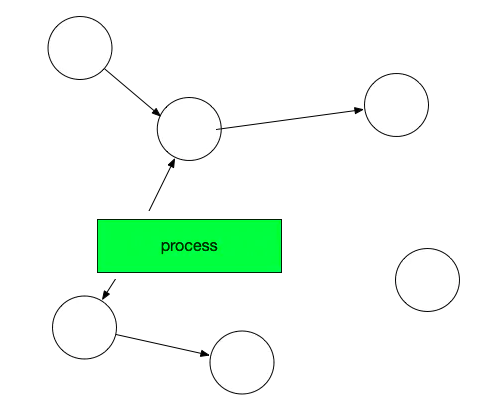
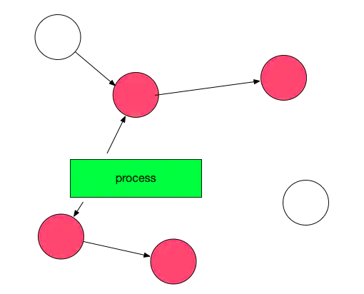
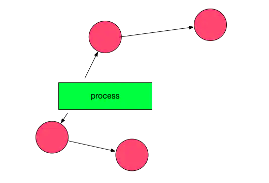
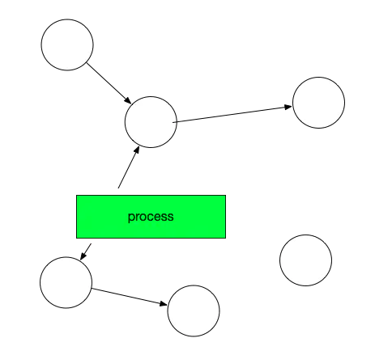
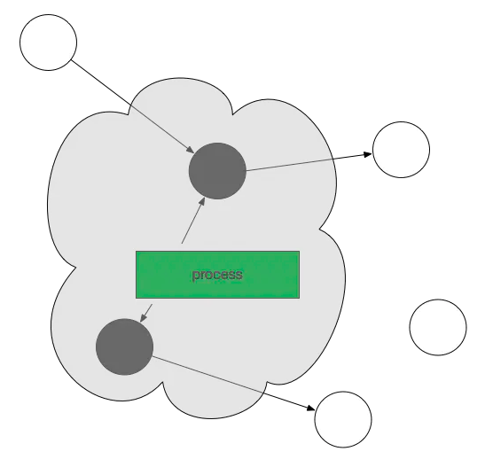
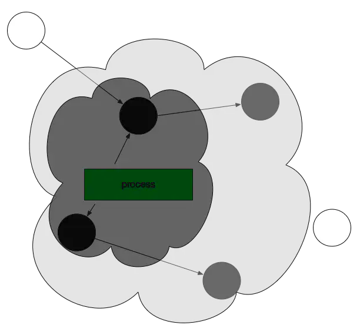
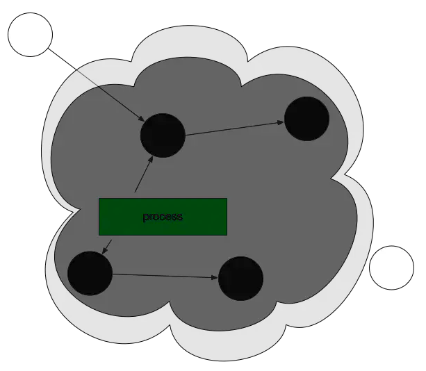
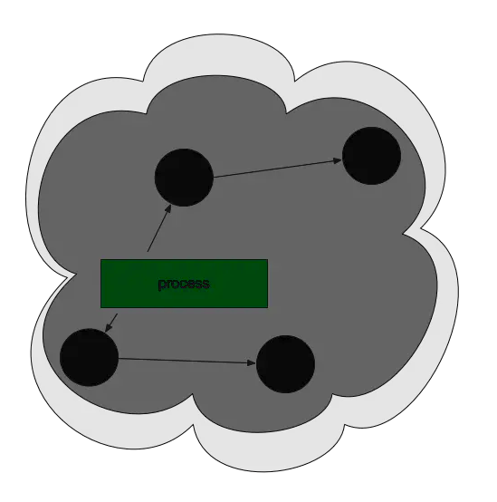
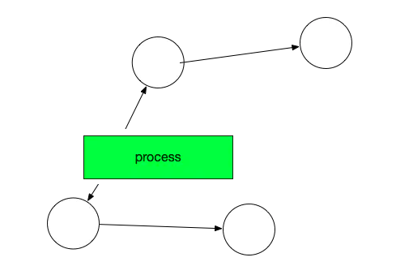

# GC：三色标记清除

## 经典垃圾回收算法

经典的GC算法有三种：引用计数(reference counting)、标记-清除(mark & sweep)、复制收集(Copy and Collection)。

引用计数法：假设有一个对象A，任何一个对象对A的引用，那么对象A的引用计数器+1，当引用失败时，对象A的引用计数器就-1，如果对象A的计算器的值
为0，就说明对象A没有引用了，可以被回收。

标记清除法：标记清除算法，是将垃圾回收分为2个阶段，分别是标记和清除。

- 标记 ：从根节点开始标记引用的对象。
- 清除 ：未被标记引用的对象就是垃圾对象，可以被清理。

复制收集法：将原有的内存空间一分为二，每次只用其中的一块，在垃圾回收时，将正在使用的对象复制到另一个内存空间中，然后将该内存空间清空，交换两个内存的角色，完成垃圾的回收。

Golang的GC算法主要是基于标记-清扫(mark and sweep)算法，并在此基础上做了改进。因此，在此先介绍一下标记-清扫(mark and sweep)算法。

## 标记-清扫(Mark And Sweep)算法

此算法主要有两个主要的步骤：

- 标记(Mark phase)
- 清除(Sweep phase)

第一步，找出可达的对象，然后做上标记。

第二步，回收未标记的对象。

操作非常简单，但是有一点需要额外注意：mark and sweep算法在执行的时候，需要程序暂停！即stop the world。也就是说，这段时间程序会卡在哪儿。故中文翻译成卡顿。

我们来看一下图解：

1.开始标记，程序暂停。程序和对象的此时关系是这样的：

2.然后开始标记，process找出它所有可达的对象，并做上标记。如下图所示：

3.标记完了之后，然后开始清除未标记的对象：

4.然后垃圾清除了，变成了下图这样。

最后，停止暂停，让程序继续跑。然后循环重复这个过程，直到process生命周期结束。

标记-清扫(Mark And Sweep)算法这种算法虽然非常的简单，但是还存在一些问题：

- STW，stop the world；让程序暂停，程序出现卡顿。
- 标记需要扫描整个heap
- 清除数据会产生heap碎片

这里面最重要的问题就是：mark-and-sweep 算法会暂停整个程序。
Go是如何面对并这个问题的呢？

## 三色并发标记法

三色标记法是对标记阶段的改进，原理如下：

1.初始状态所有对象都是白色。

2.从root根出发扫描所有根对象，将他们引用的对象标记为灰色

3.分析灰色对象是否引用了其他对象。如果没有引用其它对象则将该灰色对象标记为黑色；如果有引用则将它变为黑色的同时将它引用的对象也变为灰色

4.重复步骤3，直到灰色对象队列为空。此时白色对象即为垃圾，进行回收。

5.最后，将所有黑色对象变为白色，并重复以上所有过程。

## Go GC工作机制

上面介绍的是GO GC采用的三色标记算法，但是好像并没有体现出来怎么减少STW对程序的影响呢？其实是因为Golang GC的大部分处理是和用户代码并行的。
GC期间用户代码可能会改变某些对象的状态，如何实现GC和用户代码并行呢？先看下GC工作的完整流程：

Mark: 包含两部分:

1.Mark Prepare: 初始化GC任务，包括开启写屏障(write barrier)和辅助GC(mutator assist)，统计root对象的任务数量等。这个过程需要STW
GC Drains: 扫描所有root对象，包括全局指针和goroutine(G)栈上的指针（扫描对应G栈时需停止该G)，将其加入标记队列(灰色队列)，并循环处理灰色队列的对象，直到灰色队列为空。该过程后台并行执行

2.Mark Termination: 完成标记工作，重新扫描(re-scan)全局指针和栈。因为Mark和用户程序是并行的，所以在Mark过程中可能会有新的对象分配和指针赋值，这个时候就需要通过写屏障（write barrier）记录下来，re-scan 再检查一下。这个过程也是会STW的。

3.Sweep: 按照标记结果回收所有的白色对象，该过程后台并行执行

4.Sweep Termination: 对未清扫的span进行清扫, 只有上一轮的GC的清扫工作完成才可以开始新一轮的GC。

如果标记期间用户逻辑改变了刚打完标记的对象的引用状态，怎么办呢？

### 写屏障

写屏障：该屏障之前的写操作和之后的写操作相比，先被系统其它组件感知。
结合上面GC工作的完整流程就好理解了，就是在每一轮GC开始时会初始化一个叫做“屏障”的东西，然后由它记录第一次scan时各个对象的状态，以便和第二次re-scan进行比对，引用状态变化的对象被标记为灰色以防止丢失，将屏障前后状态未变化对象继续处理。

### 辅助GC

从上面的GC工作的完整流程可以看出Golang GC实际上把单次暂停时间分散掉了，本来程序执⾏可能是“⽤户代码-->⼤段GC-->⽤户代码”，那么分散以后实际上变成了“⽤户代码-->⼩段 GC-->⽤户代码-->⼩段GC-->⽤户代码”这样。

如果GC回收的速度跟不上用户代码分配对象的速度呢？

Go 语⾔如果发现扫描后回收的速度跟不上分配的速度它依然会把⽤户逻辑暂停，⽤户逻辑暂停了以后也就意味着不会有新的对象出现，同时会把⽤户线程抢过来加⼊到垃圾回收⾥⾯加快垃圾回收的速度。这样⼀来原来的并发还是变成了STW，还是得把⽤户线程暂停掉，要不然扫描和回收没完没了了停不下来，因为新分配对象⽐回收快，所以这种东⻄叫做辅助回收。

## GC调优实践

减少对象的分配，合理重复利用； 避免string与[]byte转化；

两者发生转换的时候，底层数据结结构会进行复制，因此导致 gc 效率会变低。

少量使用+连接 string；

Go里面string是最基础的类型，是一个只读类型，针对他的每一个操作都会创建一个新的string。 如果是少量小文本拼接，用 “+” 就好；如果是大量小文本拼接，用 strings.Join；如果是大量大文本拼接，用 bytes.Buffer。

## GC触发条件

自动垃圾回收的触发条件有两个：

1.超过内存大小阈值

2.达到定时时间

阈值是由一个gcpercent的变量控制的,当新分配的内存占已在使用中的内存的比例超过gcprecent时就会触发。比如一次回收完毕后，内存的使用量为5M，那么下次回收的时机则是内存分配达到10M的时候。也就是说，并不是内存分配越多，垃圾回收频率越高。

如果一直达不到内存大小的阈值呢？这个时候GC就会被定时时间触发，比如一直达不到10M，那就定时（默认2min触发一次）触发一次GC保证资源的回收。

