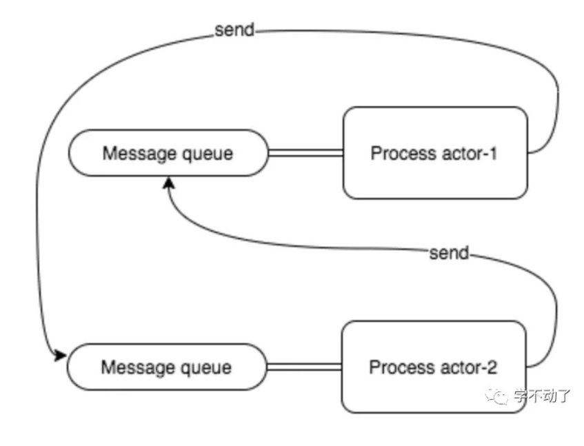
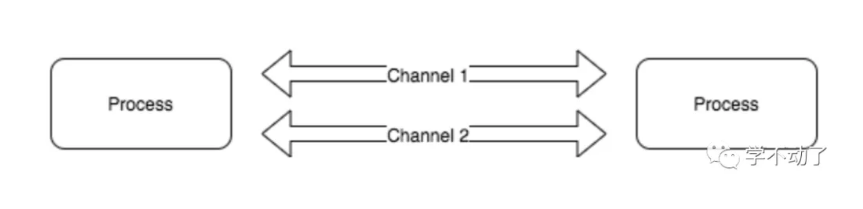
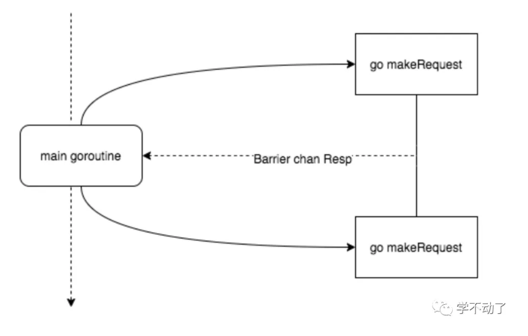
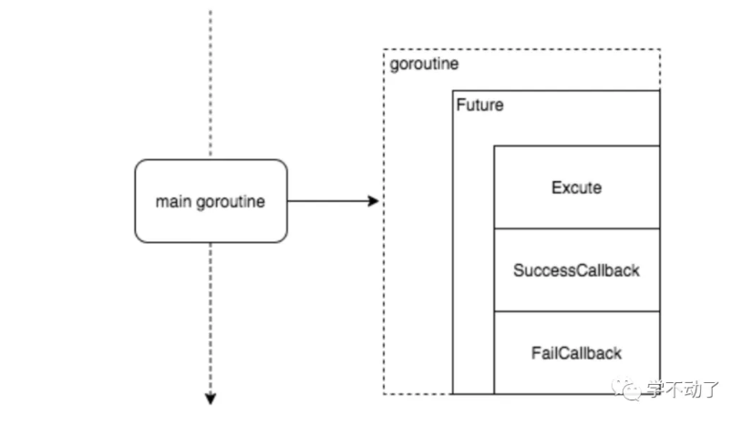
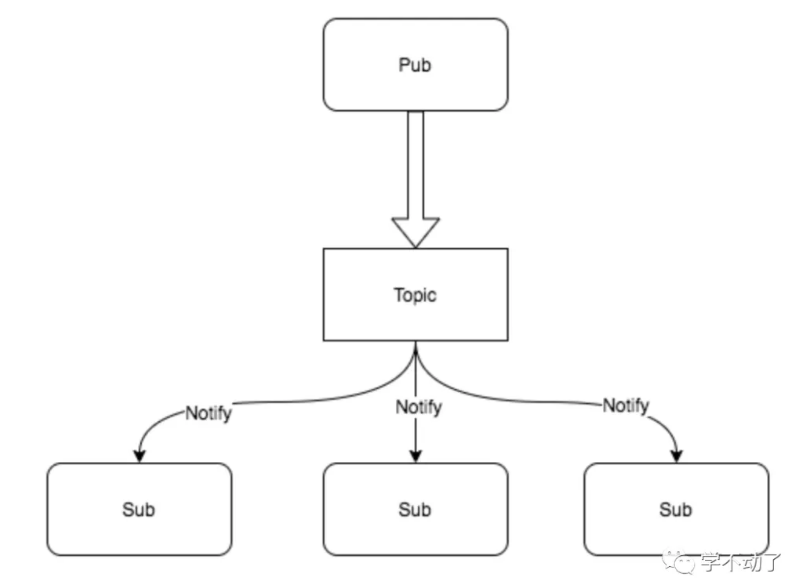

# Go的并发模型与并发模式

## Actor与CSP模型

### Actor



Actor 模型是一个通用的并发编程模型，可以应用在几乎任何一种编程语言中，典型的是 Erlang。多个 actor(进程) 可以同时运行、不共享状态、通过向与进程绑定的消息队列(也称为信箱)异步发送消息来进行通信。

actor-1 与 actor-2 进程通信依赖一个消息队列，而且消息队列与进程互相耦合绑定。actor-1 在发送完消息之后，在 actor-2 没有处理该消息的情况下，可以继续执行其他任务，这说明 actor 进程之间的通信是异步的。

**优点** 

- 消息传输和封装，多个 Actor 可以同时运行，但不共享状态，而且单个 actor 中的事件是串行执行（这归功于队列）

- Actor 模型支持共享内存模型，也支持分布式内存模型

**缺点**

- 尽管 Actor 模型比使用线程和锁模型的程序更易 debug，但是也会存在死锁的问题，而且还需要担心绑定进程的队列溢出的问题

- 没有对并行提供直接支持，需要通过并发的技术来构造并行方案

### CSP



CSP即通信顺序进程(communicating sequential processes)，与 Actor 模型类似，该模型也是由独立的、并发执行的实体所组成，实体之间通过发送消息进行通信。go 中的 csp 模型 channel 对于goroutine来说是匿名的，不需要和 gid 绑定，通过 channel 完成 goroutine 之间的通信。（channel 在 CSP 代表通道的概念，这里只讨论 Go 相关，channel 等价于 Go 中的 channel）

**优点**

- 与 Actor 相比，CSP 最大的优点是灵活性。Actor 模型，负责通信的媒介和执行单元是耦合的。而 CSP 中，channel 是第一类对象，可以被独立创造、写入、读出数据，也可以在不同执行单元中传递。

**缺点**

- CSP 模型也易受死锁影响，且没有提供直接的并行支持。并行需要建立在并发基础上，引入了不确定性。

### 区别

- Actor 模型重在参与交流的实体(即进程)，而 CSP 重在交流的通道，如 Go 中的 channel

- CSP 模型不关注发送消息的进程，而是关注发送消息时使用的 channel，而 channel 不像 Actor 模型那样进程与队列紧耦合。而是可以单独创建和读写，并在进程 (goroutine) 之间传递。

### Go中的并发模型

Go 是采用 CSP 的思想的，channel 是 go 在并发编程通信的推荐手段，Go 的设计者 Rob Pike有一句经典的名言，

> Do not communicate by sharing memory; instead, share memory by communicating.

这句话是说“不要使用共享内存通信，而是应该使用通信去共享内存”，Go 语言推荐我们使用通信来进行进程间同步消息。这样做有三点好处，来源于 draveness 的博客文章。

1. 首先，使用发送消息来同步信息相比于直接使用共享内存和互斥锁是一种更高级的抽象，使用更高级的抽象能够为我们在程序设计上提供更好的封装，让程序的逻辑更加清晰；

2. 其次，消息发送在解耦方面与共享内存相比也有一定优势，我们可以将线程的职责分成生产者和消费者，并通过消息传递的方式将它们解耦，不需要再依赖共享内存；

3. 最后，Go 语言选择消息发送的方式，通过保证同一时间只有一个活跃的线程能够访问数据，能够从设计上天然地避免线程竞争和数据冲突的问题；

## 并发设计模式

上文介绍了 Go 中使用的并发模型，而在这种并发模型下面 channel 是一个重要的概念，而下面每一种模式的设计都依赖于 channel，所以有必要了解一下。 

### Barrier模式

barrier 屏障模式故名思义就是一种屏障，用来阻塞直到聚合所有 goroutine 返回结果。可以使用 channel 来实现。

#### 使用场景

- 多个网络请求并发，聚合结果

- 粗粒度任务拆分并发执行，聚合结果



#### 代码实现

```go
/*
* Barrier
*/
type barrierResp struct {
   Err error
   Resp string
   Status int
}

// 构造请求
func makeRequest(out chan<- barrierResp, url string) {
   res := barrierResp{}

   client := http.Client{
       Timeout: time.Duration(2*time.Microsecond),
  }

   resp, err := client.Get(url)
   if resp != nil {
       res.Status = resp.StatusCode
  }
   if err != nil {
       res.Err = err
       out <- res
       return
  }

   byt, err := ioutil.ReadAll(resp.Body)
   defer resp.Body.Close()
   if err != nil {
       res.Err = err
       out <- res
       return
  }

   res.Resp = string(byt)
   out <- res
}

// 合并结果
func barrier(endpoints ...string) {
   requestNumber := len(endpoints)

   in := make(chan barrierResp, requestNumber)
   response := make([]barrierResp, requestNumber)

   defer close(in)

   for _, endpoints := range endpoints {
       go makeRequest(in, endpoints)
  }

   var hasError bool
   for i := 0; i < requestNumber; i++ {
       resp := <-in
       if resp.Err != nil {
           fmt.Println("ERROR: ", resp.Err, resp.Status)
           hasError = true
      }
       response[i] = resp
  }
   if !hasError {
       for _, resp := range response {
           fmt.Println(resp.Status)
      }
  }
}

func main() {
   barrier([]string{"https://www.baidu.com", "http://www.sina.com", "https://segmentfault.com/"}...)
}
```

Barrier 模式也可以使用 errgroup 扩展库来实现，这样更加简单明了。这个包有点类似于 sync.WaitGroup，但是区别是当其中一个任务发生错误时，可以返回该错误。而这也满足我们 Barrier 模式的需求。

```go
func barrier(endpoints ...string) {
   var g errgroup.Group
   var mu sync.Mutex
 
   response := make([]barrierResp, len(endpoints))

   for i, endpoint := range endpoints {
       i, endpoint := i, endpoint // create locals for closure below
       g.Go(func() error {
           res := barrierResp{}
           resp, err := http.Get(endpoint)
           if err != nil {
               return err
          }

           byt, err := ioutil.ReadAll(resp.Body)
           defer resp.Body.Close()
           if err != nil {
               return err
          }

           res.Resp = string(byt)
           mu.Lock()
           response[i] = res
           mu.Unlock()
           return err
      })
  }
   if err := g.Wait(); err != nil {
      fmt.Println(err)
  }
   for _, resp := range response {
       fmt.Println(resp.Status)
  }
}
```
### Future模式

future 即未来，来自未来的模式（手动狗头）。这个模式常用在异步处理也称为 Promise 模式，采用一种 fire-and-forget 的方式，是指主 goroutine 不等子 goroutine 执行完就直接返回了，然后等到未来执行完的时候再去取结果。在 Go 中由于 goroutine 的存在，实现这种模式是挺简单的。

#### 使用场景

- 异步



#### 代码实现

```go
/*
* Future
*/
type Function func(string) (string, error)

type Future interface {
   SuccessCallback() error
   FailCallback()    error
   Execute(Function) (bool, chan struct{})
}

type AccountCache struct {
   Name string
}

func (a *AccountCache) SuccessCallback() error {
   fmt.Println("It's success~")
   return nil
}

func (a *AccountCache) FailCallback() error {
   fmt.Println("It's fail~")
   return nil
}

func (a *AccountCache) Execute(f Function) (bool, chan struct{}){
   done := make(chan struct{})
   go func(a *AccountCache) {
       _, err := f(a.Name)
       if err != nil {
           _ = a.FailCallback()
      } else {
           _ = a.SuccessCallback()
      }
       done <- struct{}{}
  }(a)
   return true, done
}

func NewAccountCache(name string) *AccountCache {
   return &AccountCache{
       name,
  }
}

func testFuture() {
   var future Future
   future = NewAccountCache("Tom")
   updateFunc := func(name string) (string, error){
       fmt.Println("cache update:", name)
       return name, nil
  }
   _, done := future.Execute(updateFunc)
   defer func() {
       <-done
  }()
}

func main() {
   var future Future
   future = NewAccountCache("Tom")
   updateFunc := func(name string) (string, error){
       fmt.Println("cache update:", name)
       return name, nil
  }
   _, done := future.Execute(updateFunc)
   defer func() {
       <-done
  }()
   // do something
}
```
> 这里有一个技巧：为什么使用 struct 类型作为 channel 的通知？
>
>很多开源代码都是使用这种方式来作为信号通知机制，主要是因为空  struct 在 Go 中占的内存是最少的。

### Pipeline模式

#### 使用场景

- 可以利用多核的优势把一段粗粒度逻辑分解成多个 goroutine 执行

Pipeline 本身翻译过来就是管道的意思，注意和 Barrire 模式不同的是，它是按顺序的，类似于流水线。


这个图不是很能表达并行的概念，其实三个 goroutine 是同时执行的，通过 buffer channel 将三者串起来，只要前序 goroutine 处理完一部分数据，就往下传递，达到并行的目的。

#### 代码实现

实现一个功能，给定一个切片，然后求它的子项的平方和。

例如，[1, 2, 3] -> 1^2 + 2^2 + 3^2 = 14。

正常的逻辑，遍历切片，然后求平方累加。使用 pipeline 模式，可以把求和和求平方拆分出来并行计算。

```go
/*
* Pipeline 模式
*/

func generator(max int) <-chan int{
   out := make(chan int, 100)
   go func() {
       for i := 1; i <= max; i++ {
           out <- i
      }
       close(out)
  }()
   return out
}

func power(in <-chan int) <-chan int{
   out := make(chan int, 100)
   go func() {
       for v := range in {
           out <- v * v
      }
       close(out)
  }()
   return out
}

func sum(in <-chan int) <-chan int{
   out := make(chan int, 100)
   go func() {
       var sum int
       for v := range in {
           sum += v
      }
       out <- sum
       close(out)
  }()
   return out
}

func main() {
   // [1, 2, 3]
   fmt.Println(<-sum(power(generator(3))))
}
```

### Worker Pool 模式

#### 使用场景

- 高并发任务

在 Go 中 goroutine 已经足够轻量，甚至 net/http server 的处理方式也是 goroutine-per-connection 的，所以比起其他语言来说可能场景稍微少一些。每个 goroutine 的初始内存消耗在 2~8kb，当我们有大批量任务的时候，需要起很多 goroutine 来处理，这会给系统代理很大的内存开销和 GC 压力，这个时候就可以考虑一下协程池。

#### 代码实现

```go
/*
* Worker pool
*/
type TaskHandler func(interface{})

type Task struct {
   Param   interface{}
   Handler TaskHandler
}

type WorkerPoolImpl interface {
   AddWorker()                  // 增加 worker
   SendTask(Task)               // 发送任务
   Release()                    // 释放
}

type WorkerPool struct {
   wg   sync.WaitGroup
   inCh chan Task
}

func (d *WorkerPool) AddWorker() {
   d.wg.Add(1)
   go func(){
       for task := range d.inCh {
           task.Handler(task.Param)
      }
       d.wg.Done()
  }()
}

func (d *WorkerPool) Release() {
   close(d.inCh)
   d.wg.Wait()
}

func (d *WorkerPool) SendTask(t Task) {
   d.inCh <- t
}

func NewWorkerPool(buffer int) WorkerPoolImpl {
   return &WorkerPool{
       inCh: make(chan Task, buffer),
  }
}

func main() {
   bufferSize := 100
   var workerPool = NewWorkerPool(bufferSize)
   workers := 4
   for i := 0; i < workers; i++ {
       workerPool.AddWorker()
  }

   var sum int32
   testFunc := func (i interface{}) {
       n := i.(int32)
       atomic.AddInt32(&sum, n)
  }
   var i, n int32
   n = 1000
   for ; i < n; i++ {
       task := Task{
           i,
           testFunc,
      }
       workerPool.SendTask(task)
  }
   workerPool.Release()
   fmt.Println(sum)
}
```

>协程池使用了反射来获取执行的函数及参数，在 Go 中可能有点让人有点膈应。但是如果批量执行的函数是已知的，可以优化成一种只执行指定函数的协程池，能够提升性能。

### Pub/Sub模式

发布订阅模式是一种消息通知模式，发布者发送消息，订阅者接收消息。

#### 使用场景

- 消息队列



#### 代码实现

```go
/*
* Pub/Sub
*/
type Subscriber struct {
   in     chan interface{}
   id     int
   topic  string
   stop   chan struct{}
}

func (s *Subscriber) Close() {
   s.stop <- struct{}{}
   close(s.in)
}

func (s *Subscriber) Notify(msg interface{}) (err error) {
   defer func() {
       if rec := recover(); rec != nil {
           err = fmt.Errorf("%#v", rec)
      }
  }()
   select {
   case s.in <-msg:
   case <-time.After(time.Second):
       err = fmt.Errorf("Timeout\n")
  }
   return
}

func NewSubscriber(id int) SubscriberImpl {
   s := &Subscriber{
       id: id,
       in: make(chan interface{}),
       stop: make(chan struct{}),
  }
   go func() {
       for{
           select {
           case <-s.stop:
               close(s.stop)
               return
           default:
               for msg := range s.in {
                   fmt.Printf("(W%d): %v\n", s.id, msg)
              }
          }
  }}()
   return s
}

// 订阅者需要实现的方法
type SubscriberImpl interface {
   Notify(interface{}) error
   Close()
}

// sub 订阅 pub
func Register(sub Subscriber, pub *publisher){
   pub.addSubCh <- sub
   return
}

// pub 结果定义
type publisher struct {
   subscribers []SubscriberImpl          
   addSubCh    chan SubscriberImpl
   removeSubCh chan SubscriberImpl
   in          chan interface{}
   stop        chan struct{}
}

// 实例化
func NewPublisher () *publisher{
   return &publisher{
       addSubCh: make(chan SubscriberImpl),
       removeSubCh: make(chan SubscriberImpl),
       in: make(chan interface{}),
       stop: make(chan struct{}),
  }
}

// 监听
func (p *publisher) start() {
   for {
       select {
       // pub 发送消息
       case msg := <-p.in:
           for _, sub := range p.subscribers{
               _ = sub.Notify(msg)
          }
       // 移除指定 sub
       case sub := <-p.removeSubCh:
           for i, candidate := range p.subscribers {
               if candidate == sub {
                   p.subscribers = append(p.subscribers[:i], p.subscribers[i+1:]...)
                   candidate.Close()
                   break
              }
          }
       // 增加一个 sub
       case sub := <-p.addSubCh:
           p.subscribers = append(p.subscribers, sub)
       // 关闭 pub
       case <-p.stop:
           for _, sub := range p.subscribers {
               sub.Close()
          }
           close(p.addSubCh)
           close(p.in)
           close(p.removeSubCh)
           return
      }
  }
}


func main() {
   // 测试代码
   pub := NewPublisher()
   go pub.start()

   sub1 := NewWriterSubscriber(1)
   Register(sub1, pub)

   sub2 := NewWriterSubscriber(2)
   Register(sub2, pub)

   commands:= []int{1, 2, 3, 4, 5, 6, 7, 8, 9}
   for _, c := range commands {
       pub.in <- c
  }

   pub.stop <- struct{}{}
   time.Sleep(time.Second*1)
}
```

## 注意事项

- 同步问题，尤其同步原语和 channel 一起用时，容易出现死锁

- goroutine 崩溃问题，如果子 goroutine panic  没有 recover 会引起主 goroutine 异常退出

- goroutine 泄漏问题，确保 goroutine 能正常关闭


